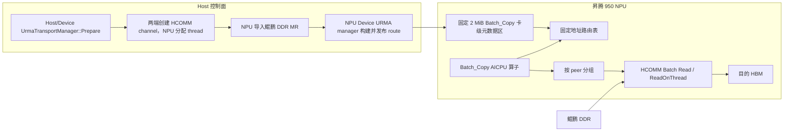
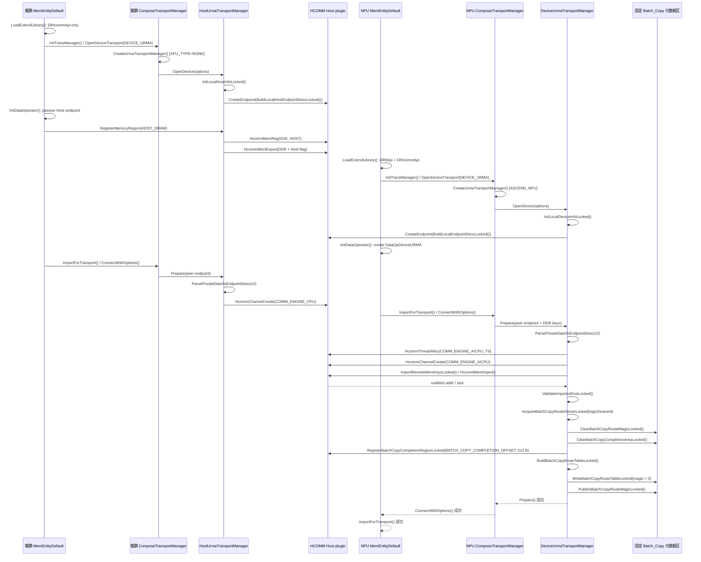
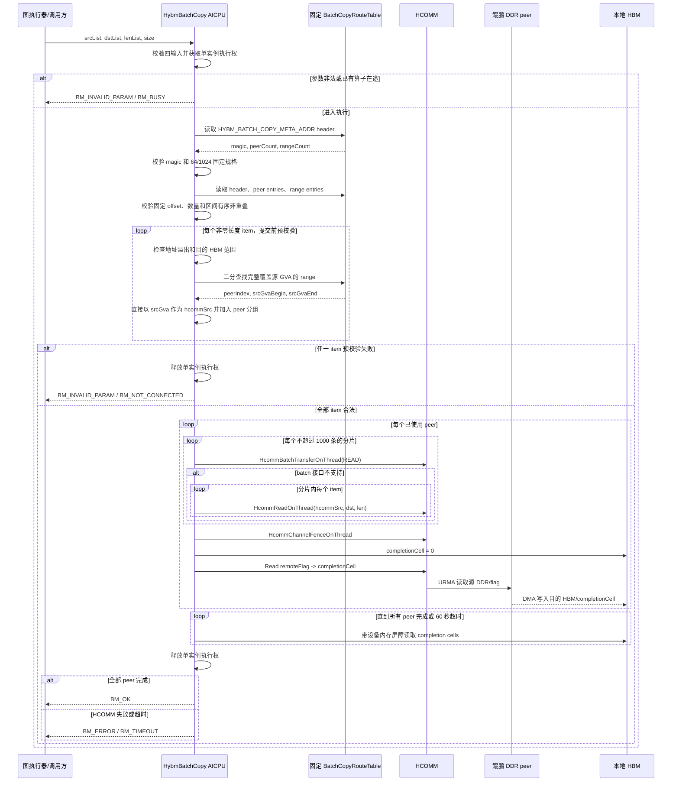

# 鲲鹏 DDR 到昇腾 950 HBM 的 Batch_Copy AICPU 算子技术方案

**Authors:** MemFabric Hybrid URMA Maintainers

**Created:** 2026-07-15

**Updated:** 2026-07-21

**Status:** Draft

**Related Issue/PR:** 无

---

# 1. 概述

## 1.1 简介

本方案面向鲲鹏服务器与昇腾 950 NPU 组成的超节点，为卡侧发起的 URMA 读提供
`Batch_Copy` AICPU 算子。算子逻辑输入为鲲鹏 DDR 源地址列表、昇腾 HBM 目的地址列表、
长度列表和列表元素个数，按源地址解析对应的 HCOMM `channel/thread`，将远端鲲鹏 DDR
数据批量读取到本地 NPU HBM。

方案在每张 NPU 上维护一份只由 MemFabric 控制面写入的卡级 HBM 路由表。路由表位于
`HYBM_DEVICE_META_ADDR` 前方固定的 2 MiB 卡级元数据区域。URMA
建链和远端内存导入成功后，Device URMA manager 把 CPU peer、地址区间及 `channel/thread` 写入
固定地址。AICPU 算子不接收内部通信句柄，直接读取这张只读表，按 CPU peer 对 batch 分组，然后
调用 `HcommBatchTransferOnThread`；接口不支持时回退到 `HcommReadOnThread`。


## 1.2 目标与限制

### 目标

- 新增 `Batch_Copy` AICPU 算子，仅暴露三组列表和列表元素个数。
- 路由表规格支持每张 NPU 最多 64 个鲲鹏 CPU peer，每个 peer 最多 16 个 DDR 地址区间。
- 支持 16 张 NPU、8 台双路鲲鹏服务器，即 16 个 CPU peer 的超节点规模。
- 建链成功后自动把地址范围与 `channel/thread` 的对应关系发布到 HBM。
- 单次 batch 可包含来自不同 CPU peer 的源地址，由算子完成查表、分组和传输。
- 保持现有 `HybmBatchRead`、`HybmBatchWrite` 及 Host 侧数据面接口兼容。
- 对参数错误、路由缺失、句柄失效、HCOMM 失败和完成超时提供可定位的 ERROR 日志。

### 限制

- 不在算子中动态建链、注册内存或导入远端内存。
- 不支持建链完成后动态增加内存区间，也不支持 peer 移除、主动断链或路由热更新。
- 初始化建链和路由发布串行执行，不支持初始化流程并发。
- 不支持同一张 NPU 上多个 Batch_Copy 实例并发执行。

---

# 2. 用例分析

## 2.1 核心用例

| 用例 | 功能要求 | 验收重点 |
| --- | --- | --- |
| 单 CPU 单地址 | 从一个鲲鹏 DDR 区间读取到一个 HBM 区间 | 地址转换、单条 HCOMM 读、完成语义 |
| 单 CPU 多地址 | 同一 peer 的多个离散 DDR 地址批量读取 | 优先使用 HCOMM batch，一次 fence |
| 多 CPU 混合 batch | 一个列表中包含不同 CPU peer 的地址 | 正确查表分组，每个 peer 使用自身句柄 |
| 最大拓扑 | 每张 NPU 连接 64 个 CPU peer，每 peer 16 个地址区间 | 固定表容量和初始化失败回滚 |
| 异常输入 | 越界、溢出、空指针、无路由地址 | 传输前失败，不提交任何 HCOMM 请求 |


## 2.2 安全、可靠性与兼容性要求

- 源 GVA 的完整 `[src, src + len)` 必须落在一个已发布路由区间内。
- 目的地址必须位于本地 HBM 有效范围，且不得覆盖 Batch_Copy 卡级元数据、HYBM meta 或任一
  entity extra context。
- 地址加法必须检查 `uint64_t` 溢出，长度为 0 的条目按 no-op 跳过。
- 路由表和 entity extra context 使用相互独立的地址区间；entity extra context 保持用户上下文语义。
- 根错误必须记录 peer rank、地址、长度、channel、thread、batch index 和返回码中的相关字段。

---

# 3. 方案设计

## 3.1 总体方案

### 3.1.1 架构



控制面负责资源创建、远端 MR 导入和路由发布；数据面只读路由表并使用已发布资源。
每张 NPU 的路由表最多记录 64 个 CPU peer，每个 peer 最多 16 个区间，总计最多 1024 个地址
区间。目标部署规模为 16 NPU × 16 CPU；每张 NPU 持有自己的本地
channel/thread 句柄，卡间不共享路由表。

### 3.1.2 地址语义

`src_ddr_ptr_list` 中的元素定义为 MemFabric GVA，而不是鲲鹏进程本地 VA。
GVA 必须在超节点内唯一，且与 `RemoteRegistration::addr/size` 使用同一地址空间。

鲲鹏 DDR 源端采用 GVA 固定地址注册：

1. `HybmConnBasedSegment::MapSlice()` 使用 `mmap()` 把 DDR 映射到 `sliceAddr`，并校验
   `sliceAddr == GVA`；映射返回其他地址或失败时终止初始化。
2. `HostUrmaTransportManager::RegisterMemoryRegion()` 对 HOST_DRAM 直接调用
   `HcommMemReg(mr.addr)`，其中 `mr.addr` 等于固定映射后的 GVA。昇腾本机 HOST_DRAM 由
   `DeviceUrmaTransportManager` 执行 HVA→DVA 注册。
3. `QueryMemoryKey()` 导出的 `key.keys[1]` 与 HCOMM 实际注册地址使用同一个 GVA。
4. NPU 侧 `ImportRemoteMemKeysLocked()` 从 key 恢复 GVA，调用 `HcommMemImport()` 后校验
   `view.addr == remoteAddr` 且 `view.size >= remoteSize`。不相等时返回 `BM_NOT_SUPPORTED`，不发布路由。

鲲鹏进程预留一段可固定映射的 GVA 地址窗口，且 P0 配置 `enable56BitsGva=false`。GVA 超出窗口、
地址已被占用或 mmap 未返回指定地址时，初始化失败。

目标 UBC_TP/UBC_CTP 后端保持 HCOMM 注册地址，地址传递流程如下：

1. `LocalUbRmaBuffer::GetExchangeDto()` 把 `buf->GetAddr()` 原样写入 `ExchangeUbBufferDto::addr`；
2. `RemoteUbRmaBuffer(rdmaHandle, dto)` 把 `dto.addr` 原样保存到 `addr`，底层
   `HrtRaUbRemoteMemImport()` 返回的 `targetSegVa` 另存为 `segVa`，不会覆盖 `addr`；
3. `UbRegedMemMgr::MemoryImport()` 最终执行
   `outMem->addr = reinterpret_cast<void *>(remoteUbRmaBuffer->GetAddr())`。

因此该后端满足：

```text
HcommMemImport.outMem.addr == 对端传给 HcommMemReg 的地址
```

鲲鹏端固定 `mmap` 到 GVA，并以该地址调用 `HcommMemReg()`，因此导入结果等于 GVA。NPU 侧执行
`view.addr == remoteAddr` 和
`view.size >= remoteSize` 校验，用于防止 CANN 后端变化、描述符损坏或注册路径误用。路由区间只保存
调用者可见的 `srcGvaBegin/srcGvaEnd`，算子直接使用输入 GVA：

```text
hcommSrc = srcGva
```

`BatchCopyRangeEntry` 只保存 `srcGvaBegin/srcGvaEnd/peerIndex`，不保存地址转换基址。

UBC 的 `UbRegedMemMgr::MemoryImport()` 回填 `outMem.addr/size`。`HcommTransportManager::HcommMemImport()`
以 MemFabric 外层 `UrmaExportDesc.memoryType` 设置 `view.type`，并校验其为 `HOST_DRAM`；快照构建器只
收录这类区间。`DEVICE_HBM` 使用设备到
设备数据路径，不进入 Batch_Copy DDR 路由表。

不同 CPU peer 的源地址范围发生重叠时，Host 发布失败。

### 3.1.3 独立卡级元数据区

路由表位于 `HYBM_DEVICE_META_ADDR` 前方的固定卡级地址，生命周期归属逻辑 NPU。该区域与 entity
extra context 独立，`hybm_set_extra_context()` 只访问用户上下文。`HYBM_DEVICE_META_ADDR`、entity meta
和 user context 的地址保持不变。昇腾 950 使用 `MEM_HUGE_PAGE_TYPE`，因此卡级路由区按一个 2 MiB
大页映射；每张 NPU 占用 2 MiB HBM，16 张 NPU 共占用 32 MiB。

地址常量如下：

```cpp
constexpr uint64_t HYBM_BATCH_COPY_META_SIZE = HYBM_LARGE_PAGE_SIZE; // 2 MiB
constexpr uint64_t HYBM_BATCH_COPY_META_ADDR =
    HYBM_DEVICE_META_ADDR - HYBM_BATCH_COPY_META_SIZE;
constexpr uint64_t HYBM_DEVICE_CONTROL_ADDR = HYBM_BATCH_COPY_META_ADDR;
constexpr uint64_t HYBM_DEVICE_CONTROL_SIZE =
    HYBM_BATCH_COPY_META_SIZE + HYBM_DEVICE_INFO_SIZE; // 34 MiB
```

其中 `HYBM_DEVICE_INFO_SIZE` 表示 32 MiB HYBM 元数据区。完整地址布局如下，地址从低到高：

```text
SVM_END_ADDR - 1 GiB
┌──────────────────────────────────────────────────────────────────┐
│ 1 GiB 固定 VA 预留区中的未映射部分：990 MiB                     │
├──────────────────────────────────────────────────────────────────┤
│ HYBM_BATCH_COPY_META_ADDR = SVM_END_ADDR - 34 MiB                │
│ Batch_Copy 卡级元数据映射：2 MiB                                 │
├──────────────────────────────────────────────────────────────────┤
│ HYBM_DEVICE_META_ADDR = SVM_END_ADDR - 32 MiB                    │
│ global meta + 511 个 entity meta：64 KiB                         │
├──────────────────────────────────────────────────────────────────┤
│ HYBM_DEVICE_USER_CONTEXT_ADDR                                    │
│ 511 个 entity extra context：511 × 64 KiB                        │
├──────────────────────────────────────────────────────────────────┤
│ SVM_END_ADDR                                                     │
└──────────────────────────────────────────────────────────────────┘

Batch_Copy 元数据区 + HYBM 元数据区 = 2 MiB + 32 MiB = 34 MiB
```

Modern 路径预留 1 GiB VA，`HalMemCreate()` 申请 34 MiB，并从 `HYBM_DEVICE_CONTROL_ADDR` 开始一次性
`HalMemMap()`。Legacy 路径从同一地址执行 `HalGvaAlloc()`。释放路径使用
`HYBM_DEVICE_CONTROL_ADDR/HYBM_DEVICE_CONTROL_SIZE` 解除映射并释放物理资源。

每个逻辑 NPU 维护一份表。`DeviceUrmaTransportManager` 通过按 `logicDeviceId` 索引的
`BatchCopyRouteOwnerRegistry` 获取唯一发布权；同一卡的第二个发布者返回 `BM_BUSY`。

### 3.1.4 路由表布局与规格

#### 固定规格

| 项目 | 规格 |
| --- | ---: |
| 每张 NPU 最大 peer 数 | 64 |
| 每个 peer 最大地址区间数 | 16 |
| 每张 NPU 最大地址区间总数 | 1024 |
| 每个 peer 的 channel/thread 数 | 各 1 |
| Completion cell 数 | 64，每项 8 B |
| `BatchCopyPeerEntry` 大小 | 32 B（`0x20`） |
| `BatchCopyRangeEntry` 大小 | 32 B（`0x20`） |
| 静态路由表大小 | 34880 B（`0x8840`） |
| 运行期 completion workspace | 512 B（`0x0200`） |
| Batch_Copy 控制区实际使用大小 | 35392 B（`0x8A40`） |
| 卡级元数据物理映射开销 | 2 MiB/NPU |
| 16 张 NPU 的新增 HBM 开销 | 32 MiB |

路由表使用固定容量数组。这样 AICPU 可以使用编译期 offset 定位 peer、range 和 completion，无需根据
数量计算变长区域地址。有效 peer 被压缩放在前 `peerCount` 项；有效 range 被全局按
`srcGvaBegin` 排序后放在前 `rangeCount` 项。

#### 结构体设计

```cpp
constexpr uint16_t BATCH_COPY_MAX_PEER_COUNT = 64;
constexpr uint16_t BATCH_COPY_MAX_RANGE_PER_PEER = 16;
constexpr uint16_t BATCH_COPY_MAX_RANGE_COUNT =
    BATCH_COPY_MAX_PEER_COUNT * BATCH_COPY_MAX_RANGE_PER_PEER;

struct alignas(64) BatchCopyRouteHeader {
    uint32_t magic;
    uint16_t peerCount;
    uint16_t rangeCount;
};

struct alignas(32) BatchCopyPeerEntry {
    uint64_t thread;
    uint64_t channel;
    uint64_t remoteFlagAddr;
};

struct alignas(32) BatchCopyRangeEntry {
    uint64_t srcGvaBegin;
    uint64_t srcGvaEnd;
    uint16_t peerIndex;
};

struct alignas(64) BatchCopyRouteTable {
    BatchCopyRouteHeader header;
    BatchCopyPeerEntry peers[BATCH_COPY_MAX_PEER_COUNT];
    BatchCopyRangeEntry ranges[BATCH_COPY_MAX_RANGE_COUNT];
};

struct alignas(64) BatchCopyCompletionArea {
    uint64_t cells[BATCH_COPY_MAX_PEER_COUNT];
};

static_assert(sizeof(BatchCopyRouteHeader) == 0x40);
static_assert(sizeof(BatchCopyPeerEntry) == 0x20);
static_assert(sizeof(BatchCopyRangeEntry) == 0x20);
static_assert(offsetof(BatchCopyRouteTable, peers) == 0x40);
static_assert(offsetof(BatchCopyRouteTable, ranges) == 0x840);
static_assert(sizeof(BatchCopyRouteTable) == 0x8840);
static_assert(sizeof(BatchCopyCompletionArea) == 0x200);

constexpr uint64_t BATCH_COPY_COMPLETION_OFFSET = sizeof(BatchCopyRouteTable);
constexpr uint64_t BATCH_COPY_CONTROL_USED_SIZE =
    sizeof(BatchCopyRouteTable) + sizeof(BatchCopyCompletionArea);
static_assert(BATCH_COPY_COMPLETION_OFFSET == 0x8840);
static_assert(BATCH_COPY_CONTROL_USED_SIZE == 0x8A40);
```

Header、PeerEntry 和 RangeEntry 中的尾部 padding 只用于 64/32 字节对齐，不定义为扩展字段。
`BatchCopyPeerEntry` 的 3 个有效字段占 24 B，尾部对齐填充 8 B；`BatchCopyRangeEntry` 的有效字段
占 18 B，尾部对齐填充 14 B。`remoteFlagSize` 固定为 `sizeof(uint64_t)`，发布前校验，不写入表。
`peerRank` 只用于 Host 侧建链和日志，AICPU 使用
`peerIndex` 定位通信资源，因此也不写入表。`BatchCopyRouteTable` 在发布后只读；单独定义的
`BatchCopyCompletionArea` 是算子和 HCOMM 在运行期读写的工作区，不属于静态路由表。

#### 2 MiB 区域内部布局

```text
HYBM_BATCH_COPY_META_ADDR
  + 0x000000  ┌──────────────────────────────────────┐
              │ BatchCopyRouteHeader                 │ 0x0040 B
  + 0x000040  ├──────────────────────────────────────┤
              │ PeerEntry[64]                        │ 0x0800 B
  + 0x000840  ├──────────────────────────────────────┤
              │ RangeEntry[1024]                     │ 0x8000 B
  + 0x008840  ├──────────────────────────────────────┤
              │ BatchCopyCompletionArea              │ 0x0200 B
              │   cells[64]                          │
  + 0x008A40  ├──────────────────────────────────────┤
              │ 大页映射粒度产生的未使用空间         │
  + 0x200000  └──────────────────────────────────────┘
HYBM_DEVICE_META_ADDR
```

`0x8A40～0x200000` 为 HBM 大页映射粒度产生的未使用空间，不承载协议字段。
普通 HBM 分配和 Batch_Copy 目的地址校验都必须把
`[HYBM_BATCH_COPY_META_ADDR, SVM_END_ADDR)` 视为控制区，禁止业务读写。

发布前必须满足：

- `1 <= peerCount <= 64`；
- `1 <= rangeCount <= 1024`，且 `rangeCount <= peerCount * 16`；
- 每个 `peerIndex` 对应的 range 不超过 16 个；
- 每个区间非空、不溢出，所有有效区间按 GVA 升序且互不重叠；
- 每个有效 peer 的 `thread/channel/remoteFlagAddr` 非 0。

`Prepare()` 确认需要发布 Batch_Copy 路由后，获取每卡 owner，并固定注册从
`BATCH_COPY_COMPLETION_OFFSET` 开始的 512 B HBM 区域。构建 route image 时先清零整个
`BatchCopyRouteTable`，header 的 `magic` 保持 0，并单独清零 `BatchCopyCompletionArea`；完成 H2D
拷贝和 completion 注册后，最后单独写入 `BATCH_COPY_ROUTE_MAGIC`。AICPU 只在 magic 有效时读取
静态表。Close 时先清零 magic，再释放 channel/thread 和 completion 注册句柄。

### 3.1.5 建链与路由表发布

#### Endpoint 描述

`UrmaEndpointDesc` 使用 HCOMM 原生 `EndpointLoc` 表示 endpoint 位置：

```cpp
struct UrmaEndpointDesc {
    UrmaProtocol protocol;
    CommAddrType type;
    uint8_t raws[URMA_ENDPOINT_RAW_LEN];
    EndpointLoc loc;
};
```

- 昇腾侧设置 `loc.locType = ENDPOINT_LOC_TYPE_DEVICE`，并填写 `loc.device.devPhyId`、
  `superDevId`、`serverIdx` 和 `superPodIdx`；
- 鲲鹏侧设置 `loc.locType = ENDPOINT_LOC_TYPE_HOST`，只填写 `loc.host.id = rankId`；初始化结构时
  先清零，不能把 `superPodId` 等 device 字段填成伪造值；
- `EndpointLoc.host.id` 使用全局唯一的 `rankId`。

#### Host/Device URMA manager 设计

`transport::urma` 公共模块提供 `HcommTransportManager`、endpoint/MR 描述符、序列化和范围查找工具。
`DeviceUrmaTransportManager` 管理 ACL、AICPU thread/channel、远端 MR 导入和设备数据面；
`HostUrmaTransportManager` 管理 Host endpoint、CPU channel、本地 DDR/flag 导出。两个 manager 独立
实现 `TransportManager` 接口并组合使用公共 HCOMM 模块。

函数职责划分如下：

| 函数或函数组 | Device manager | Host manager |
| --- | --- | --- |
| `OpenDevice()`、`CloseDevice()` 及回滚函数 | 管理 Ascend 950、ACL 和 device kernel 生命周期 | 管理 Host 内存及 HCOMM endpoint/channel/MR 生命周期 |
| 本地信息和 endpoint 构建函数 | 查询逻辑/物理卡、SDID、serverId、superPodId 和设备 EID | `InitLocalHostInfoLocked()/BuildLocalHostEndpointDescLocked()` 读取 Host NIC 并填写 `loc.host.id` |
| transfer flag 初始化 | 使用 `AclrtMalloc/AclrtMemcpy` 创建 device flag | `InitHostTransferFlagLocked()` 分配 8 B Host flag，并以 `COMM_MEM_TYPE_HOST` 注册 |
| TLS/completion context 函数 | 管理 ACL stream、device notify 和 TLS completion context | P0 被动 endpoint 不创建数据搬运上下文 |
| 本地 MR 注册、查询和注销函数 | 本机 HOST_DRAM 执行 HVA→DVA，HBM 使用 device address | 固定 GVA/HVA 直接注册；共用范围查找、描述符序列化和 refCount helper |
| 远端 MR 导入函数 | 导入鲲鹏 DDR MR/flag 并保存 HCOMM view | P0 只导出本地 DDR/flag |
| `Prepare()` 及 channel 清理函数 | 分配 `COMM_ENGINE_AICPU_TS` thread 并创建 `COMM_ENGINE_AICPU` channel | 创建 `COMM_ENGINE_CPU` channel |
| `RemoveRanks()/UpdateRankOptions()` | 不更新已发布的 Batch_Copy 路由 | 返回 `BM_NOT_SUPPORTED` |
| 连接和 private-data 函数 | 序列化 Device `EndpointLoc` | 序列化 Host `EndpointLoc` |
| Remote I/O 函数 | 通过 AICPU kernel 发起 device 数据面 | 返回 `BM_NOT_SUPPORTED` |
| H2D staging、kernel launch 和 stream 同步函数 | 管理设备侧执行资源 | 无对应资源 |

CPU 和 NPU 两端使用 DEVICE_URMA 协议位进入同一套 URMA 建链、peer 过滤和前 6 个 memory-key 槽位。
`ComposeTransportManager::OpenDeviceTransport()` 调用 `CreateUrmaTransportManager()`：`ASCEND_NPU` 构建
创建 `DeviceUrmaTransportManager`，`XPU_TYPE=NONE` 构建创建 `HostUrmaTransportManager`，
`NVIDIA_GPU` 构建返回 `BM_NOT_SUPPORTED`。无卡 Host 支持 DEVICE_URMA/UBC_CTP，DEVICE_UBOE 由
Device manager 处理。

两个 manager 在 private data 中填写 `UrmaEndpointDesc.loc`。`URMA_PRIVATE_DATA_VERSION` 为 2，
`SerializePrivateData()/ParsePrivateDataToEndpointDesc()` 校验 magic、version、payloadLen 和容量；版本或
负载不匹配时返回 `BM_NOT_SUPPORTED`。

初始化行为如下：

- `ASCEND_NPU` 构建加载 `DlRtApi` 和 `DlHcommApi`，并初始化 `DataOpDeviceURMA`。
- `XPU_TYPE=NONE` 构建加载 `DlHcommApi`，`HostComposeDataOp` 作为被动 endpoint；其
  `DataCopy()/DataCopyAsync()/BatchDataCopy()` 返回 `BM_NOT_SUPPORTED`。
- `DlApi::CleanupLibrary()` 统一清理已加载的 wrapper。

#### 建链和发布时序



建链主调用链为 `MemEntityDefault::ImportForTransport()` →
`TransportManager::ConnectWithOptions()` → `ComposeTransportManager::Prepare()`。CPU/NPU 两端分别进入
Host/Device manager。具体修改点和原因如下：

| 文件/位置 | 修改内容 | 原因 |
| --- | --- | --- |
| `device/urma/hcomm_transport_manager.{h,cpp}` | 迁移到 `transport/urma` 公共目录和命名空间；key 常量使用 `URMA_*` 名称，数值和槽位保持一致 | Host/Device 共用 HCOMM endpoint、MR 和描述符封装 |
| 公共 URMA 模块的 endpoint/private-data 函数 | `UrmaEndpointDesc` 保存完整 `EndpointLoc`；private-data 使用 v2 并严格校验 | HCOMM 根据 endpoint 实际位置创建 Host/Device 资源 |
| `compose_transport_manager.cpp`，`OpenDeviceTransport()/CreateUrmaTransportManager()` | DEVICE_URMA 分支按构建平台创建 Host/Device URMA manager，GPU 构建返回不支持 | manager 实现与本地硬件平台一致 |
| `under_api/dl_api.cpp`，`LoadExtendLibrary(DL_EXT_LIB_DEVICE_URMA)` | `ASCEND_NPU` 加载 RT + HCOMM；`XPU_TYPE=NONE` 加载 HCOMM | 无卡鲲鹏只依赖 Host HCOMM 能力 |
| `data_operation/host/hybm_compose_data_op.cpp` | `XPU_TYPE=NONE` 使用被动 endpoint 行为，DEVICE_URMA DataCopy 接口返回 `BM_NOT_SUPPORTED` | CPU peer 负责 DDR 导出和建链，数据搬运由 NPU 发起 |
| `host/urma/host_urma_transport_manager.{h,cpp}` | 实现 Host endpoint、DDR/flag 注册导出、CPU channel 和清理 | 承载无卡鲲鹏的 URMA 控制面 |
| `hybm_conn_based_segment.cpp`，`AllocMemory()/MapSlice()` | 鲲鹏源 DDR 固定 `mmap` 到 GVA，并校验映射结果 | HCOMM 注册地址与 MemFabric GVA 一致 |
| `HostUrmaTransportManager::RegisterMemoryRegion()/QueryMemoryKey()` | 直接 `HcommMemReg(mr.addr)`，校验并导出同一 GVA | 鲲鹏 DDR 使用 Host VA/GVA，不经过 DVA |
| `HcommTransportManager::HcommMemImport()` | 使用 `UrmaExportDesc.memoryType` 设置 view type | UBC import 结果提供 addr/size，内存类型由 MemFabric 描述符确定 |
| `DeviceUrmaTransportManager::ImportRemoteMemKeysLocked()` | 增加 `ValidateImportedGvaLocked()`，校验 addr/size 和导出类型 | 只有验证导入 view 等于已发布 GVA 后，RangeEntry 才能省略地址转换字段 |
| `src/hybm/csrc/common/hybm_define.h` | 增加 2 MiB route 区、34 MiB control 映射常量及共享结构定义 | 固定地址必须由 Host/AICPU 使用同一组编译期常量和 offset |
| `hybm_gva.cpp`，`hybm_init_hbm_gva()/HybmModernInitMetaGva()/HybmLegacyInitMetaGva()` | meta 物理申请和映射使用 34 MiB，起点为 `HYBM_DEVICE_CONTROL_ADDR` | 2 MiB route 区与 32 MiB HYBM 元数据区一次性映射 |
| `src/hybm/csrc/hybm_entry.cpp`，`hybm_uninit()` | Modern 使用 `HYBM_DEVICE_CONTROL_ADDR` unmap，保留 `g_baseAddr` 释放 1 GiB VA；Legacy 按 control 起点和 34 MiB 大小 free | 映射地址、物理 handle 和 1 GiB VA reservation 是不同资源，初始化/销毁边界必须成对 |
| `DeviceUrmaTransportManager::Prepare()` | 获取每卡发布权，清 magic 和 completion area，注册固定 512 B completion 区，并拆出 peer 准备、route 构建/写入/发布函数 | 仅实际发布 Batch_Copy 路由的 manager 占用卡级资源，其他 Device URMA entity 不受影响 |
| `DeviceUrmaTransportManager::CloseDevice()` | 先执行 `ClearBatchCopyRouteMagicLocked()`，再注销 completion 和通信资源，最后释放 owner | 防止 AICPU 读取已经释放的 HCOMM 句柄 |
| HBM 地址范围校验 | 控制区起点使用 `HYBM_BATCH_COPY_META_ADDR` | 业务目的 HBM 排除完整 34 MiB 控制区 |

发布事务边界为：两端全部 peer 建链成功 → NPU 导入并校验所有 DDR MR/flag → 获取每卡唯一 owner →
清零 completion area 并注册固定 completion 区 → 构建固定 route image → 以 magic=0 同步写入卡级元数据区 → 最后写
magic → 初始化成功。任一步失败都不得留下有效 magic，并释放本次创建的资源。P0 要求第一次
`Prepare()` 一次性携带全部 peer 和 MR，`UpdateRankOptions()` 不修改路由。Close 前调用方保证
没有在途算子，manager 先清 magic，再按逆序释放 HCOMM。

新增和拆分函数均不超过 50 行非空非注释代码，嵌套深度不超过 4 层。

### 3.1.6 Batch_Copy 执行流程

详细时序如下：



算子使用以下顺序处理一次调用：

1. 校验参数结构、三组列表地址和 `size != 0`，检查按 `size` 计算列表/描述符字节数时无整数溢出，
   并以原子方式取得 P0 单实例执行权。
2. 从 `HYBM_BATCH_COPY_META_ADDR` 读取 header，校验 magic、`peerCount <= 64` 和
   `rangeCount <= 1024`。
3. 按固定 offset 读取 peer/range 表，校验 `rangeCount <= peerCount * 16`、每 peer 区间数不超过 16，
   并检查区间升序且不重叠。
4. 扫描所有输入但暂不提交传输：
   - 0 长度条目直接跳过。
   - 检查源/目的地址加长度不溢出。
   - 二分查找包含完整源区间的 range entry。
   - 校验 `peerIndex` 有效、thread/channel 非 0。
   - 直接使用 `srcGva` 作为 `hcommSrc`，并检查目的地址不落入
     `[HYBM_BATCH_COPY_META_ADDR, SVM_END_ADDR)` 控制区。
5. 按 `peerIndex` 分组；组内保持输入顺序，peer 组按索引升序处理。
6. 每组优先调用 `HcommBatchTransferOnThread`，每次最多提交 1000 条 READ 描述。
7. HCOMM batch 不支持时，逐条调用 `HcommReadOnThread`；其他错误立即停止后续提交。
8. 每个已使用 peer 调用一次 `HcommChannelFenceOnThread`。
9. 将该 peer 的本地 completion cell 清零，再把已注册的 remote flag 读入 completion cell。
10. 轮询所有已使用 peer 的 completion cell，全部完成或达到 60 秒超时后返回。
11. 释放单实例执行权。

混合 peer 使用不同 HCOMM thread，线程之间没有完成顺序保证。每 peer 独立完成后由 AICPU 汇聚，
保证算子成功返回时所有目的 HBM 数据均可见。completion cell 的清零、DMA 可见性和轮询屏障使用
昇腾 950/HCOMM 支持的设备侧
内存屏障，不能仅依赖 Host C++ 的 `std::atomic_thread_fence`。

所有输入在提交前完成校验，因此参数错误不会导致部分拷贝。HCOMM 提交开始后的链路错误可能造成
部分完成，算子返回失败但不回滚已写入的 HBM；调用方不得在失败后使用整个 batch 的输出。

### 3.1.7 并发和顺序语义

- P0 每张 NPU 同时只允许一个 Batch_Copy；并发调用返回 `BM_BUSY`。
- 同一 peer 内保持输入顺序，并在该 peer 最后执行 fence。
- 不同 peer 之间不承诺写入先后顺序，但成功返回时全部完成。
- 调用方不得提供相互重叠的目的 HBM 区间；P0 不做 `O(n²)` 的重叠检测。
- 路由在初始化完成前发布一次，运行期不可变；P0 不处理动态 MR、peer 删除或断链并发。
- 最终 Close 前由调用方保证没有在途 Batch_Copy，然后先清除 route magic，再释放通信资源。

## 3.2 技术选型

- 路由键使用 MemFabric GVA，算子从固定 HBM 路由表解析 peer 和 HCOMM 句柄。
- 路由表位于 `HYBM_DEVICE_META_ADDR` 前方独立的 2 MiB 卡级元数据区。
- 路由在初始化期一次性发布，运行期只读。
- 鲲鹏 DDR 固定映射并以同一 GVA 调用 `HcommMemReg()`。
- 地址区间全局排序，算子使用二分查找并按固定 64 个 peer 桶分组。
- 每个 peer 的传输按 1000 条分片提交，完成状态通过独立 completion cell 汇聚。

## 3.3 功能与性能设计

### 3.3.1 代码影响范围

| 模块 | 修改内容 |
| --- | --- |
| `src/hybm/csrc/common/` | 增加卡级 route/control 地址常量和 Host/AICPU 共享固定表定义 |
| `src/hybm/include/hybm_def.h` | 定义错误码 `BM_BUSY (-11)` |
| `src/hybm/csrc/driver/`、`hybm_entry.cpp` | 元数据物理映射、回滚和释放使用 34 MiB 控制区边界 |
| `src/hybm/csrc/mm/` | 鲲鹏源 DDR 使用固定 GVA mmap，映射结果不是目标 GVA 时直接失败 |
| `src/hybm/csrc/under_api/` | 无卡构建的 DEVICE_URMA 初始化加载 HCOMM |
| `src/hybm/csrc/data_operation/host/` | 无卡构建使用被动 Host endpoint 数据面语义 |
| `src/hybm/csrc/transport/` | 抽取公共 URMA/HCOMM 封装，在 `UrmaEndpointDesc` 中携带 endpoint 位置，并增加 route 和 completion 接口 |
| `src/hybm/csrc/transport/host/urma/` | 新增无卡 Host endpoint、固定 GVA MR/flag 导出和 CPU channel |
| `src/hybm/csrc/transport/device/urma/` | 增加 import 地址校验、路由构建和 completion 注册 |
| `src/hybm/ops/hybm_kernel/` | 新增 `HybmBatchCopy` 参数校验、查表、分组、HCOMM 读和完成汇聚 |
| `src/hybm/ops/hybm_kernel/libcann_hybm_kernel.ini` | 注册 `HybmBatchCopy` 函数 |
| AICPU CMake/打包 | 将新源文件和共享 ABI 头加入 `cann-hybm-compat.tar.gz` |
| `test/ut/testcase/hybm/` | 路由发布、查表、混合 peer、回滚和异常路径 UT |
| `doc/installation_aicpu_kernel.md` | 增加算子名称、版本兼容和验证方法 |

### 3.3.2 性能策略

- 路由表只在初始化建链完成后写入一次，不在数据热路径写入。
- AICPU 只读取实际 `peerCount/rangeCount` 对应的内容。
- 地址区间排序后使用二分查找，1024 个区间最多比较 10 次；分组使用固定 64 桶，避免哈希表。
- HCOMM batch 每组最多 1000 条，沿用现有内核限制和 fallback 行为。
- 每个 peer 只执行一次 fence 和一次 completion read。
- `size` 没有固定总条数上限。临时数组按 `size` 受检分配，所有长度乘法先做溢出检查；分配失败记录
  batch size 并返回 `BM_MALLOC_FAILED`。每次 HCOMM 提交最多包含 1000 条。
- completion 默认超时为 60 秒，与 Device URMA 数据面超时保持一致。

### 3.3.3 返回语义

| 场景 | 返回值 | 是否可能已写入部分 HBM |
| --- | --- | --- |
| 空指针、`size == 0`、长度计算或地址溢出 | `BM_INVALID_PARAM` | 否 |
| 路由表未初始化或布局非法 | `BM_NOT_INITIALIZED` / `BM_INVALID_PARAM` | 否 |
| 地址未命中或 peer 句柄无效 | `BM_NOT_CONNECTED` | 否 |
| 并发调用 | `BM_BUSY` | 否 |
| 临时内存不足 | `BM_MALLOC_FAILED` | 否 |
| HCOMM 提交/fence 失败 | `BM_ERROR` 或下层错误码 | 是 |
| completion 超时 | `BM_TIMEOUT` | 是 |
| 全部成功 | `BM_OK` | 是，且全部可见 |

`BM_BUSY` 的值为 `-11`，表示可重试的单实例并发冲突。该值位于 `BM_NOT_SUPPORT_FUNC (-10)` 之后，
与 `BM_NOT_SUPPORTED (-100)`、`BM_NOT_CONNECTED (-101)` 不冲突。

## 3.4 安全隐私与 DFX 设计

发布前校验 64 peer、每 peer 16 range、总计 1024 range 的边界、GVA
区间和 HCOMM 句柄；算子提交前校验输入、目的 HBM 范围和路由命中。错误日志记录
`logicDeviceId/rankId/peerIndex`、batch index、地址/长度和 HCOMM 返回码，但不读取或打印业务数据。
Host 与 AICPU 对共享结构执行 `sizeof/offsetof` 断言，UT 覆盖固定 offset、最大规格、route 构建、查找、
发布失败和每卡 owner 冲突。

## 3.5 编程与调用设计

### 3.5.1 编程模型基本设计

#### 开发环境

- 昇腾 950 NPU 与支持 URMA/HCOMM 的鲲鹏服务器。
- CANN/Ascend 环境由 `ASCEND_HOME_PATH` 指定。
- 昇腾节点以 `XPU_TYPE=NPU` 构建；鲲鹏无卡节点以 `XPU_TYPE=NONE` 构建。两端均包含目标 HCOMM/URMA
  依赖，只有昇腾节点构建和安装 AICPU 算子。
- AICPU 算子使用现有 `script/kernel/build_ops_run.sh` 构建和打包。

#### 使用约束

- 调用前必须完成 HYBM 初始化、URMA 建链、鲲鹏 DDR 注册/导出和 NPU 侧导入。
- `src_ddr_ptr_list` 的元素必须是 MemFabric GVA。
- 三组列表本身必须位于 AICPU 可访问的设备内存。
- 目的地址必须是本地 NPU HBM，并已满足 HCOMM 本地内存访问要求。
- P0 单张 NPU 只允许一个在途 Batch_Copy。

#### 验收设计

构建和基础测试命令：

```bash
bash script/build_and_pack_run.sh --build_hcom ON --build_hcom_rdma ON
bash script/build_and_pack_run.sh --xpu_type NONE --build_hcom ON --build_hcom_rdma OFF
bash script/kernel/build_ops_run.sh
bash script/run_ut.sh --fast UrmaTransportManager
```

前两条分别是昇腾节点和鲲鹏节点构建命令；第三条只在昇腾/CANN 环境执行。

硬件验收矩阵至少包括：

| 维度 | 取值 |
| --- | --- |
| 拓扑 | 1 NPU × 1 CPU、1 × 16、1 × 64（规格验证）、16 × 16（目标部署） |
| batch size | 1、16、128、999、1000、1001，以及按硬件可用内存选取的较大 batch |
| 单条长度 | 1 B、4 KiB、64 KiB、1 MiB、4 MiB |
| 地址分布 | 单 MR、每 peer 16 MR、1024 MR 满表、跨 peer 混合、区间边界 |
| HCOMM 能力 | batch 可用、batch 不支持回退单条 |
| 异常 | URMA private-data v1/v2 不匹配、导入失败、表损坏、HCOMM 提交失败、完成超时 |

### 3.5.2 接口定义与设计

#### 3.5.2.1 `HybmBatchCopy`

**描述：** 从一个或多个鲲鹏 CPU peer 的 DDR GVA 批量读取到本地昇腾 950 HBM。

**原型：**

```cpp
struct HybmBatchCopyParam {
    const void *const *srcDdrPtrList;
    void *const *dstHbmPtrList;
    const uint64_t *ptrLenList;
    uint32_t size;
};

extern "C" uint32_t HybmBatchCopy(HybmBatchCopyParam *param);
```

结构只包含用户要求的四个输入；末尾如有编译器 padding，不定义为可写字段。

**输入参数：**

| 参数 | 输入/输出 | 类型 | 说明 | 范围 |
| --- | --- | --- | --- | --- |
| `srcDdrPtrList` | 输入 | `const void *const *` | 鲲鹏 DDR MemFabric GVA 列表 | 非空，设备可访问 |
| `dstHbmPtrList` | 输入 | `void *const *` | 本地昇腾 HBM 地址列表 | 非空，不能指向控制区 |
| `ptrLenList` | 输入 | `const uint64_t *` | 每组源/目的区间的字节长度 | 元素可为 0 |
| `size` | 输入 | `uint32_t` | 三个列表的元素个数，不是字节数 | 大于 0；列表可访问且临时空间可分配；无额外固定上限 |

**返回值：**

| 返回值 | 说明 |
| --- | --- |
| `BM_OK` | 全部非零长度条目已完成，目的 HBM 数据可见 |
| `BM_INVALID_PARAM` | 参数、地址、长度或表项非法 |
| `BM_NOT_INITIALIZED` | 固定路由表 header magic 尚未发布 |
| `BM_NOT_CONNECTED` | 源地址无路由或 peer 句柄无效 |
| `BM_BUSY` | 已有算子在途 |
| `BM_NOT_SUPPORTED` | ABI/HCOMM 能力不兼容且无 fallback |
| `BM_MALLOC_FAILED` | AICPU 临时空间分配失败 |
| `BM_TIMEOUT` | 一个或多个 peer 未在 60 秒内完成 |
| `BM_ERROR` | HCOMM 或其他内部错误 |

其中 `BM_BUSY` 是新增的 HYBM 公共错误码，数值为 `-11`。

**异常处理：** 参数和路由错误在任何 HCOMM 提交前返回。提交后的错误可能部分写入，调用方应丢弃
本次 batch 的全部输出或按上层重试协议重新读取。

**约束：** 不支持重叠目的区间、多实例并发和 raw remote VA。

**变更说明：** `HybmBatchCopy` 使用独立符号，`HybmBatchRead/HybmBatchWrite` 接口语义保持不变。

**参考代码：**

```cpp
HybmBatchCopyParam param{};
param.srcDdrPtrList = deviceSrcGvaList;
param.dstHbmPtrList = deviceDstHbmList;
param.ptrLenList = deviceLengthList;
param.size = batchSize;

// 通过现有 AICPU kernel loader 获取 HybmBatchCopy 并在业务 stream 上拉起。
// 返回成功后，deviceDstHbmList 指向的非零长度区间均已完成写入。
```

#### 3.5.2.2 内部路由发布接口

内部接口不对 SMEM/HYBM 公共 API 暴露：

```cpp
Result DeviceUrmaTransportManager::AcquireBatchCopyRouteOwnerLocked();
Result DeviceUrmaTransportManager::ClearBatchCopyCompletionAreaLocked();
Result DeviceUrmaTransportManager::RegisterBatchCopyCompletionRegionLocked();
Result DeviceUrmaTransportManager::BuildBatchCopyRouteTableLocked(BatchCopyRouteTable &table) const;
Result DeviceUrmaTransportManager::WriteBatchCopyRouteTableLocked(const BatchCopyRouteTable &table);
Result DeviceUrmaTransportManager::PublishBatchCopyRouteMagicLocked();
Result DeviceUrmaTransportManager::ClearBatchCopyRouteMagicLocked();
```

这些函数是 Device manager 私有实现，不对 SMEM/HYBM 公共 API 或 entity 暴露。`Prepare()` 在全部
peer/MR 成功后获取每卡发布权、清除 magic、注册固定 completion 区，并构建发布路由表。
P0 的 `UpdateRankOptions()`、`RemoveRanks()` 不更新已发布表，对 Batch_Copy route 返回
`BM_NOT_SUPPORTED`。最终销毁前清除 magic。下层失败处负责记录 ERROR 日志，
上层只透传已记录的根错误时不重复打印。

### 3.5.3 编程手册设计

在现有 AICPU 安装文档和 API 文档中增加：

1. 支持平台、HCOMM/RDMA 构建开关和 run 包安装。
2. `HybmBatchCopy` 四输入语义，特别说明 `size` 为元素个数。
3. MemFabric GVA 与 raw remote VA 的区别。
4. 建链、内存注册/导入、算子拉起和最终资源释放的完整示例。
5. 每卡 64 peer、每 peer 16 range、总计 1024 range 的容量和单实例并发限制。
6. 错误码、部分完成语义、超时和重试建议。
7. logic device owner、peer/channel/thread 和 route 数量日志的排障方法。

---

# 4. 缺点和风险

| 风险 | 影响 | 缓解措施 |
| --- | --- | --- |
| 源地址不是全局唯一 GVA | 可能路由到错误 CPU peer | 发布时拒绝跨 peer 重叠地址区间 |
| 固定 GVA mmap 失败 | 鲲鹏源 DDR 无法按 GVA 注册 | 限制并预留可映射 GVA 窗口；初始化失败且不发布路由 |
| HCOMM import 重定位地址 | 算子直接使用 GVA 会读错地址 | 建链时强制校验 `view.addr == remoteAddr`，不相等则拒绝启用 |
| 目标 CANN 未提供无卡 Host UB plugin | 鲲鹏端创建 endpoint 失败 | 部署包含 Host UB plugin 的 CANN 版本，并在启动时检查能力 |
| 元数据映射从 32 MiB 增至 34 MiB | 每张 NPU 额外占用 2 MiB HBM | 保持 2 MiB 大页对齐；同时覆盖 modern/legacy 初始化、回滚和释放 UT |
| 同一 NPU 多 manager 发布 | 固定路由表被相互覆盖 | `BatchCopyRouteOwnerRegistry` 按 `logicDeviceId` 保证每卡单 owner |
| Host/NPU 的 URMA private-data 版本混用 | endpoint 位置被错误解释或建链失败 | 解析端严格校验 v2，并在创建 channel 前拒绝其他版本 |
| 新旧 Host/AICPU 包混用 | 旧 Host 只映射 32 MiB，新算子访问未映射 route 地址 | Host 包和 AICPU 包版本绑定；启动时清零并校验固定 magic |
| 最终销毁时仍有在途算子 | use-after-free、传输失败或设备异常 | 调用方保证 quiescent；先清 route magic，再释放 HCOMM 资源 |
| 多 peer 完成语义不明确 | 算子提前返回，目的数据未完成 | P0 使用每 peer completion cell 汇聚；硬件上验证内存屏障和超时路径 |
| AICPU 轮询占用核 | 长尾或断链时占用 AICPU 资源 | 60 秒超时并返回 `BM_TIMEOUT` |
| 大 batch 的临时描述占用 AICPU 堆 | 内存不足或抖动 | 字节数溢出检查、每 1000 条分片提交、分配失败可诊断 |
| batch 中途失败可能部分完成 | 上层误用部分数据 | 明确失败语义；成功前不对上层声明可用；提供整体重试建议 |
| peer/range 超过固定规格 | 初始化无法发布路由 | 超过 64 peer、每 peer 16 range 或总计 1024 range 时返回资源不足 |
| P0 单实例限制影响多 stream 并发 | 并发调用返回 `BM_BUSY` | 调用方按卡串行提交 Batch_Copy |

`HybmBatchRead/HybmBatchWrite` 调用者无需修改。`HybmBatchCopy` 调用者安装包含该符号的 AICPU run 包，
并使用路由表 ABI 一致的 Host `libmf_hybm_core.so` 与设备包。

---

# 5. 现有技术

本方案复用以下仓库能力：

- `hybm_batch_transfer.cc` 提供 HCOMM batch、单条 fallback、fence 和 remote flag 完成通知封装。
- `device_urma_transport_manager.cpp` 提供按 peer 保存的 `RemoteRankState`、远端 MR 导入和 HCOMM view。
- `hybm_define.h/hybm_gva.cpp` 提供 `SVM_END_ADDR` 前的固定 VA 预留和 HBM 大页映射能力。
- `hybm_conn_based_segment.cpp` 提供固定地址 `mmap()` 能力。
- `DeviceUrmaTransportManager::RegisterMemoryRegion()` 处理昇腾本机 HOST_DRAM 的 HVA→DVA 注册；
  `HostUrmaTransportManager` 处理鲲鹏 DDR 的固定 GVA 注册。
- `app/zbal` 提供 Host/Device 共用定长结构和固定 offset 的 AICPU ABI 实践。

---

# 6. 未解决问题

以下硬件和部署条件需在 RFC 批准前确认：

- [ ] 确认目标 CANN 安装包包含并启用无卡 Host UB plugin，且 `CpuUrmaEndpoint` 不依赖
      `hrtGetDevice()`/`hrtGetDevicePhyIdByIndex()`。
- [ ] 确认鲲鹏进程可固定 mmap 的 GVA 窗口及预留策略；P0 配置 `enable56BitsGva=false`。
- [ ] HCOMM/CANN 团队确认昇腾 950 上 completion cell 清零、remote flag 写入和 AICPU 轮询所需的
      设备内存屏障；若不支持，改用每 peer STARS notify/event 聚合。
- [ ] 确认 `HcommChannelFenceOnThread` 的完成边界，明确 fence 后 remote flag read 是否覆盖该
      thread 上此前所有 batch/single read。
- [ ] 确认昇腾 950 modern 和 legacy 路径均支持从 `HYBM_DEVICE_META_ADDR - 2 MiB` 开始一次性映射
      34 MiB，并验证初始化失败回滚和 uninit 释放边界。

---

# 附录

## A. 参考文件

- `src/hybm/csrc/transport/device/urma/device_urma_transport_manager.h`
- `src/hybm/csrc/transport/device/urma/device_urma_transport_manager.cpp`
- `src/hybm/csrc/transport/device/urma/hcomm_transport_manager.cpp`
- `src/hybm/csrc/transport/hybm_transport_common.h`
- `src/hybm/csrc/transport/hybm_transport_manager.cpp`
- `src/hybm/csrc/transport/compose/compose_transport_manager.cpp`
- `src/hybm/csrc/entity/hybm_entity_default.cpp`
- `src/hybm/csrc/mm/hybm_conn_based_segment.cpp`
- `src/hybm/ops/hybm_kernel/hybm_batch_transfer.h`
- `src/hybm/ops/hybm_kernel/hybm_batch_transfer.cc`
- `src/hybm/csrc/common/hybm_define.h`
- `src/hybm/csrc/driver/hybm_gva.cpp`
- `doc/installation_aicpu_kernel.md`

CANN/HCOMM 源码参考（以下路径相对于 HCOMM 源码根目录）：

- `include/hcomm_res_defs.h`
- `src/base_comm/resources/endpoints/endpoint.cc`
- `src/base_comm/resources/endpoints/cpu_urma_endpoint.cc`
- `src/base_comm/resources/reged_mems/urma_mem.cc`
- `src/legacy/ascend950/unified_platform/resource/buffer/local_ub_rma_buffer.cc`
- `src/legacy/ascend950/unified_platform/resource/buffer/remote_rma_buffer.cc`
- `experimental/base_comm/nic_plugin/README.md`
- `experimental/base_comm/endpoint/cpu_urma_endpoint.cc`
- `experimental/base_comm/comm_mem/urma_mem.cc`

## B. 术语

| 术语 | 含义 |
| --- | --- |
| GVA | MemFabric 全局虚拟地址，在本方案中必须可唯一定位 CPU peer 和远端 MR |
| HCOMM view | `HcommMemImport()` 返回、可供本地 HCOMM 操作使用的远端内存视图 |
| peer | 一条本地 NPU 到远端鲲鹏 CPU endpoint 的通信关系 |
| completion cell | 每个 peer 的本地 HBM 完成标记，由 remote flag read 写入 |

## C. 文档更新计划

RFC 决策完成后同步更新：

- `doc/API.md`：新增算子 ABI、错误码和调用约束。
- `doc/installation_aicpu_kernel.md`：新增安装后符号检查与硬件验证步骤。
- `doc/environment_variables.md`：仅当超时或调试开关最终允许配置时新增对应变量。
