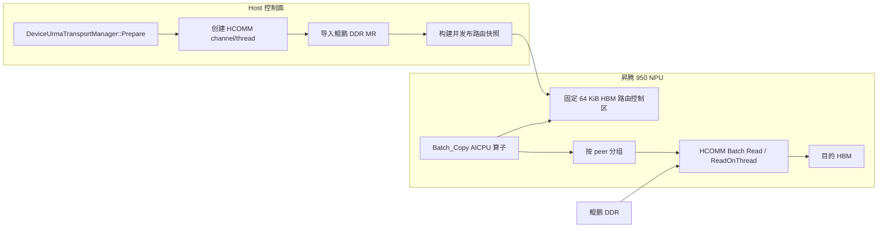
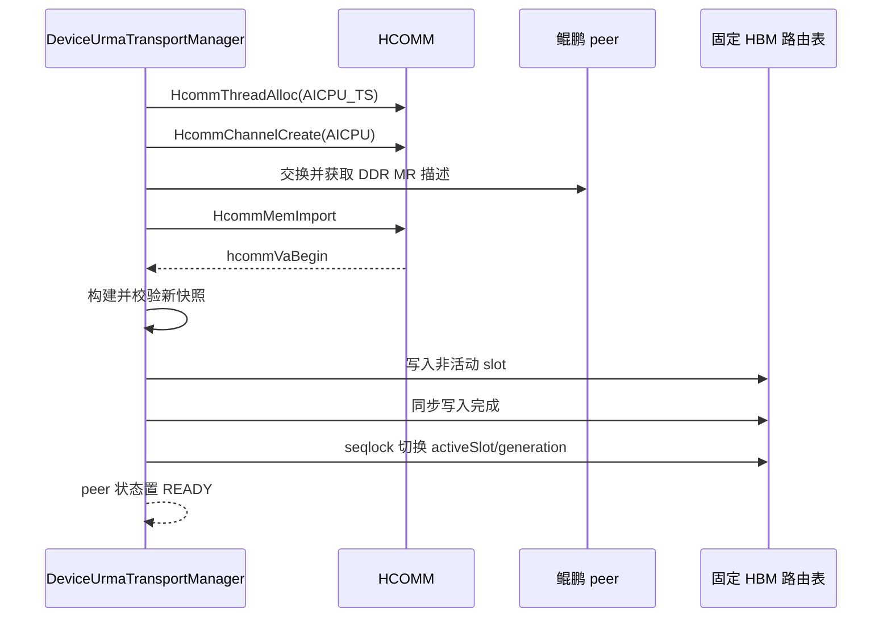

# 鲲鹏 DDR 到昇腾 950 HBM 的 Batch_Copy AICPU 算子技术方案

**Authors:** MemFabric Hybrid URMA Maintainers

**Created:** 2026-07-15

**Updated:** 2026-07-15

**Status:** Draft

**Related Issue/PR:** 无

---

# 1. 概述

## 1.1 简介

本方案面向鲲鹏服务器与昇腾 950 NPU 组成的超节点，为卡侧发起的 URMA 读提供
`Batch_Copy` AICPU 算子。算子逻辑输入为鲲鹏 DDR 源地址列表、昇腾 HBM 目的地址列表、
长度列表和列表元素个数，按源地址解析对应的 HCOMM `channel/thread`，将远端鲲鹏 DDR
数据批量读取到本地 NPU HBM。

方案在每张 NPU 上维护一份只由 MemFabric 控制面写入的 HBM 路由表。URMA 建链和远端
内存导入成功后，Host 侧把 CPU peer、地址区间、地址转换关系及 `channel/thread` 发布到
固定 HBM 控制区。AICPU 算子不接收内部通信句柄，而是从固定控制区读取一致性快照，按
CPU peer 对 batch 分组，然后调用 `HcommBatchTransferOnThread`；接口不支持时回退到
`HcommReadOnThread`。

## 1.2 动机

当前仓库已经具备以下基础能力：

- `DeviceUrmaTransportManager::Prepare()` 为每个远端 peer 创建一个 AICPU HCOMM thread 和 channel。
- `ImportRemoteMemKeysLocked()` 保存远端原始地址区间及 `HcommMemImport()` 返回的本地可访问视图。
- `HybmBatchRead` 接收 Host 传入的单个 `thread/channel`，调用 HCOMM 完成批量读。
- HYBM 已在 NPU SVM 尾部维护固定虚拟地址控制区。

现有 `HybmBatchRead` 一次只面向一个已由 Host 选定的 peer，而且通信句柄属于算子入参。
当 Batch_Copy 从图或其他卡侧流程直接发起时，Host 不应参与每次数据面的 peer 选择，也不应
把内部 HCOMM 句柄暴露给调用者。若不增加卡侧路由能力，调用方必须拆 batch、查询 peer、取得
句柄并逐次拉起算子，无法满足纯卡侧发起和跨 CPU peer 批处理的目标。

## 1.3 目标与非目标

### 目标

- 新增 `Batch_Copy` AICPU 算子，仅暴露三组列表和列表元素个数。
- 支持一张 NPU 与最多 16 个鲲鹏 CPU peer 建立 URMA 通信。
- 支持 16 张 NPU、8 台双路鲲鹏服务器，即 16 个 CPU peer 的超节点规模。
- 建链成功后自动把地址范围与 `channel/thread` 的对应关系发布到 HBM。
- 单次 batch 可包含来自不同 CPU peer 的源地址，由算子完成查表、分组和传输。
- 保持现有 `HybmBatchRead`、`HybmBatchWrite` 及 Host 侧数据面接口兼容。
- 对参数错误、路由缺失、句柄失效、HCOMM 失败和完成超时提供可定位的 ERROR 日志。

### 非目标

- 本阶段不提供 NPU HBM 到鲲鹏 DDR 的 Batch_Copy 写方向；继续使用现有 `HybmBatchWrite`。
- 不支持非昇腾 950 NPU、非鲲鹏 CPU 或非 URMA/HCOMM 数据通路。
- 不在算子中动态建链、注册内存或导入远端内存。
- 不允许把远端进程的普通本地 VA 直接当作可路由地址；源地址必须是超节点内唯一的
  MemFabric GVA。若上游只能提供可能重叠的远端本地 VA，接口必须增加 peer/rank 信息。
- P0 阶段不支持同一张 NPU 上多个 Batch_Copy 实例并发执行。

---

# 2. 用例分析

## 2.1 核心用例

| 用例 | 功能要求 | 验收重点 |
| --- | --- | --- |
| 单 CPU 单地址 | 从一个鲲鹏 DDR 区间读取到一个 HBM 区间 | 地址转换、单条 HCOMM 读、完成语义 |
| 单 CPU 多地址 | 同一 peer 的多个离散 DDR 地址批量读取 | 优先使用 HCOMM batch，一次 fence |
| 多 CPU 混合 batch | 一个列表中包含不同 CPU peer 的地址 | 正确查表分组，每个 peer 使用自身句柄 |
| 最大拓扑 | 每张 NPU 连接 16 个 CPU peer | 表容量、句柄生命周期和 teardown |
| 动态增加内存区间 | 已建链 peer 新增远端 MR | 原子发布新表，旧表在切换前持续可用 |
| peer 移除/断链 | CPU peer 离开或连接关闭 | 先排空算子，再撤销路由和销毁句柄 |
| 异常输入 | 越界、溢出、空指针、无路由地址 | 传输前失败，不提交任何 HCOMM 请求 |

## 2.2 容量与性能指标

| 指标 | P0 设计值/目标 |
| --- | --- |
| 本地 NPU 数量 | 超节点最多 16 张；每张 NPU 独立维护路由表 |
| 远端 CPU peer | 每张 NPU 最多 16 个 |
| 远端地址区间 | 每张 NPU 最多 512 个已导入 DDR 区间 |
| 单次 batch 元素数 | 1～4096；HCOMM batch 按最多 1000 条分片提交 |
| 路由复杂度 | 地址表排序后进行二分查找，单元素为 `O(log 512)` |
| 控制面写入量 | 每次发布最多写一个 32 KiB 非活动 slot，不在数据热路径执行 |
| Host 热路径参与 | 建链后为 0；每次 Batch_Copy 不执行 Host 侧 peer 选择或地址转换 |
| 单 peer 稳态带宽 | batch ≥128 时不低于现有 `HybmBatchRead` 基线的 95% |
| 路由和分组开销 | batch=128、单条 4 KiB 时，不超过端到端耗时的 10% |

`4096` 是 P0 的安全上限，用于限制 AICPU 堆内存和最坏查表时间。若实测需要更大 batch，
应通过性能数据调整上限，而不是取消边界检查。

## 2.3 安全、可靠性与兼容性要求

- 源 GVA 的完整 `[src, src + len)` 必须落在一个 READY 路由区间内。
- 目的地址必须位于本地 HBM 有效范围，且不得覆盖 MemFabric 固定控制区。
- 地址加法必须检查 `uint64_t` 溢出，长度为 0 的条目按 no-op 跳过。
- 路由表必须包含 magic、ABI 版本、结构大小、generation、状态和数量边界。
- 表更新不得让 AICPU 观察到半写入结构；句柄销毁不得早于旧表读者退出。
- 新算子使用独立符号和配置项，旧算子 ABI、固定元数据地址及 user extra context 地址不变。
- 根错误必须记录 peer rank、地址、长度、channel、thread、batch index 和返回码中的相关字段。

---

# 3. 方案设计

## 3.1 总体方案

### 3.1.1 架构



控制面负责资源创建、远端 MR 导入和路由发布；数据面只读路由表并使用已发布资源。
每张 NPU 的路由表最多记录 16 个 CPU peer。16 张 NPU 各自持有本地句柄，因此系统最多
存在 16 × 16 组 NPU 到 CPU 的 channel/thread 关系，但单张表仍只有 16 个 peer。

### 3.1.2 地址语义

`src_ddr_ptr_list` 中的元素定义为 MemFabric GVA，而不是鲲鹏进程本地 VA。
GVA 必须在超节点内唯一，且与 `RemoteRegistration::addr/size` 使用同一地址空间。

HCOMM 导入远端内存后可能返回不同的本地视图地址。路由区间同时保存：

- `srcGvaBegin/srcGvaEnd`：调用者可见的鲲鹏 DDR GVA，区间为左闭右开。
- `hcommVaBegin`：`HcommMemImport()` 返回的远端内存视图起始地址。

算子按以下公式得到 HCOMM 实际源地址：

```text
hcommSrc = hcommVaBegin + (srcGva - srcGvaBegin)
```

快照构建器只收录 `RemoteRegistration::view.type == UrmaMemoryType::HOST_DRAM` 的远端区间；
`DEVICE_HBM` 继续使用现有设备到设备数据路径，不进入 Batch_Copy DDR 路由表。

若不同 CPU peer 的源地址范围发生重叠，Host 发布前直接失败。仅凭四个输入无法区分地址
重叠的 peer，不能通过“选择第一个命中项”规避该问题。

### 3.1.3 固定 HBM 控制区

现有 `hybm_set_extra_context()` 对用户开放，不能存放内部 HCOMM 句柄。新增专用固定控制区：

```cpp
constexpr uint64_t HYBM_BATCH_COPY_ROUTE_TABLE_SIZE = 64UL * 1024UL;
constexpr uint64_t HYBM_BATCH_COPY_ROUTE_TABLE_ADDR =
    HYBM_DEVICE_META_ADDR - HYBM_BATCH_COPY_ROUTE_TABLE_SIZE;
```

地址布局如下：

```text
低地址
┌──────────────────────────────────────────────┐
│ Batch_Copy 路由控制区，64 KiB（新增）         │
├──────────────────────────────────────────────┤ <- HYBM_DEVICE_META_ADDR（地址不变）
│ 现有 HYBM device meta，64 KiB                │
├──────────────────────────────────────────────┤
│ 现有 entity user context，511 × 64 KiB       │
└──────────────────────────────────────────────┘
高地址
```

现代 VMM 路径扩展固定控制内存的创建和映射范围，旧路径扩展 `HalGvaAlloc/HalGvaFree` 范围。
现有 `HYBM_DEVICE_META_ADDR`、`HYBM_DEVICE_USER_CONTEXT_ADDR` 及每个 entity 的 user context
偏移不变，避免破坏现有 AICore/AICPU 消费方。

该 64 KiB 区域由 MemFabric 独占，不通过公共内存分配或 extra context API 暴露。初始化时将
整个区域注册到本地 HCOMM endpoint，使 completion cell 可作为 HCOMM 读的本地目的地址。

### 3.1.4 路由表布局

路由控制区由一个 128 B selector 和两个 32 KiB 左右的 slot 组成：

```text
┌──────────────────────┐
│ RouteTableSelector   │ 128 B
├──────────────────────┤
│ Slot A               │ 32704 B
├──────────────────────┤
│ Slot B               │ 32704 B
└──────────────────────┘
```

每个 slot 使用固定上限，所有结构按 8 字节对齐并通过 `static_assert` 固化 ABI：

```cpp
struct alignas(8) BatchCopyRouteSlotHeader {
    uint32_t magic;
    uint16_t abiVersion;
    uint16_t headerSize;
    uint32_t slotState;
    uint32_t peerCount;
    uint32_t rangeCount;
    uint32_t peerCapacity;
    uint32_t rangeCapacity;
    uint32_t peerEntrySize;
    uint32_t rangeEntrySize;
    uint64_t generation;
    uint64_t ownerPid;
    uint32_t deviceId;
    uint32_t headerCrc32;
    uint64_t reserved[8];
};

struct alignas(8) BatchCopyPeerEntry {
    uint32_t peerRank;
    uint32_t state;
    uint64_t thread;
    uint64_t channel;
    uint64_t remoteFlagAddr;
    uint32_t remoteFlagSize;
    uint32_t flags;
    uint64_t endpointGeneration;
    uint64_t reserved[2];
};

struct alignas(8) BatchCopyRangeEntry {
    uint64_t srcGvaBegin;
    uint64_t srcGvaEnd;
    uint64_t hcommVaBegin;
    uint64_t memTag;
    uint32_t peerIndex;
    uint32_t flags;
    uint64_t reserved;
};
```

每个 slot 包含以下内容：

| 区域 | 数量 | 单项大小 | 总大小 |
| --- | ---: | ---: | ---: |
| Slot header | 1 | 128 B | 128 B |
| Peer entries | 16 | 64 B | 1024 B |
| Range entries | 512 | 48 B | 24576 B |
| Completion cells | 16 | 64 B | 1024 B |
| 预留 | - | - | 5952 B |

Range entries 按 `srcGvaBegin` 升序排列，发布前检查区间非空、不溢出、不重叠，并检查
`peerIndex < peerCount`。多个 MR 可指向同一 peer entry，避免重复存储句柄和完成信息。

`RouteTableSelector` 至少包含 `publishSeq`、`activeSlot`、`activeGeneration`、`inFlight`、magic 和
ABI 版本。`publishSeq` 使用 seqlock 语义：奇数表示正在切换，偶数表示稳定。AICPU 两次读取
相同的偶数序号后才能使用 slot；最多重试 3 次，仍不稳定则返回 `BM_BUSY`。

### 3.1.5 建链与路由表发布



发布遵循以下事务边界：

1. 只有 thread、channel、远端 MR 和 remote flag 全部创建/导入成功后才构建快照。
2. Host 在内存中从 `remoteRanks_` 构建完整快照，校验容量、区间和句柄后写入非活动 slot。
3. slot 写入并完成 H2D 同步后，再以 `publishSeq` 奇数/偶数协议切换 selector。
4. selector 切换成功后，新的 `Prepare()` 才对上层返回成功。
5. slot 写入或 selector 切换失败时，旧 slot 保持活动；本次新建资源按现有回滚规则释放。

P0 的所有发布操作都必须先取得生命周期锁并等待 `inFlight == 0`。双 slot 用于避免半写入和支持
发布回滚，不作为允许表更新与算子并发的 RCU 机制；这样可防止连续两次更新过早覆盖旧 slot。

更新和删除遵循不同顺序：

- 新增 MR：先导入，后发布包含新范围的快照。
- 删除 peer：先阻止新 Batch_Copy，等待在途算子完成，再发布删除该 peer 的快照，最后销毁
  channel/thread 并 unimport MR。
- Close：先将表状态改为 DRAINING 并排空算子，再清空 selector，最后释放全部 HCOMM 资源。

为了符合仓库函数长度和单一职责规范，不能继续扩展当前较长的 `Prepare()`。实现时至少拆分为：

- `PreparePeerResourcesLocked()`
- `BuildBatchCopyRouteSnapshotLocked()`
- `ValidateBatchCopyRouteSnapshot()`
- `PublishBatchCopyRouteSnapshotLocked()`
- `DrainBatchCopyOperationsLocked()`

每个新增函数不超过 50 行非空非注释代码，嵌套深度不超过 4 层。

### 3.1.6 Batch_Copy 执行流程

算子使用以下顺序处理一次调用：

1. 校验参数结构、三组列表地址和 `size`，并以原子方式取得 P0 单实例执行权。
2. 读取 selector 和活动 slot，校验 magic、ABI、状态、generation、数量和 header CRC。
3. 扫描所有输入但暂不提交传输：
   - 0 长度条目直接跳过。
   - 检查源/目的地址加长度不溢出。
   - 二分查找包含完整源区间的 range entry。
   - 校验 peer READY、thread/channel 非 0。
   - 计算 `hcommSrc`，并检查目的 HBM 地址不落入固定控制区。
4. 按 `peerIndex` 分组；组内保持输入顺序，peer 组按索引升序处理。
5. 每组优先调用 `HcommBatchTransferOnThread`，每次最多提交 1000 条 READ 描述。
6. HCOMM batch 不支持时，逐条调用 `HcommReadOnThread`；其他错误立即停止后续提交。
7. 每个已使用 peer 调用一次 `HcommChannelFenceOnThread`。
8. 将该 peer 的本地 completion cell 清零，再把已注册的 remote flag 读入 completion cell。
9. 轮询所有已使用 peer 的 completion cell，全部完成或达到 60 秒超时后返回。
10. 释放单实例执行权。

P0 使用每 peer completion cell 的原因是：现有实现只有一个 notify，混合 peer 时不同 HCOMM thread
之间不能假定完成顺序。每 peer 独立完成后再由 AICPU 汇聚，才能保证算子成功返回时所有目的 HBM
数据均可见。completion cell 的清零、DMA 可见性和轮询屏障必须使用昇腾 950/HCOMM 支持的设备侧
内存屏障，不能仅依赖 Host C++ 的 `std::atomic_thread_fence`。

所有输入在提交前完成校验，因此参数错误不会导致部分拷贝。HCOMM 提交开始后的链路错误可能造成
部分完成，算子返回失败但不回滚已写入的 HBM；调用方不得在失败后使用整个 batch 的输出。

### 3.1.7 并发和顺序语义

- P0 每张 NPU 同时只允许一个 Batch_Copy；并发调用返回 `BM_BUSY`。
- 同一 peer 内保持输入顺序，并在该 peer 最后执行 fence。
- 不同 peer 之间不承诺写入先后顺序，但成功返回时全部完成。
- 调用方不得提供相互重叠的目的 HBM 区间；P0 不做 `O(n²)` 的重叠检测。
- 路由发布、peer 删除和 Close 必须等待当前 Batch_Copy 退出。

## 3.2 技术选型

| 方案 | 优点 | 缺点 | 结论 |
| --- | --- | --- | --- |
| Host 每次传入 thread/channel | 已有实现，改动小 | Host 参与热路径；一次只能选择一个 peer；暴露内部句柄 | 不满足目标 |
| 算子增加 `src_rank_list` | 路由明确，可支持重叠远端 VA | 改变四输入要求；上游必须额外生成列表 | 作为 GVA 不唯一时的备选 |
| 从源 GVA 查询固定 HBM 路由表 | 四输入不变；支持混合 peer；无 Host 热路径 | 需要表一致性和句柄生命周期控制 | 采用 |
| 复用 `hybm_set_extra_context` | 已有 64 KiB 固定区和写接口 | 用户可覆盖；内部 ABI 与用户数据冲突 | 拒绝 |
| 新增专用固定 64 KiB 控制区 | 与用户数据隔离；算子可直接定位；ABI 可版本化 | 需要扩展固定 HBM 映射和兼容性测试 | 采用 |
| 单表原地更新 | 占用更少 | AICPU 可能读到半更新内容 | 拒绝 |
| 双 slot + seqlock | 读路径无锁；失败可保留旧表 | 多占约 32 KiB | 采用 |
| 仅线性地址表 | 实现简单 | 512 区间 × 4096 元素最坏开销较高 | 拒绝 |
| 排序地址表 + 二分查找 | 查找上界稳定，适合只读快照 | 发布时需要排序和重叠检查 | 采用 |

## 3.3 功能与性能设计

### 3.3.1 代码影响范围

| 模块 | 预期修改 |
| --- | --- |
| `src/hybm/csrc/common/` | 增加 Host/AICPU 共享的固定地址和路由表 ABI 定义 |
| `src/hybm/include/hybm_def.h` | 新增非破坏性错误码 `BM_BUSY (-11)` |
| `src/hybm/csrc/driver/` | 扩展固定 HBM 控制区的分配、映射和释放 |
| `src/hybm/csrc/transport/device/urma/` | 建链后构建/发布表，删除和 Close 时排空并撤销路由 |
| `src/hybm/ops/hybm_kernel/` | 新增 `HybmBatchCopy` 参数校验、查表、分组、HCOMM 读和完成汇聚 |
| `src/hybm/ops/hybm_kernel/libcann_hybm_kernel.ini` | 注册 `HybmBatchCopy` 函数 |
| AICPU CMake/打包 | 将新源文件和共享 ABI 头加入 `cann-hybm-compat.tar.gz` |
| `test/ut/testcase/hybm/` | 路由发布、查表、混合 peer、回滚和异常路径 UT |
| `doc/installation_aicpu_kernel.md` | 增加算子名称、版本兼容和验证方法 |

### 3.3.2 性能策略

- 路由表只在建链、MR 变化或 peer 变化时更新，不在数据热路径写入。
- AICPU 读取只包含实际 `peerCount/rangeCount` 的活动内容。
- 地址区间排序后使用二分查找；分组使用固定 16 桶，避免哈希表。
- HCOMM batch 每组最多 1000 条，沿用现有内核限制和 fallback 行为。
- 每个 peer 只执行一次 fence 和一次 completion read。
- 所有临时数组受 `size <= 4096` 限制；分配失败记录 batch size 并返回 `BM_MALLOC_FAILED`。

### 3.3.3 返回语义

| 场景 | 返回值 | 是否可能已写入部分 HBM |
| --- | --- | --- |
| 空指针、size 越界、地址溢出 | `BM_INVALID_PARAM` | 否 |
| 路由表未初始化/ABI 不匹配 | `BM_NOT_INITIALIZED` / `BM_NOT_SUPPORTED` | 否 |
| 地址未命中、peer 非 READY | `BM_NOT_CONNECTED` | 否 |
| 并发调用或表正在切换 | `BM_BUSY` | 否 |
| 临时内存不足 | `BM_MALLOC_FAILED` | 否 |
| HCOMM 提交/fence 失败 | `BM_ERROR` 或下层错误码 | 是 |
| completion 超时 | `BM_TIMEOUT` | 是 |
| 全部成功 | `BM_OK` | 是，且全部可见 |

`BM_BUSY (-11)` 为本方案新增错误码，用于区分可重试的并发冲突与不可恢复的内部错误；它只新增
返回值，不改变现有错误码数值。

## 3.4 安全隐私与 DFX 设计

### 3.4.1 安全

- HCOMM 句柄只存在于 MemFabric 专用控制区，不通过公共 API 返回。
- Host 是路由表唯一写者；算子只允许修改 completion cell 和单实例状态字段。
- AICPU 在调用 HCOMM 前校验表 ABI、数量、entry size、peer index、地址范围和句柄状态。
- 目的地址不得落入 Batch_Copy 路由区、HYBM meta 区或 entity user context 区。
- 路由发布拒绝重叠源 GVA，防止恶意或错误地址路由到错误 CPU peer。
- 表中不保存鲲鹏业务数据，只保存地址范围和通信资源元数据。

### 3.4.2 可靠性

- 双 slot 保证发布失败时仍可使用上一代完整快照。
- `generation` 和 `endpointGeneration` 防止旧 range 引用重建后的新句柄。
- peer 删除采用 drain → 撤销路由 → 销毁资源顺序，避免 use-after-free。
- Close 超时不得强制销毁仍被 AICPU 使用的句柄；返回错误并保留可诊断状态。
- 中途 HCOMM 错误记录第一个失败 item/peer，并继续完成必要的资源清理。

### 3.4.3 可维护性与可测试性

- Host 和 AICPU 共用一个无 STL、定长类型的 ABI 头文件。
- 所有结构具有 `sizeof` 和关键字段 `offsetof` 编译期断言。
- 表构建、表校验、地址查找和 peer 分组拆成纯函数，便于 Host UT 直接覆盖。
- HCOMM 调用继续使用 weak symbol/under-api mock 模式，覆盖 batch 支持与 fallback 两条路径。
- 新增函数遵守 50 行、4 层嵌套和 120 字符行宽要求。

### 3.4.4 日志与可观测性

控制面 INFO 日志至少包含：

- `deviceId`、本地 `rankId`、`peerRank`
- `channel`、`thread`、generation
- peer/range 数量和活动 slot

根错误 ERROR 日志按场景包含：

- 路由错误：`batchIndex`、`srcGva`、`length`、表 generation
- HCOMM 错误：`peerRank`、`channel`、`thread`、分片 offset/count、`ret`
- 发布错误：目标 slot、generation、peer/range 数、ACL/HAL 返回码
- 超时：`peerRank`、completion 地址、超时时间、已完成 peer bitmap

地址日志默认使用十六进制；生产环境不得打印对应内存中的业务数据。

## 3.5 编程与调用设计

### 3.5.1 编程模型基本设计

#### 开发环境

- 昇腾 950 NPU 与支持 URMA/HCOMM 的鲲鹏服务器。
- CANN/Ascend 环境由 `ASCEND_HOME_PATH` 指定。
- MemFabric 以 NPU 模式构建并启用 HCOM/RDMA。
- AICPU 算子使用现有 `script/kernel/build_ops_run.sh` 构建和打包。

#### 使用约束

- 调用前必须完成 HYBM 初始化、URMA 建链、鲲鹏 DDR 注册/导出和 NPU 侧导入。
- `src_ddr_ptr_list` 的元素必须是 MemFabric GVA。
- 三组列表本身必须位于 AICPU 可访问的设备内存。
- 目的地址必须是本地 NPU HBM，并已满足 HCOMM 本地内存访问要求。
- P0 单张 NPU 只允许一个在途 Batch_Copy。

#### 验收设计

构建和基础测试命令：

```bash
bash script/build_and_pack_run.sh --build_hcom ON --build_hcom_rdma ON
bash script/kernel/build_ops_run.sh
bash script/run_ut.sh --fast DeviceUrmaTransportManager
```

硬件验收矩阵至少包括：

| 维度 | 取值 |
| --- | --- |
| 拓扑 | 1 NPU × 1 CPU、1 × 16、16 × 16 |
| batch size | 1、16、128、1000、4096 |
| 单条长度 | 1 B、4 KiB、64 KiB、1 MiB、4 MiB |
| 地址分布 | 单 MR、每 peer 多 MR、跨 peer 混合、区间边界 |
| HCOMM 能力 | batch 可用、batch 不支持回退单条 |
| 异常 | 断链、导入失败、表损坏、句柄失效、完成超时 |

### 3.5.2 接口定义与设计

#### 3.5.2.1 `HybmBatchCopy`

**描述：** 从一个或多个鲲鹏 CPU peer 的 DDR GVA 批量读取到本地昇腾 950 HBM。

**原型：**

```cpp
struct HybmBatchCopyParam {
    const void *const *srcDdrPtrList;
    void *const *dstHbmPtrList;
    const uint64_t *ptrLenList;
    uint32_t size;
    uint32_t reserved;
};

extern "C" uint32_t HybmBatchCopy(HybmBatchCopyParam *param);
```

`reserved` 必须为 0，用于保持 8 字节对齐和后续 ABI 扩展。逻辑上仍只有用户要求的四个输入。

**输入参数：**

| 参数 | 输入/输出 | 类型 | 说明 | 范围 |
| --- | --- | --- | --- | --- |
| `srcDdrPtrList` | 输入 | `const void *const *` | 鲲鹏 DDR MemFabric GVA 列表 | 非空，设备可访问 |
| `dstHbmPtrList` | 输入 | `void *const *` | 本地昇腾 HBM 地址列表 | 非空，不能指向控制区 |
| `ptrLenList` | 输入 | `const uint64_t *` | 每组源/目的区间的字节长度 | 元素可为 0 |
| `size` | 输入 | `uint32_t` | 三个列表的元素个数，不是字节数 | 1～4096 |

**返回值：**

| 返回值 | 说明 |
| --- | --- |
| `BM_OK` | 全部非零长度条目已完成，目的 HBM 数据可见 |
| `BM_INVALID_PARAM` | 参数、地址、长度或表项非法 |
| `BM_NOT_INITIALIZED` | 固定路由表尚未发布 |
| `BM_NOT_CONNECTED` | 源地址无 READY peer 路由 |
| `BM_BUSY` | 已有算子在途或表正切换 |
| `BM_NOT_SUPPORTED` | ABI/HCOMM 能力不兼容且无 fallback |
| `BM_MALLOC_FAILED` | AICPU 临时空间分配失败 |
| `BM_TIMEOUT` | 一个或多个 peer 未在 60 秒内完成 |
| `BM_ERROR` | HCOMM 或其他内部错误 |

其中 `BM_BUSY` 是新增的 HYBM 公共错误码，数值为 `-11`。

**异常处理：** 参数和路由错误在任何 HCOMM 提交前返回。提交后的错误可能部分写入，调用方应丢弃
本次 batch 的全部输出或按上层重试协议重新读取。

**约束：** 不支持重叠目的区间、多实例并发和 raw remote VA。

**变更说明：** 新增独立符号，不改变 `HybmBatchRead/HybmBatchWrite`。

**参考代码：**

```cpp
HybmBatchCopyParam param{};
param.srcDdrPtrList = deviceSrcGvaList;
param.dstHbmPtrList = deviceDstHbmList;
param.ptrLenList = deviceLengthList;
param.size = batchSize;

// 通过现有 AICPU kernel loader 获取 HybmBatchCopy 并在业务 stream 上拉起。
// 返回成功后，deviceDstHbmList 指向的非零长度区间均已完成写入。
```

#### 3.5.2.2 内部路由发布接口

内部接口不对 SMEM/HYBM 公共 API 暴露：

```cpp
Result PublishBatchCopyRouteSnapshotLocked();
Result DrainBatchCopyOperationsLocked(uint32_t timeoutSeconds);
```

`Prepare()`、`UpdateRankOptions()`、`RemoveRanks()` 和 `Close()` 分别在对应生命周期阶段调用。
下层失败处负责记录 ERROR 日志，上层只透传已记录的根错误时不重复打印。

### 3.5.3 编程手册设计

在现有 AICPU 安装文档和 API 文档中增加：

1. 支持平台、HCOMM/RDMA 构建开关和 run 包安装。
2. `HybmBatchCopy` 四输入语义，特别说明 `size` 为元素个数。
3. MemFabric GVA 与 raw remote VA 的区别。
4. 建链、内存注册/导入、算子拉起和 teardown 的完整示例。
5. 16 NPU × 16 CPU 容量限制、512 区间限制和单实例并发限制。
6. 错误码、部分完成语义、超时和重试建议。
7. 路由 generation、peer/channel/thread 日志的排障方法。

---

# 4. 缺点和风险

| 风险 | 影响 | 缓解措施 |
| --- | --- | --- |
| 源地址不是全局唯一 GVA | 可能路由到错误 CPU peer | 发布时拒绝重叠；确认上游地址语义；必要时改为 rank list 接口 |
| 固定 HBM 区扩展与旧版本不兼容 | Host 与 AICPU 包版本不一致时解析失败 | ABI version 校验；安装包与库版本绑定；保留原 meta/user context 地址 |
| 句柄表与资源生命周期竞态 | use-after-free、传输失败或设备异常 | 双 slot、generation、单实例锁、删除前 drain |
| 多 peer 完成语义不明确 | 算子提前返回，目的数据未完成 | P0 使用每 peer completion cell 汇聚；硬件上验证内存屏障和超时路径 |
| AICPU 轮询占用核 | 长尾或断链时占用 AICPU 资源 | 60 秒超时；后续评估 STARS 多 notify/event 聚合 |
| 4096 条临时描述占用 AICPU 堆 | 内存不足或抖动 | 固定上限、分片提交、分配失败可诊断 |
| batch 中途失败可能部分完成 | 上层误用部分数据 | 明确失败语义；成功前不对上层声明可用；提供整体重试建议 |
| 512 个区间不足 | 新 MR 无法发布 | 返回资源耗尽并打印 peer/range 数；基于真实部署数据调整布局版本 |
| P0 单实例限制影响多 stream 并发 | 吞吐受限或返回 `BM_BUSY` | 先保证正确性；后续使用 per-invocation completion workspace 扩展并发 |
| 固定地址被其他模块占用 | 初始化映射失败 | 统一由 HYBM 固定 VA 管理器预留；初始化时检测冲突并 ERROR 退出 |

迁移方面，旧调用者无需修改。只有使用新 `HybmBatchCopy` 的调用者需要安装包含该符号的新 AICPU
run 包，并确保 Host `libmf_hybm_core.so` 与设备包的路由表 ABI 一致。

---

# 5. 现有技术

本方案主要复用仓库内已有实现：

- `src/hybm/ops/hybm_kernel/hybm_batch_transfer.cc` 已实现 HCOMM batch、单条 fallback、fence 和
  remote flag 完成通知，新算子复用其 HCOMM 封装与错误处理模式。
- `src/hybm/csrc/transport/device/urma/device_urma_transport_manager.cpp` 已按 peer 保存
  `RemoteRankState`，并在导入远端 MR 后保存原始区间与 HCOMM view，可直接生成路由表。
- `src/hybm/csrc/common/hybm_define.h` 和 `src/hybm/csrc/driver/hybm_gva.cpp` 已实现固定 NPU
  VA 控制区，新路由区延续同一分配模型。
- `app/zbal` 的 AICPU workspace 固定布局表明 Host/Device 共用定长结构和 offset 的模式在仓库中
  已有实践，但其 workspace 属于 ZBAL，不作为 HYBM 路由表的存储位置。

与现有 `HybmBatchRead` 的主要差异是：当前实现由 Host 完成 peer 选择和地址转换，并把单个
`thread/channel` 放入 `HybmOneSideOpParam`；本方案将选择、转换和跨 peer 分组下沉到 AICPU。

---

# 6. 未解决问题

以下问题必须在 RFC 批准前给出结论：

- [ ] 上游确认 `src_ddr_ptr_list` 元素是 MemFabric GVA，而不是可能跨服务器重叠的 raw VA。
- [ ] HCOMM/CANN 团队确认昇腾 950 上 completion cell 清零、remote flag 写入和 AICPU 轮询所需的
      设备内存屏障；若不支持，改用每 peer STARS notify/event 聚合。
- [ ] 确认 `HcommChannelFenceOnThread` 的完成边界，明确 fence 后 remote flag read 是否覆盖该
      thread 上此前所有 batch/single read。
- [ ] 确认同一进程、同一逻辑 NPU 上是否允许多个 AI-core-initiate entity 同时拥有 URMA manager；
      若允许，需定义全局路由表的 owner/refcount 或在算子接口增加 entity 选择信息。
- [ ] 用目标硬件数据确认 P0 上限：4096 个 batch 元素、512 个远端 MR 区间、60 秒超时。
- [ ] 确认外部算子名使用需求中的 `Batch_Copy`，还是按现有命名规则发布为 `HybmBatchCopy`；本文
      建议配置/符号统一使用 `HybmBatchCopy`，文档中保留 Batch_Copy 作为功能名。
- [ ] 完成固定 64 KiB 地址区在现代 VMM、legacy GVA、多进程和异常退出重建场景下的兼容性验证。

---

# 附录

## A. 参考文件

- `src/hybm/csrc/transport/device/urma/device_urma_transport_manager.h`
- `src/hybm/csrc/transport/device/urma/device_urma_transport_manager.cpp`
- `src/hybm/csrc/transport/device/urma/hcomm_transport_manager.cpp`
- `src/hybm/ops/hybm_kernel/hybm_batch_transfer.h`
- `src/hybm/ops/hybm_kernel/hybm_batch_transfer.cc`
- `src/hybm/csrc/common/hybm_define.h`
- `src/hybm/csrc/driver/hybm_gva.cpp`
- `doc/installation_aicpu_kernel.md`

## B. 术语

| 术语 | 含义 |
| --- | --- |
| GVA | MemFabric 全局虚拟地址，在本方案中必须可唯一定位 CPU peer 和远端 MR |
| HCOMM view | `HcommMemImport()` 返回、可供本地 HCOMM 操作使用的远端内存视图 |
| peer | 一条本地 NPU 到远端鲲鹏 CPU endpoint 的通信关系 |
| route generation | 一次完整路由快照的单调递增版本号 |
| completion cell | 每个 peer 的本地 HBM 完成标记，由 remote flag read 写入 |
| drain | 停止新提交并等待所有在途 Batch_Copy 完成 |

## C. 文档更新计划

RFC 决策完成后同步更新：

- `doc/API.md`：新增算子 ABI、错误码和调用约束。
- `doc/installation_aicpu_kernel.md`：新增安装后符号检查与硬件验证步骤。
- `doc/environment_variables.md`：仅当超时或调试开关最终允许配置时新增对应变量。
