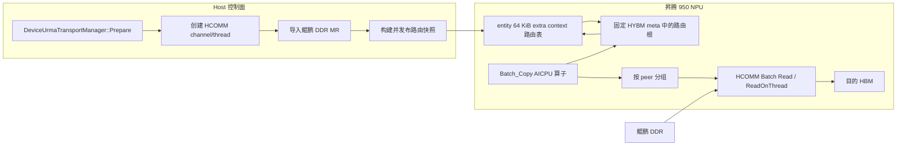
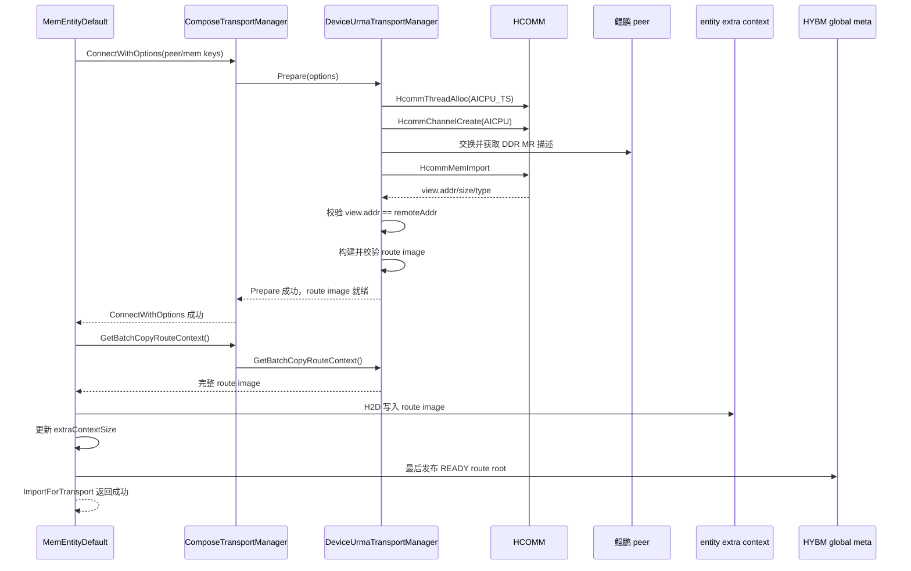
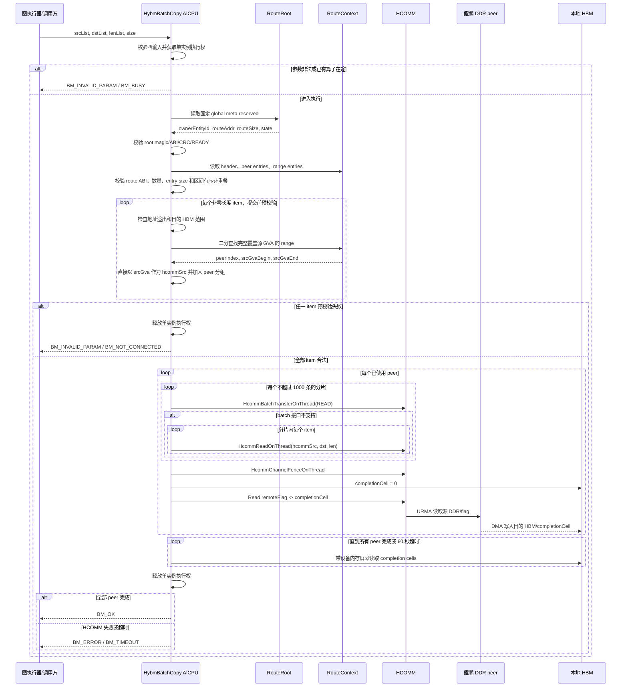

# 鲲鹏 DDR 到昇腾 950 HBM 的 Batch_Copy AICPU 算子技术方案

**Authors:** MemFabric Hybrid URMA Maintainers

**Created:** 2026-07-15

**Updated:** 2026-07-17

**Status:** Draft

**Related Issue/PR:** 无

---

# 1. 概述

## 1.1 简介

本方案面向鲲鹏服务器与昇腾 950 NPU 组成的超节点，为卡侧发起的 URMA 读提供
`Batch_Copy` AICPU 算子。算子逻辑输入为鲲鹏 DDR 源地址列表、昇腾 HBM 目的地址列表、
长度列表和列表元素个数，按源地址解析对应的 HCOMM `channel/thread`，将远端鲲鹏 DDR
数据批量读取到本地 NPU HBM。

方案在每张 NPU 上维护一份只由 MemFabric 控制面写入的 HBM 路由表。URMA 建链和远端
内存导入成功后，Host 侧把 CPU peer、地址区间、地址转换关系及 `channel/thread` 写入
Batch_Copy 所属 entity 的 64 KiB extra context，并最后发布一个固定位置的路由根描述。
AICPU 算子不接收内部通信句柄，而是通过路由根定位只读快照，按 CPU peer 对 batch 分组，
然后调用 `HcommBatchTransferOnThread`；接口不支持时回退到 `HcommReadOnThread`。


## 1.2 目标与限制

### 目标

- 新增 `Batch_Copy` AICPU 算子，仅暴露三组列表和列表元素个数。
- 支持一张 NPU 与最多 16 个鲲鹏 CPU peer 建立 URMA 通信。
- 支持 16 张 NPU、8 台双路鲲鹏服务器，即 16 个 CPU peer 的超节点规模。
- 建链成功后自动把地址范围与 `channel/thread` 的对应关系发布到 HBM。
- 单次 batch 可包含来自不同 CPU peer 的源地址，由算子完成查表、分组和传输。
- 保持现有 `HybmBatchRead`、`HybmBatchWrite` 及 Host 侧数据面接口兼容。
- 对参数错误、路由缺失、句柄失效、HCOMM 失败和完成超时提供可定位的 ERROR 日志。

### 限制

- 不在算子中动态建链、注册内存或导入远端内存。
- 不支持建链完成后动态增加内存区间，也不支持 peer 移除、主动断链或路由热更新。
- 初始化建链和路由发布串行执行，不支持初始化流程并发。
- 不支持同一张 NPU 上多个 Batch_Copy 实例并发执行。

---

# 2. 用例分析

## 2.1 核心用例

| 用例 | 功能要求 | 验收重点 |
| --- | --- | --- |
| 单 CPU 单地址 | 从一个鲲鹏 DDR 区间读取到一个 HBM 区间 | 地址转换、单条 HCOMM 读、完成语义 |
| 单 CPU 多地址 | 同一 peer 的多个离散 DDR 地址批量读取 | 优先使用 HCOMM batch，一次 fence |
| 多 CPU 混合 batch | 一个列表中包含不同 CPU peer 的地址 | 正确查表分组，每个 peer 使用自身句柄 |
| 最大拓扑 | 每张 NPU 连接 16 个 CPU peer | 表容量和初始化失败回滚 |
| 异常输入 | 越界、溢出、空指针、无路由地址 | 传输前失败，不提交任何 HCOMM 请求 |


## 2.2 安全、可靠性与兼容性要求

- 源 GVA 的完整 `[src, src + len)` 必须落在一个 READY 路由区间内。
- 目的地址必须位于本地 HBM 有效范围，且不得覆盖 HYBM meta 或任一 entity extra context。
- 地址加法必须检查 `uint64_t` 溢出，长度为 0 的条目按 no-op 跳过。
- Batch_Copy 所属 entity 的 extra context 由内部路由表独占，公共 `hybm_set_extra_context()`
  必须拒绝覆盖该 entity 的内容。
- 根错误必须记录 peer rank、地址、长度、channel、thread、batch index 和返回码中的相关字段。

---

# 3. 方案设计

## 3.1 总体方案

### 3.1.1 架构



控制面负责资源创建、远端 MR 导入和路由发布；数据面只读路由表并使用已发布资源。
每张 NPU 的路由表最多记录 16 个 CPU peer。16 张 NPU 各自持有本地句柄，因此系统最多
存在 16 × 16 组 NPU 到 CPU 的 channel/thread 关系，但单张表仍只有 16 个 peer。

### 3.1.2 地址语义

`src_ddr_ptr_list` 中的元素定义为 MemFabric GVA，而不是鲲鹏进程本地 VA。
GVA 必须在超节点内唯一，且与 `RemoteRegistration::addr/size` 使用同一地址空间。

目标场景不复用“昇腾本机 Host 内存供卡侧 URMA 访问”的 DVA 注册路径。当前
`MapSlice()` 中昇腾 950 使用 `HalMemAlloc()`，以及 `RegisterMemoryRegion()` 将 HOST_DRAM 的 HVA
转换为 DVA，都是为本机 NPU 访问 Host 内存服务；鲲鹏 DDR 作为远端源时不需要这层转换。

P0 对鲲鹏 DDR 源端采用 GVA 固定地址注册：

1. 去除目标分支中昇腾 950 强制 `HalMemAlloc()` 的行为，鲲鹏侧使用 `mmap()` 把 DDR 映射到
   `sliceAddr`；源端要求 `sliceAddr == GVA`，映射返回其他地址或失败时终止初始化。
2. 该源端路径不调用 `HalHostRegister()`，也不生成 DVA。Batch_Copy 源 DDR 注册时增加内部
   `REG_MR_FLAG_GVA_DIRECT` 标志，`HcommMemReg()` 据此直接注册 `mr.addr`，并要求 `mr.addr == GVA`；
   未设置该标志的既有 HOST_DRAM 注册继续执行 HVA→DVA 转换。
3. `QueryMemoryKey()` 导出的 `key.keys[1]` 与 HCOMM 实际注册地址使用同一个 GVA。
4. NPU 侧 `ImportRemoteMemKeysLocked()` 从 key 恢复 GVA，调用 `HcommMemImport()` 后校验
   `view.addr == remoteAddr` 且 `view.size >= remoteSize`。不相等时返回 `BM_NOT_SUPPORTED`，不发布路由。

固定地址 mmap 只适用于 GVA 落在鲲鹏进程可映射 VA 范围且地址未被占用的配置。当前
`enable56BitsGva` 路径把 GVA 与本地可访问地址分离，不能直接满足该约束；P0 应禁用该模式，或在
后续实现前提供一段经平台验证、可由鲲鹏进程固定映射的 GVA 地址窗口。

`HcommMemImport()` 的底层输出参数是 `HcommCommMem`，其中包含 `addr/size/type`。
`HcommTransportManager::HcommMemImport()` 把 `outMem.addr` 封装为 `UrmaCommMem::addr` 返回，所以接口
**会返回一个导入视图起始地址**。P0 将地址相等作为建链成功的硬性条件，而不是依赖未校验的
隐含假设。路由区间只保存调用者可见的 `srcGvaBegin/srcGvaEnd`，算子直接使用输入 GVA：

```text
hcommSrc = srcGva
```

因此 `BatchCopyRangeEntry` 删除 `hcommVaBegin`。现有通用 `RemoteIo()`/`RemoteIoBatch()` 仍可保留
`RemoteRegistration::view` 和基址加偏移逻辑，避免影响非 Batch_Copy 或非固定地址注册场景。

快照构建器只收录 `RemoteRegistration::view.type == UrmaMemoryType::HOST_DRAM` 的远端区间；
`DEVICE_HBM` 继续使用现有设备到设备数据路径，不进入 Batch_Copy DDR 路由表。

若不同 CPU peer 的源地址范围发生重叠，Host 发布前直接失败。仅凭四个输入无法区分地址
重叠的 peer，不能通过“选择第一个命中项”规避该问题。

### 3.1.3 复用 entity extra context

复用现有每 entity 64 KiB extra context：

```text
routeAddr = HYBM_DEVICE_USER_CONTEXT_ADDR
          + ownerEntityId * HYBM_DEVICE_USER_CONTEXT_PRE_SIZE
```

现有 `MemEntityDefault::SetExtraContext()` 已完成 H2D 拷贝，并通过 `UpdateHybmDeviceInfo()` 更新
`HybmDeviceMeta::extraContextSize`。Batch_Copy 复用这段拷贝和元数据更新逻辑，但该 entity 的
extra context 改为 MemFabric 内部独占；一旦启用 Batch_Copy 路由，公共
`smem_shm_set_extra_context()`/`hybm_set_extra_context()` 对该 entity 返回 `BM_NOT_SUPPORTED`，避免
用户上下文覆盖 HCOMM 句柄。P0 限制同一逻辑 NPU 只能有一个 Batch_Copy route owner entity。

AICPU 仍需从固定位置找到 owner entity。在现有 `HybmDeviceGlobalMeta::reserved` 起始处定义
64 B 路由根，不改变 128 B global meta 总大小：

```cpp
struct alignas(8) BatchCopyRouteRoot {
    uint32_t magic;
    uint16_t abiVersion;
    uint16_t rootSize;
    uint32_t state;
    uint32_t ownerEntityId;
    uint32_t activeOffset;
    uint32_t routeSize;
    uint64_t routeAddr;
    uint64_t generation;
    uint32_t rootCrc32;
    uint32_t reserved0;
    uint64_t reserved[2];
};
```

`routeAddr` 指向对应 entity extra context，P0 的 `activeOffset` 固定为 0、`generation` 固定为 1。
初始化时先完整写入 extra context，再单独写路由根并把状态置为 READY。AICPU 只在根为 READY
时读取路由内容，因此串行初始化场景不会观察到半写入表。为后续扩容保留 `activeOffset`、
`generation` 和 extra context 后 32 KiB；未来可在 ABI v2 中引入双 buffer，而不移动路由根地址。

extra context 中的 completion cell 需要作为 HCOMM 读的本地目的地址，因此在
`OpenDevice()` 创建本地 endpoint 后注册 completion 区域。注册失败则初始化失败，不发布路由根。

### 3.1.4 路由表布局

P0 去除 `RouteTableSelector`、seqlock 和双 slot。extra context 前 32 KiB 保存一份初始化期只发布
一次的路由表，后 32 KiB 保留给 ABI v2：

```text
┌────────────────────────────┐
│ BatchCopyRouteHeader       │ 128 B
├────────────────────────────┤
│ Peer entries               │ 16 × 64 B
├────────────────────────────┤
│ Range entries              │ 512 × 40 B
├────────────────────────────┤
│ Completion cells           │ 16 × 64 B
├────────────────────────────┤
│ P0 reserved                │ 10112 B
├────────────────────────────┤
│ ABI v2 reserved            │ 32768 B
└────────────────────────────┘
```

所有结构按 8 字节对齐并通过 `static_assert` 固化 ABI：

```cpp
struct alignas(8) BatchCopyRouteHeader {
    uint32_t magic;
    uint16_t abiVersion;
    uint16_t headerSize;
    uint32_t routeState;
    uint32_t peerCount;
    uint32_t rangeCount;
    uint32_t peerCapacity;
    uint32_t rangeCapacity;
    uint32_t peerEntrySize;
    uint32_t rangeEntrySize;
    uint64_t generation;
    uint64_t ownerPid;
    uint32_t deviceId;
    uint32_t headerCrc32;
    uint64_t reserved[8];
};

struct alignas(8) BatchCopyPeerEntry {
    uint32_t peerRank;
    uint32_t state;
    uint64_t thread;
    uint64_t channel;
    uint64_t remoteFlagAddr;
    uint32_t remoteFlagSize;
    uint32_t flags;
    uint64_t endpointGeneration;
    uint64_t reserved[2];
};

struct alignas(8) BatchCopyRangeEntry {
    uint64_t srcGvaBegin;
    uint64_t srcGvaEnd;
    uint64_t memTag;
    uint32_t peerIndex;
    uint32_t flags;
    uint64_t reserved;
};
```

P0 路由表包含以下内容：

| 区域 | 数量 | 单项大小 | 总大小 |
| --- | ---: | ---: | ---: |
| Route header | 1 | 128 B | 128 B |
| Peer entries | 16 | 64 B | 1024 B |
| Range entries | 512 | 40 B | 20480 B |
| Completion cells | 16 | 64 B | 1024 B |
| P0 预留 | - | - | 10112 B |
| ABI v2 预留 | - | - | 32768 B |

Range entries 按 `srcGvaBegin` 升序排列，发布前检查区间非空、不溢出、不重叠，并检查
`peerIndex < peerCount`。多个 MR 可指向同一 peer entry，避免重复存储句柄和完成信息。

P0 初始化和路由发布无并发，建链成功后不支持动态 MR、peer 移除或热更新，因此 selector 没有
解决实际竞态，反而增加状态机和失败回滚复杂度。未来若增加动态能力，在保留现有 root 的前提下，
让 `activeOffset` 指向前/后 32 KiB buffer，并升级 `abiVersion` 即可；P0 算子发现 ABI v2 时返回
`BM_NOT_SUPPORTED`，不会误读新布局。

### 3.1.5 建链与路由表发布



当前调用链是 `MemEntityDefault::ImportForTransport()` →
`TransportManager::ConnectWithOptions()` → `ComposeTransportManager::Prepare()` →
`DeviceUrmaTransportManager::Prepare()`。建议按下表修改：

| 当前文件/位置 | 修改内容 |
| --- | --- |
| `hybm_transport_common.h` | `TransportOptions` 增加 `entityId`；MR flags 增加 `REG_MR_FLAG_GVA_DIRECT` |
| `hybm_entity_default.cpp`，`InitTransManager()` | 构造参数时写入 `options.entityId = id_` |
| `hybm_conn_based_segment.cpp`，`AllocMemory()/MapSlice()` | 鲲鹏源 DDR 使用固定 GVA `mmap`，跳过 HAL 分配和 DVA 注册 |
| `hybm_entity_default.cpp`，源 DDR 注册处 | 仅 Batch_Copy 鲲鹏源 DDR 设置 `REG_MR_FLAG_GVA_DIRECT` |
| `device_urma_transport_manager.cpp`，`OpenDevice()` | 保存 `entityId`；计算 completion 区地址，并在 endpoint 创建后完成本地 HCOMM 注册 |
| 同文件，`RegisterMemoryRegion()` | GVA direct 分支直接注册 `mr.addr`；保留既有 HOST_DRAM 的 HVA→DVA 分支 |
| 同文件，`QueryMemoryKey()` | GVA direct 分支校验并导出实际注册地址，禁止再次地址转换 |
| 同文件，`ImportRemoteMemKeysLocked()` | Batch_Copy 源 MR 校验 `view.addr == remoteAddr`，不等则初始化失败 |
| 同文件，`Prepare()` | 保持现有 peer 循环语义；全部 peer 创建 thread/channel、导入 MR/flag 后构建 route image |
| `device_urma_transport_manager.{h,cpp}` | 新增 route context 构建、校验和只读获取接口 |
| `compose_transport_manager.{h,cpp}` | 将 route context 获取请求转发给 device URMA manager |
| `hybm_transport_manager.{h,cpp}` | 为内部 route context 增加默认不支持的虚接口，不改变公共 SMEM/HYBM API |
| `hybm_entity_default.cpp`，`ImportForTransport()` | 建链成功后写 route context，最后发布 READY root |
| 同文件，`SetExtraContext()` | 提取共用 H2D 拷贝 helper；Batch_Copy owner 已占用时拒绝公共覆盖 |
| 同文件，`UpdateHybmDeviceInfo()` | 沿用 `extraContextSize` 更新；新增只写 global meta reserved 的 route root helper |
| `src/hybm/csrc/common/hybm_define.h` | 增加 Host/AICPU 共享 root、header、peer/range entry 定长 ABI |

发布事务边界为：所有 peer 资源成功 → 构建并校验完整 Host image → 同步写入 extra context → 更新
entity meta → 最后写 READY root → 初始化返回成功。任一步失败都不得发布 READY root，并按现有
`Prepare()` 失败路径释放本次资源。最终 Close 只需先把 root 置 INVALID，再按现有顺序释放 HCOMM；
P0 要求调用方保证此时没有在途算子，不增加 drain/RCU 状态机。

为了符合仓库函数长度和单一职责规范，不能继续扩展当前较长的 `Prepare()`。实现时至少拆分为：

- `PreparePeerResourcesLocked()`
- `BuildBatchCopyRouteContextLocked()`
- `ValidateBatchCopyRouteContext()`
- `PublishBatchCopyRouteContext()`
- `PublishBatchCopyRouteRoot()`

每个新增函数不超过 50 行非空非注释代码，嵌套深度不超过 4 层。

### 3.1.6 Batch_Copy 执行流程

详细时序如下：



算子使用以下顺序处理一次调用：

1. 校验参数结构、三组列表地址和 `size`，并以原子方式取得 P0 单实例执行权。
2. 读取固定路由根，校验 magic、ABI、READY、owner、地址、长度和 CRC，再定位 route context。
3. 校验 route header 的 magic、ABI、状态、entry size、数量和 CRC。
4. 扫描所有输入但暂不提交传输：
   - 0 长度条目直接跳过。
   - 检查源/目的地址加长度不溢出。
   - 二分查找包含完整源区间的 range entry。
   - 校验 peer READY、thread/channel 非 0。
   - 直接使用 `srcGva` 作为 `hcommSrc`，并检查目的地址不落入 HYBM 控制区。
5. 按 `peerIndex` 分组；组内保持输入顺序，peer 组按索引升序处理。
6. 每组优先调用 `HcommBatchTransferOnThread`，每次最多提交 1000 条 READ 描述。
7. HCOMM batch 不支持时，逐条调用 `HcommReadOnThread`；其他错误立即停止后续提交。
8. 每个已使用 peer 调用一次 `HcommChannelFenceOnThread`。
9. 将该 peer 的本地 completion cell 清零，再把已注册的 remote flag 读入 completion cell。
10. 轮询所有已使用 peer 的 completion cell，全部完成或达到 60 秒超时后返回。
11. 释放单实例执行权。

P0 使用每 peer completion cell 的原因是：现有实现只有一个 notify，混合 peer 时不同 HCOMM thread
之间不能假定完成顺序。每 peer 独立完成后再由 AICPU 汇聚，才能保证算子成功返回时所有目的 HBM
数据均可见。completion cell 的清零、DMA 可见性和轮询屏障必须使用昇腾 950/HCOMM 支持的设备侧
内存屏障，不能仅依赖 Host C++ 的 `std::atomic_thread_fence`。

所有输入在提交前完成校验，因此参数错误不会导致部分拷贝。HCOMM 提交开始后的链路错误可能造成
部分完成，算子返回失败但不回滚已写入的 HBM；调用方不得在失败后使用整个 batch 的输出。

### 3.1.7 并发和顺序语义

- P0 每张 NPU 同时只允许一个 Batch_Copy；并发调用返回 `BM_BUSY`。
- 同一 peer 内保持输入顺序，并在该 peer 最后执行 fence。
- 不同 peer 之间不承诺写入先后顺序，但成功返回时全部完成。
- 调用方不得提供相互重叠的目的 HBM 区间；P0 不做 `O(n²)` 的重叠检测。
- 路由在初始化完成前发布一次，运行期不可变；P0 不处理动态 MR、peer 删除或断链并发。
- 最终 Close 前由调用方保证没有在途 Batch_Copy，然后先清除 READY root，再释放通信资源。

## 3.2 技术选型

| 方案 | 优点 | 缺点 | 结论 |
| --- | --- | --- | --- |
| Host 每次传入 thread/channel | 已有实现，改动小 | Host 参与热路径；一次只能选择一个 peer；暴露内部句柄 | 不满足目标 |
| 算子增加 `src_rank_list` | 路由明确，可支持重叠远端 VA | 改变四输入要求；上游必须额外生成列表 | 作为 GVA 不唯一时的备选 |
| 从源 GVA 查询 HBM 路由表 | 四输入不变；支持混合 peer；无 Host 热路径 | 需要保存通信资源元数据 | 采用 |
| 复用 entity extra context | 已有 64 KiB 区域和 H2D 写入流程；不改固定映射 | owner entity 不能再存用户 context | P0 采用并设为内部独占 |
| 新增专用固定 64 KiB 控制区 | 与用户 context 隔离 | 需要扩展 VMM/legacy 映射和兼容测试 | P0 不采用 |
| 单表、初始化期发布一次 | 状态机简单；符合当前无并发初始化和无动态更新约束 | 不支持运行期扩容 | P0 采用 |
| 双 slot + selector/seqlock | 可支持运行期原子切换 | P0 无对应场景，增加状态和回滚复杂度 | 留待 ABI v2 |
| 鲲鹏源 DDR 固定映射并以 GVA 注册 | 算子直接使用 GVA；range 少一个基址 | 限制 GVA 窗口；import 后必须校验地址未重定位 | P0 采用 |
| 仅线性地址表 | 实现简单 | 512 区间 × 4096 元素最坏开销较高 | 拒绝 |
| 排序地址表 + 二分查找 | 查找上界稳定，适合只读快照 | 发布时需要排序和重叠检查 | 采用 |

## 3.3 功能与性能设计

### 3.3.1 代码影响范围

| 模块 | 预期修改 |
| --- | --- |
| `src/hybm/csrc/common/` | 增加 Host/AICPU 共享的路由根和路由表 ABI 定义 |
| `src/hybm/include/hybm_def.h` | 新增非破坏性错误码 `BM_BUSY (-11)` |
| `src/hybm/csrc/entity/` | 复用 extra context 拷贝、发布 route root，并阻止 owner context 被公共 API 覆盖 |
| `src/hybm/csrc/mm/` | 鲲鹏源 DDR 使用固定 GVA mmap，并标记 GVA direct 注册模式 |
| `src/hybm/csrc/transport/` | 透传 `entityId` 和 route context 获取接口 |
| `src/hybm/csrc/transport/device/urma/` | 增加 GVA direct 注册和 import 地址校验，建链后构建路由表 |
| `src/hybm/ops/hybm_kernel/` | 新增 `HybmBatchCopy` 参数校验、查表、分组、HCOMM 读和完成汇聚 |
| `src/hybm/ops/hybm_kernel/libcann_hybm_kernel.ini` | 注册 `HybmBatchCopy` 函数 |
| AICPU CMake/打包 | 将新源文件和共享 ABI 头加入 `cann-hybm-compat.tar.gz` |
| `test/ut/testcase/hybm/` | 路由发布、查表、混合 peer、回滚和异常路径 UT |
| `doc/installation_aicpu_kernel.md` | 增加算子名称、版本兼容和验证方法 |

### 3.3.2 性能策略

- 路由表只在初始化建链完成后写入一次，不在数据热路径写入。
- AICPU 只读取实际 `peerCount/rangeCount` 对应的内容。
- 地址区间排序后使用二分查找；分组使用固定 16 桶，避免哈希表。
- HCOMM batch 每组最多 1000 条，沿用现有内核限制和 fallback 行为。
- 每个 peer 只执行一次 fence 和一次 completion read。
- 所有临时数组受 `size <= 4096` 限制；分配失败记录 batch size 并返回 `BM_MALLOC_FAILED`。

### 3.3.3 返回语义

| 场景 | 返回值 | 是否可能已写入部分 HBM |
| --- | --- | --- |
| 空指针、size 越界、地址溢出 | `BM_INVALID_PARAM` | 否 |
| 路由表未初始化/ABI 不匹配 | `BM_NOT_INITIALIZED` / `BM_NOT_SUPPORTED` | 否 |
| 地址未命中、peer 非 READY | `BM_NOT_CONNECTED` | 否 |
| 并发调用 | `BM_BUSY` | 否 |
| 临时内存不足 | `BM_MALLOC_FAILED` | 否 |
| HCOMM 提交/fence 失败 | `BM_ERROR` 或下层错误码 | 是 |
| completion 超时 | `BM_TIMEOUT` | 是 |
| 全部成功 | `BM_OK` | 是，且全部可见 |

`BM_BUSY (-11)` 为本方案新增错误码，用于区分可重试的并发冲突与不可恢复的内部错误；它只新增
返回值，不改变现有错误码数值。

## 3.4 安全隐私与 DFX 设计

P0 只保留必要防护和诊断：

- Host 是 route context 和 root 的唯一写者；AICPU 只修改 completion cells 和进程内单实例锁。
- 发布前校验源 GVA 区间非空、有序且不重叠；执行前校验 ABI、数量、entry size、peer index、
  地址溢出、目的 HBM 范围和句柄状态。
- Batch_Copy owner 的 extra context 禁止被公共 API 覆盖；表中不保存业务数据。
- 参数或路由错误必须在 HCOMM 提交前返回；提交后的错误允许部分完成，并记录第一个失败项。
- INFO 日志记录 `deviceId/rankId`、owner entity、peer/range 数；ERROR 日志按场景记录
  `peerRank`、`batchIndex`、地址/长度、`channel/thread`、HCOMM/ACL 返回码或超时 bitmap。
- Host 和 AICPU 共用定长 ABI 头并添加 `sizeof/offsetof` 断言；UT 覆盖表构建、查找、混合 peer、
  batch fallback、发布失败不置 READY 及 extra context 覆盖拒绝。

生产日志只打印地址和元数据，不读取或打印鲲鹏 DDR/HBM 中的业务内容。新增函数继续遵守 50 行、
4 层嵌套和 120 字符行宽要求。

## 3.5 编程与调用设计

### 3.5.1 编程模型基本设计

#### 开发环境

- 昇腾 950 NPU 与支持 URMA/HCOMM 的鲲鹏服务器。
- CANN/Ascend 环境由 `ASCEND_HOME_PATH` 指定。
- MemFabric 以 NPU 模式构建并启用 HCOM/RDMA。
- AICPU 算子使用现有 `script/kernel/build_ops_run.sh` 构建和打包。

#### 使用约束

- 调用前必须完成 HYBM 初始化、URMA 建链、鲲鹏 DDR 注册/导出和 NPU 侧导入。
- `src_ddr_ptr_list` 的元素必须是 MemFabric GVA。
- 三组列表本身必须位于 AICPU 可访问的设备内存。
- 目的地址必须是本地 NPU HBM，并已满足 HCOMM 本地内存访问要求。
- P0 单张 NPU 只允许一个在途 Batch_Copy。

#### 验收设计

构建和基础测试命令：

```bash
bash script/build_and_pack_run.sh --build_hcom ON --build_hcom_rdma ON
bash script/kernel/build_ops_run.sh
bash script/run_ut.sh --fast DeviceUrmaTransportManager
```

硬件验收矩阵至少包括：

| 维度 | 取值 |
| --- | --- |
| 拓扑 | 1 NPU × 1 CPU、1 × 16、16 × 16 |
| batch size | 1、16、128、1000、4096 |
| 单条长度 | 1 B、4 KiB、64 KiB、1 MiB、4 MiB |
| 地址分布 | 单 MR、每 peer 多 MR、跨 peer 混合、区间边界 |
| HCOMM 能力 | batch 可用、batch 不支持回退单条 |
| 异常 | 导入失败、表损坏、HCOMM 提交失败、完成超时 |

### 3.5.2 接口定义与设计

#### 3.5.2.1 `HybmBatchCopy`

**描述：** 从一个或多个鲲鹏 CPU peer 的 DDR GVA 批量读取到本地昇腾 950 HBM。

**原型：**

```cpp
struct HybmBatchCopyParam {
    const void *const *srcDdrPtrList;
    void *const *dstHbmPtrList;
    const uint64_t *ptrLenList;
    uint32_t size;
    uint32_t reserved;
};

extern "C" uint32_t HybmBatchCopy(HybmBatchCopyParam *param);
```

`reserved` 必须为 0，用于保持 8 字节对齐和后续 ABI 扩展。逻辑上仍只有用户要求的四个输入。

**输入参数：**

| 参数 | 输入/输出 | 类型 | 说明 | 范围 |
| --- | --- | --- | --- | --- |
| `srcDdrPtrList` | 输入 | `const void *const *` | 鲲鹏 DDR MemFabric GVA 列表 | 非空，设备可访问 |
| `dstHbmPtrList` | 输入 | `void *const *` | 本地昇腾 HBM 地址列表 | 非空，不能指向控制区 |
| `ptrLenList` | 输入 | `const uint64_t *` | 每组源/目的区间的字节长度 | 元素可为 0 |
| `size` | 输入 | `uint32_t` | 三个列表的元素个数，不是字节数 | 1～4096 |

**返回值：**

| 返回值 | 说明 |
| --- | --- |
| `BM_OK` | 全部非零长度条目已完成，目的 HBM 数据可见 |
| `BM_INVALID_PARAM` | 参数、地址、长度或表项非法 |
| `BM_NOT_INITIALIZED` | READY 路由根尚未发布 |
| `BM_NOT_CONNECTED` | 源地址无 READY peer 路由 |
| `BM_BUSY` | 已有算子在途 |
| `BM_NOT_SUPPORTED` | ABI/HCOMM 能力不兼容且无 fallback |
| `BM_MALLOC_FAILED` | AICPU 临时空间分配失败 |
| `BM_TIMEOUT` | 一个或多个 peer 未在 60 秒内完成 |
| `BM_ERROR` | HCOMM 或其他内部错误 |

其中 `BM_BUSY` 是新增的 HYBM 公共错误码，数值为 `-11`。

**异常处理：** 参数和路由错误在任何 HCOMM 提交前返回。提交后的错误可能部分写入，调用方应丢弃
本次 batch 的全部输出或按上层重试协议重新读取。

**约束：** 不支持重叠目的区间、多实例并发和 raw remote VA。

**变更说明：** 新增独立符号，不改变 `HybmBatchRead/HybmBatchWrite`。

**参考代码：**

```cpp
HybmBatchCopyParam param{};
param.srcDdrPtrList = deviceSrcGvaList;
param.dstHbmPtrList = deviceDstHbmList;
param.ptrLenList = deviceLengthList;
param.size = batchSize;

// 通过现有 AICPU kernel loader 获取 HybmBatchCopy 并在业务 stream 上拉起。
// 返回成功后，deviceDstHbmList 指向的非零长度区间均已完成写入。
```

#### 3.5.2.2 内部路由发布接口

内部接口不对 SMEM/HYBM 公共 API 暴露：

```cpp
Result GetBatchCopyRouteContext(BatchCopyRouteContext &context) const;
Result MemEntityDefault::PublishBatchCopyRouteContext(const BatchCopyRouteContext &context) noexcept;
Result MemEntityDefault::PublishBatchCopyRouteRoot(const BatchCopyRouteRoot &root) noexcept;
```

`DeviceUrmaTransportManager::Prepare()` 生成 context，`MemEntityDefault::ImportForTransport()` 在
`ConnectWithOptions()` 成功后发布。P0 的 `UpdateRankOptions()`、`RemoveRanks()` 不更新已发布表；若
Batch_Copy route 已 READY 后又请求动态拓扑变更，应对该能力返回 `BM_NOT_SUPPORTED`。最终销毁前
只清除 route root，不引入 drain 接口。下层失败处负责记录 ERROR 日志，上层只透传已记录的根错误
时不重复打印。

### 3.5.3 编程手册设计

在现有 AICPU 安装文档和 API 文档中增加：

1. 支持平台、HCOMM/RDMA 构建开关和 run 包安装。
2. `HybmBatchCopy` 四输入语义，特别说明 `size` 为元素个数。
3. MemFabric GVA 与 raw remote VA 的区别。
4. 建链、内存注册/导入、算子拉起和最终资源释放的完整示例。
5. 16 NPU × 16 CPU 容量限制、512 区间限制和单实例并发限制。
6. 错误码、部分完成语义、超时和重试建议。
7. owner entity、peer/channel/thread 和 route generation 日志的排障方法。

---

# 4. 缺点和风险

| 风险 | 影响 | 缓解措施 |
| --- | --- | --- |
| 源地址不是全局唯一 GVA | 可能路由到错误 CPU peer | 发布时拒绝重叠；确认上游地址语义；必要时改为 rank list 接口 |
| 固定 GVA mmap 失败 | 鲲鹏源 DDR 无法按 GVA 注册 | 限制并预留可映射 GVA 窗口；初始化失败且不发布路由 |
| HCOMM import 重定位地址 | 算子直接使用 GVA 会读错地址 | 建链时强制校验 `view.addr == remoteAddr`，不相等则拒绝启用 |
| extra context 与用户数据冲突 | 路由或用户上下文被覆盖 | owner entity 独占；公共 set-extra-context 返回不支持 |
| 同一 NPU 多 owner 冲突 | 固定 route root 无法选择 entity | P0 只允许一个 owner，第二个初始化失败并记录 entityId |
| Host/AICPU ABI 不匹配 | 算子误解析句柄或地址 | root/context ABI 与 CRC 校验；Host 包和 AICPU 包版本绑定 |
| 最终销毁时仍有在途算子 | use-after-free、传输失败或设备异常 | 调用方保证 quiescent；先清 READY root，再释放 HCOMM 资源 |
| 多 peer 完成语义不明确 | 算子提前返回，目的数据未完成 | P0 使用每 peer completion cell 汇聚；硬件上验证内存屏障和超时路径 |
| AICPU 轮询占用核 | 长尾或断链时占用 AICPU 资源 | 60 秒超时；后续评估 STARS 多 notify/event 聚合 |
| 4096 条临时描述占用 AICPU 堆 | 内存不足或抖动 | 固定上限、分片提交、分配失败可诊断 |
| batch 中途失败可能部分完成 | 上层误用部分数据 | 明确失败语义；成功前不对上层声明可用；提供整体重试建议 |
| 512 个区间不足 | 初始化无法发布路由 | 返回资源耗尽并打印 peer/range 数；基于真实部署数据升级布局版本 |
| P0 单实例限制影响多 stream 并发 | 吞吐受限或返回 `BM_BUSY` | 先保证正确性；后续使用 per-invocation completion workspace 扩展并发 |
| 后续动态扩容需要新状态机 | ABI v1 无法热更新 | root 预留 `activeOffset/generation`，后 32 KiB 预留给 ABI v2 双 buffer |

迁移方面，旧调用者无需修改。只有使用新 `HybmBatchCopy` 的调用者需要安装包含该符号的新 AICPU
run 包，并确保 Host `libmf_hybm_core.so` 与设备包的路由表 ABI 一致。

---

# 5. 现有技术

本方案主要复用仓库内已有实现：

- `src/hybm/ops/hybm_kernel/hybm_batch_transfer.cc` 已实现 HCOMM batch、单条 fallback、fence 和
  remote flag 完成通知，新算子复用其 HCOMM 封装与错误处理模式。
- `src/hybm/csrc/transport/device/urma/device_urma_transport_manager.cpp` 已按 peer 保存
  `RemoteRankState`，并在导入远端 MR 后保存原始区间与 HCOMM view，可直接生成路由表。
- `src/hybm/csrc/common/hybm_define.h` 和 `MemEntityDefault::SetExtraContext()` 已定义每 entity
  64 KiB 固定 user context 和 H2D 写入流程，本方案复用该空间而不扩展 driver 固定映射。
- `src/hybm/csrc/mm/hybm_conn_based_segment.cpp` 的非 56-bit 路径已经使用固定地址 `mmap()`；目标
  分支去除强制 HAL 分配后可复用该模式，使鲲鹏源端 HVA 与 GVA 相等。
- `RegisterMemoryRegion()` 现有 HVA→DVA 分支继续服务本机 NPU 访问 Host 内存；Batch_Copy 的鲲鹏
  源 DDR 增加独立 GVA direct 分支，避免改变既有场景。
- `app/zbal` 的 AICPU workspace 固定布局表明 Host/Device 共用定长结构和 offset 的模式在仓库中
  已有实践，但其 workspace 属于 ZBAL，不作为 HYBM 路由表的存储位置。

与现有 `HybmBatchRead` 的主要差异是：当前实现由 Host 完成 peer 选择和地址转换，并把单个
`thread/channel` 放入 `HybmOneSideOpParam`；本方案将选择、转换和跨 peer 分组下沉到 AICPU。

---

# 6. 未解决问题

以下问题必须在 RFC 批准前给出结论：

- [ ] HCOMM 团队确认鲲鹏 DDR 以 GVA 注册后，昇腾侧 `HcommMemImport()` 返回的 `outMem.addr`
      保持同值；无正式契约时必须通过目标硬件测试，并始终保留初始化期相等校验。
- [ ] 确认鲲鹏进程可固定 mmap 的 GVA 窗口及预留策略；P0 不启用当前会分离 GVA/HVA 的
      `enable56BitsGva` 模式。
- [ ] HCOMM/CANN 团队确认昇腾 950 上 completion cell 清零、remote flag 写入和 AICPU 轮询所需的
      设备内存屏障；若不支持，改用每 peer STARS notify/event 聚合。
- [ ] 确认 `HcommChannelFenceOnThread` 的完成边界，明确 fence 后 remote flag read 是否覆盖该
      thread 上此前所有 batch/single read。
- [ ] 确认同一进程、同一逻辑 NPU 上是否允许多个 AI-core-initiate entity 同时拥有 URMA manager；
      P0 默认第二个 Batch_Copy owner 初始化失败；若业务必须多 owner，算子接口需增加 entity 选择信息。
- [ ] 确认 Batch_Copy owner entity 的 extra context 可由 MemFabric 独占，业务不会再调用公共
      `smem_shm_set_extra_context()` 写入该 entity。
- [ ] 用目标硬件数据确认 P0 上限：4096 个 batch 元素、512 个远端 MR 区间、60 秒超时。
- [ ] 确认外部算子名使用需求中的 `Batch_Copy`，还是按现有命名规则发布为 `HybmBatchCopy`；本文
      建议配置/符号统一使用 `HybmBatchCopy`，文档中保留 Batch_Copy 作为功能名。

---

# 附录

## A. 参考文件

- `src/hybm/csrc/transport/device/urma/device_urma_transport_manager.h`
- `src/hybm/csrc/transport/device/urma/device_urma_transport_manager.cpp`
- `src/hybm/csrc/transport/device/urma/hcomm_transport_manager.cpp`
- `src/hybm/csrc/transport/hybm_transport_common.h`
- `src/hybm/csrc/transport/hybm_transport_manager.cpp`
- `src/hybm/csrc/transport/compose/compose_transport_manager.cpp`
- `src/hybm/csrc/entity/hybm_entity_default.cpp`
- `src/hybm/csrc/mm/hybm_conn_based_segment.cpp`
- `src/hybm/ops/hybm_kernel/hybm_batch_transfer.h`
- `src/hybm/ops/hybm_kernel/hybm_batch_transfer.cc`
- `src/hybm/csrc/common/hybm_define.h`
- `src/hybm/csrc/driver/hybm_gva.cpp`
- `doc/installation_aicpu_kernel.md`

## B. 术语

| 术语 | 含义 |
| --- | --- |
| GVA | MemFabric 全局虚拟地址，在本方案中必须可唯一定位 CPU peer 和远端 MR |
| HCOMM view | `HcommMemImport()` 返回、可供本地 HCOMM 操作使用的远端内存视图 |
| peer | 一条本地 NPU 到远端鲲鹏 CPU endpoint 的通信关系 |
| route generation | P0 固定为 1；为后续动态路由 ABI 预留的版本字段 |
| completion cell | 每个 peer 的本地 HBM 完成标记，由 remote flag read 写入 |

## C. 文档更新计划

RFC 决策完成后同步更新：

- `doc/API.md`：新增算子 ABI、错误码和调用约束。
- `doc/installation_aicpu_kernel.md`：新增安装后符号检查与硬件验证步骤。
- `doc/environment_variables.md`：仅当超时或调试开关最终允许配置时新增对应变量。
