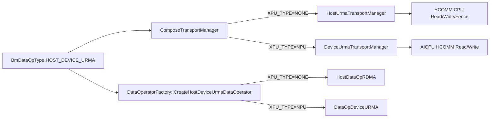
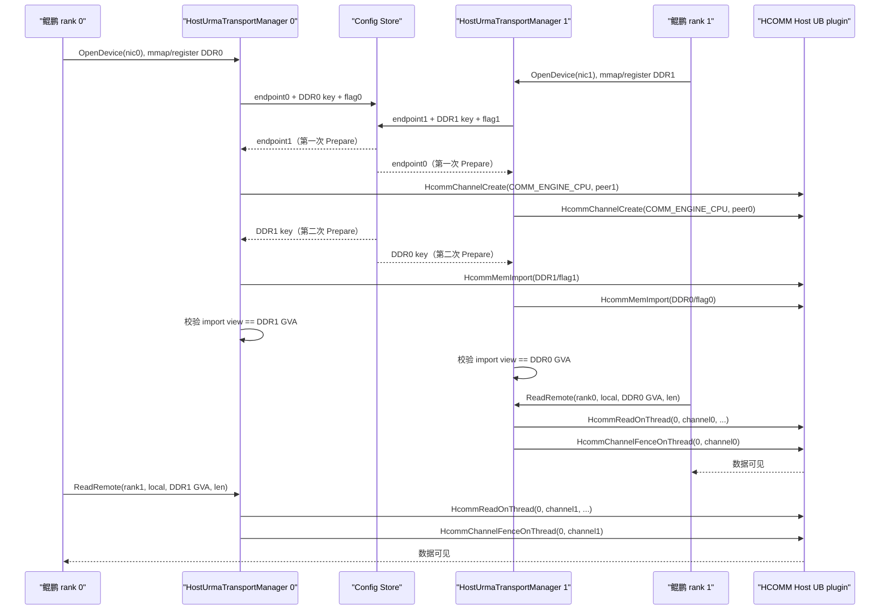
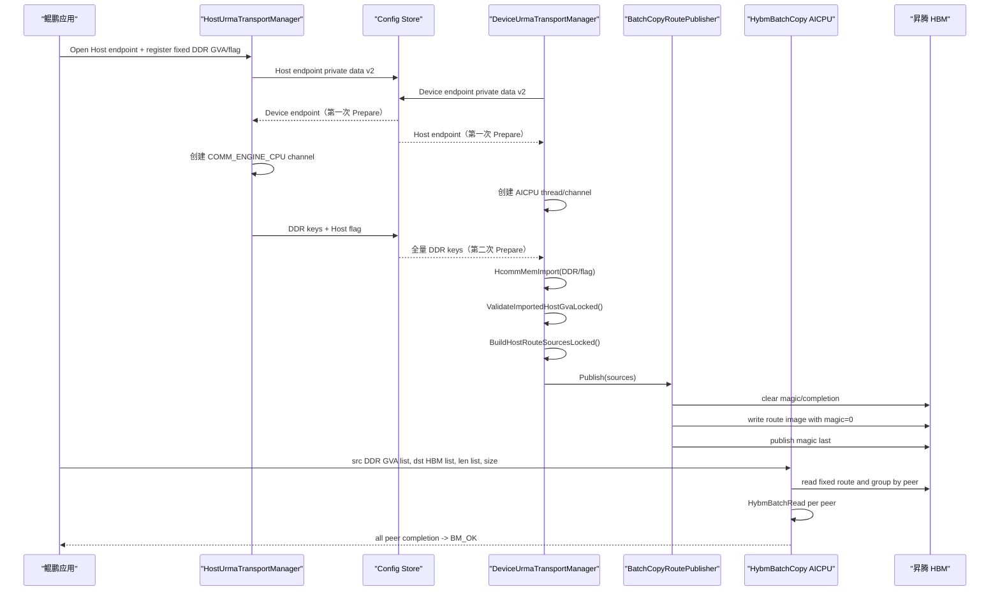

# Batch_Copy URMA 分阶段编码与验证计划

> 状态：待评审  
> 日期：2026-07-22
> 目标方案：[batch_copy_aicpu_urma_design.md](batch_copy_aicpu_urma_design.md)  
> 本文用途：指导代码实现、分阶段硬件验证和代码评审；本文中的阶段门禁优先于一次性实现全部功能。

## 1. 结论与计划调整

原计划的三类硬件环境拆分是合理的，但建议实际执行时拆成四个门禁：

1. **阶段 0：公共 HCOMM/URMA 层重构和软件测试。** 不依赖硬件，先消除 Host/Device
   重复实现及 wire format 差异。
2. **阶段 1：两台鲲鹏 Host-to-Host。** 两端都使用 `HostUrmaTransportManager`，验证 Host endpoint、
   DDR 注册/导出/导入、CPU channel、主动 Read/Write、Fence 和批量回退。
3. **阶段 2：两台昇腾 Device-to-Device 路由探针。** 使用测试专用的 Device-HBM 路由适配层，验证固定 HBM
   元数据映射、路由发布、AICPU 查表和卡间拷贝。
4. **阶段 3：鲲鹏到昇腾的完整流程。** 使用生产语义发布 Host DDR GVA 路由，运行最终
   `HybmBatchCopy`。

阶段 0 不是新增硬件阶段，而是阶段 1 开始前的编码门禁。增加它的原因是当前
`hcomm_transport_manager`、endpoint private data 和 `HcommMemImport` 处理都位于 Device 目录并含有
Device 假设；直接复制出一个 Host manager 会形成两套不一致协议。

阶段 2 不能直接把“两张 NPU 的 HBM 互拷成功”等价为最终方案成功。Device HBM 的导入地址可能是
HCOMM view，而最终路由键必须是鲲鹏 DDR 的 MemFabric GVA。阶段 2 因而使用仅在 `BUILD_TEST=ON` 时存在的
适配层，把 HCOMM view 写入同一份路由 ABI，验证发布和算子执行机械链路；阶段 3 再验证
`Host DDR GVA == HCOMM import view` 这一生产地址语义。

阶段 1 对原目标设计有一项永久补充：`HostUrmaTransportManager` 不再只是被动 DDR 导出端，它也实现
Host CPU 主动 `ReadRemote/WriteRemote`。最终鲲鹏到昇腾流程仍由 NPU 发起读取，Host 主动能力不会改变
Batch_Copy 的生产方向，但可用于独立验证、诊断和后续 Host-to-Host 场景。

## 2. 范围和约束

### 2.1 本轮实现目标

- 新增 `HOST_DEVICE_URMA` 数据操作类型，作为 HCOMM Host↔Host/Host↔Device 的共同协商协议；
  `HOST_URMA` 继续表示原有 HCOM 路径，`DEVICE_URMA` 继续表示 Device↔Device HCOMM 路径。
- 在 `XPU_TYPE=NONE` 构建中为 `HOST_DEVICE_URMA` 创建 `HostUrmaTransportManager`。
- 两台无 NPU 的鲲鹏服务器通过 HCOMM Host UB plugin 完成双向 DDR 拷贝。
- 抽取 Host/Device 共用的 endpoint、memory descriptor、private data 和 HCOMM 资源封装。
- 映射并发布 `HYBM_DEVICE_META_ADDR` 前方 2 MiB 卡级 Batch_Copy 元数据区。
- 提供测试专用的简化 AICPU 路由探针，使用两台昇腾服务器验证路由表下发与查表拷贝。
- 最终实现鲲鹏 DDR GVA 到昇腾 HBM 的 `HybmBatchCopy`。

### 2.2 P0 约束

- 初始化时一次性交换完整 peer 集合和每个 peer 的全部初始内存区间。
- 每张 NPU 最多 64 个 peer，每个 peer 最多 16 个源地址区间，总区间数最多 1024。
- 初始化完成后不新增可导出的源内存区间，不处理 peer 移除、断链或热替换；数据操作层的固定 staging
  MR 必须在建 channel 前完成注册。
- 阶段 1 每台鲲鹏只运行一个 rank；多进程共享同一 Host URMA NIC/监听端口不在本阶段验证。
- 阶段 2 的 Device-HBM 路由只存在于测试构建，不进入生产包和 Python wheel。
- 阶段 3 先验收 1 NPU × 1 CPU，再扩展到目标拓扑；不以满规格拓扑作为首轮调试环境。

## 3. 当前代码基线与关键事实

### 3.1 MemFabric 当前流程

- `ComposeTransportManager::OpenDeviceTransport()` 对 `DEVICE_URMA/DEVICE_UBOE` 固定创建
  `DeviceUrmaTransportManager`。
- `HostComposeDataOp::Initialize()` 对 `DEVICE_URMA/DEVICE_UBOE` 固定创建 `DataOpDeviceURMA`；该实现包含
  ACL、HBM swap buffer 和 AICPU kernel 启动逻辑，不能在无 NPU 的鲲鹏节点使用。
- `HostDataOpRDMA` 已经提供 Host staging buffer、GVA rank 解析和基于 `TransportManager` 的
  Read/Write/Batch 调用，可以作为 Host URMA 的数据操作层复用。
- `HybmConnBasedSegment::MapSlice()` 对 `DEVICE_URMA` 无条件执行 `HalHostRegister()`；无 NPU 构建必须跳过
  HAL，并保持固定 `mmap` 得到的 HVA 与 GVA 相同。
- `TransportMemoryKey` 的前 `6 * KEY_SIZE` slots 已用于 Device URMA 描述符，容量为 672 B；Host URMA
  的 HCOMM 描述也应走这一路径，不能放入只占 `KEY_SIZE` slots 的旧 Host HCOM 区域。
- entity 连接分两次调用 manager：第一次只有 endpoint private data，第二次带完整 memory keys。
  Host/Device manager 的 `Prepare()` 都必须对同一 endpoint 幂等，并在第二次调用时导入 key。

### 3.2 `HOST_DEVICE_URMA` 的协议语义

新增以下两个同义枚举值，保留所有既有枚举值不变：

```cpp
// src/smem/include/host/smem_bm_def.h
SMEMB_DATA_OP_HOST_DEVICE_URMA = 1U << 8,

// src/hybm/include/hybm_def.h
HYBM_DOP_TYPE_HOST_DEVICE_URMA = 1U << 10,
```

Python 暴露名为 `BmDataOpType.HOST_DEVICE_URMA`。该值不是仅在鲲鹏本地使用的 manager 开关，而是
参与 entity tag 交换和 rank-to-rank 协商的端到端协议位：

- 阶段 1 的两个 Host rank 均配置 `HOST_DEVICE_URMA`；
- 阶段 3 的鲲鹏 rank 和昇腾 rank 也均配置 `HOST_DEVICE_URMA`；
- 本端为 `XPU_TYPE=NONE` 时创建 `HostUrmaTransportManager` 和 `HostDataOpRDMA`；本端为
  `ASCEND_NPU` 时创建 `DeviceUrmaTransportManager` 和 `DataOpDeviceURMA`；
- 阶段 2 的两个 NPU rank 仍配置既有 `DEVICE_URMA`，验证原有 Device↔Device 路径；
- `HOST_URMA` 不改语义，仍进入 `HcomTransportManager`。因此 HCOMM 与 HCOM 不再依靠构建平台或
  endpoint 类型猜测，而由 DataOpType 明确区分。

实现时同步修改 SMEM 合法值掩码、SMEM→HYBM 转换、Python 枚举、HYBM 合法值/能力掩码、动态库加载、
entity tag 的字符串双向映射、Compose transport 路由和 data-operator 优先级映射。P0 禁止同时配置
`HOST_DEVICE_URMA` 与 `DEVICE_URMA/DEVICE_UBOE`，避免多个 HCOMM 协议竞争同一个
`deviceTransportManager_` 槽位；发现组合冲突时在参数校验阶段返回 `BM_INVALID_PARAM`。

### 3.3 CANN/HCOMM 源码结论

- Host UB plugin `libhcomm_cpu_ub_plugin.so` 支持 `COMM_PROTOCOL_UBC_TP` 和
  `COMM_PROTOCOL_UBC_CTP`，Host endpoint 使用 `ENDPOINT_LOC_TYPE_HOST`。
- `EndpointLoc.host.id` 是 HCOMM endpoint 的业务标识，可直接使用 MemFabric `rankId`；CANN 内部固定的
  `hostResourceId = 0` 是网卡资源索引，二者不是同一个字段。
- `CpuUrmaEndpoint` 从 `EndpointDesc.commAddr` 解析 IPv4/IPv6 地址，因此 Host manager 从现有
  `TransportOptions.nic` 解析本地 IP 即可。
- Host CPU 数据面支持 `HcommReadOnThread()`、`HcommWriteOnThread()` 和
  `HcommChannelFenceOnThread()`；Host 调用时 thread 参数未使用，传 0。
- CPU 版 `HcommBatchTransferOnThread()` 当前返回不支持。Host manager 的 batch 方法必须逐条调用
  Read/Write，并在 `Synchronize()` 中对该 peer 做一次 fence。
- UBC 的 `HcommMemImport()` 当前只填写 `outMem.addr/outMem.size`，不填写 `outMem.type`。MemFabric 必须从
  自己的导出描述符恢复类型，不能因 `outMem.type == COMM_MEM_TYPE_INVALID` 判定导入失败。
- UBC import 返回的 `outMem.addr` 来自远端导出 DTO 的注册地址。阶段 1 必须把
  `outMem.addr == exportedGva` 作为硬门禁，成功后才能保留生产路由表省略地址转换基址的设计。

## 4. 总体代码结构

```text
src/hybm/csrc/transport/
├── urma/
│   ├── urma_transport_common.h/.cpp       # 共用 wire ABI、序列化、地址/范围校验
│   └── hcomm_transport_manager.h/.cpp     # 共用 endpoint/MR export/import 封装
├── host/urma/
│   └── host_urma_transport_manager.h/.cpp # Host endpoint、CPU channel、主动数据面
├── device/urma/
│   ├── device_urma_transport_manager.h/.cpp
│   └── batch_copy_route_publisher.h/.cpp  # 卡级路由 image 构建、发布和清理
└── compose/
    └── compose_transport_manager.cpp      # 按构建平台选择 Host/Device manager
```

数据路径选择如下：



阶段 1 的 Python 用例设置 `BmDataOpType.HOST_DEVICE_URMA`，验证最终方案使用的前 672 B memory-key
wire format、private data 和 Host manager 链路；`HOST_URMA -> HCOM` 与 `DEVICE_URMA -> Device HCOMM`
的既有语义均保持不变。

## 5. 阶段 0：公共 URMA 层和软件门禁

### 5.1 共用 endpoint 描述符

将当前 `device/urma/hcomm_transport_manager.{h,cpp}` 的通用内容迁移到 `transport/urma/`，namespace
调整为 `ock::mf::transport::urma`。Device/Host manager 都只依赖公共封装。

```cpp
namespace ock::mf::transport::urma {

struct UrmaEndpointDesc {
    UrmaProtocol protocol{UrmaProtocol::RESERVED};
    CommAddrType type{COMM_ADDR_TYPE_RESERVED};
    uint8_t raws[URMA_ENDPOINT_RAW_LEN]{};
    EndpointLoc loc{};
};

struct UrmaPrivateDataDesc {
    uint32_t magic{URMA_PRIVATE_DATA_MAGIC};
    uint16_t version{URMA_PRIVATE_DATA_VERSION}; // 本次固定为 2
    uint16_t payloadLen{0};
};

Result SerializeUrmaPrivateData(const UrmaEndpointDesc &endpoint,
                                TransportPrivateData &privateData);

Result ParseUrmaPrivateData(const TransportPrivateData &privateData,
                            UrmaEndpointDesc &endpoint);

EndpointDesc ToHcommEndpointDesc(const UrmaEndpointDesc &endpoint);

} // namespace ock::mf::transport::urma
```

接口参数约定：

- `endpoint`：完整的协议、通信地址和 HCOMM `EndpointLoc`。Host 使用
  `loc.locType = ENDPOINT_LOC_TYPE_HOST`、`loc.host.id = rankId`；Device 把现有四个 device 标识写入
  `loc.device`。
- `privateData`：使用 `TransportPrivateData.key.keys` 存放 header 和 payload，序列化前整体清零。
- 解析函数必须校验 magic、version、payload 长度、总容量、协议、地址类型和 location 类型；错误日志带
  magic/version/length，返回 `BM_INVALID_PARAM`。
- 两侧增加 `std::is_trivially_copyable`、`sizeof` 和容量 `static_assert`。

### 5.2 共用内存描述符与 import 修正

`UrmaExportDesc` 保持当前 v1 布局，不增加、删除或重命名字段。普通 MR 与同一 export payload 携带的
transfer flag 使用相同的 `memoryType`；`devTransFlagDescLen` 已能表达 flag descriptor 长度，不需要新增
`flagMemoryType` 或 `payloadLen`。实现时增加 `static_assert(sizeof(UrmaExportDesc) == 48)` 固定现有 ABI。

```cpp
struct UrmaExportDesc {
    uint32_t magic{URMA_EXPORT_DESC_MAGIC};
    uint16_t version{URMA_EXPORT_DESC_VERSION}; // 保持当前值 1
    uint16_t headerSize{0};
    UrmaMemoryType memoryType{UrmaMemoryType::INVALID_BUTT};
    UrmaMemTag memTag{0};
    uint64_t addr{0};
    uint64_t size{0};
    uint32_t hcommDescLen{0};
    uint32_t devTransFlagDescLen{0};
};
```

公共封装提供以下接口：

```cpp
class HcommTransportManager final {
public:
    UrmaEndpointHandle CreateEndpoint(const UrmaEndpointDesc &desc) const;

    Result HcommMemReg(const UrmaEndpointHandle &endpoint,
                       UrmaMemTag memTag,
                       const UrmaCommMem &mem,
                       HcommMemHandle *memHandle);

    Result HcommMemUnreg(const UrmaEndpointHandle &endpoint,
                         HcommMemHandle memHandle);

    Result HcommMemExport(const UrmaEndpointHandle &endpoint,
                          HcommMemHandle memHandle,
                          const uint8_t **memDesc,
                          uint32_t *memDescLen);

    Result HcommMemImport(const UrmaEndpointHandle &endpoint,
                          const uint8_t *memDesc,
                          uint32_t descLen,
                          UrmaCommMem *commMem);

    Result HcommRawMemImport(const UrmaEndpointHandle &endpoint,
                             const uint8_t *hcommDesc,
                             uint32_t hcommDescLen,
                             UrmaMemoryType expectedType,
                             UrmaCommMem *commMem);

    Result HcommRawMemUnimport(const UrmaEndpointHandle &endpoint,
                               const uint8_t *hcommDesc,
                               uint32_t hcommDescLen);

    Result HcommMemUnimport(const UrmaEndpointHandle &endpoint,
                            const uint8_t *memDesc,
                            uint32_t descLen);
};
```

参数和行为要求：

- `HcommMemImport()` 从外层 `UrmaExportDesc.memoryType` 设置 `commMem->type`，只使用 HCOMM
  `outMem.addr/outMem.size`，并校验 descriptor 总长度、返回范围非空、无溢出且
  `outMem.size >= exportDesc.size`。该方法继续接收 `header + MR descriptor`；外层 manager 根据现有
  `devTransFlagDescLen` 定位 payload 尾部的 flag descriptor。
- `HcommRawMemImport()` 用于 transfer flag，`expectedType` 直接使用 `UrmaExportDesc.memoryType`，不能读取
  HCOMM 未填写的 `outMem.type`。
- `HcommRawMemUnimport()` 只接收 flag 的原始 HCOMM descriptor，供回滚和 Close 使用。
- import 成功后若 MemFabric 自身校验失败，必须立即调用对应 unimport 回滚。
- `HcommMemExport()` 返回的缓存仍由 endpoint 内部 `MemEntry` 持有，调用者不能释放。
- 公共层错误日志不再使用 `device_urma` 前缀，日志至少包含 API 名、memTag、addr、size、descLen 和 HCOMM
  返回码中适用的部分。

### 5.3 现有结构体和枚举变更审计

以下表格只列现有源码类型；阶段 1 manager 内部状态和阶段 2 路由表均为新增类型，不属于现有结构体改动。

| 现有类型 | 新增字段/枚举值 | 删除字段 | 必要性和兼容性结论 |
| --- | --- | --- | --- |
| `smem_bm_data_op_type` | `SMEMB_DATA_OP_HOST_DEVICE_URMA = 1U << 8` | 无 | 必须。为 Python/C API 提供独立 HCOMM Host↔Device 选择值，不能复用表示 HCOM 的 `HOST_URMA`。既有 bit 不重排。 |
| `hybm_data_op_type` | `HYBM_DOP_TYPE_HOST_DEVICE_URMA = 1U << 10` | 无 | 必须。用于 HYBM tag 协商、transport 和 data operator 路由。既有 bit 不重排；`*_BUTT` 只作为边界值，不允许落盘或跨进程交换。 |
| `UrmaEndpointDesc` | `EndpointLoc loc` | `devPhyId`、`superDevId`、`serverIdx`、`superPodIdx` | 必须。四个旧字段只能描述 Device，无法表达 Host；`EndpointLoc` 同时容纳 `host.id` 和原四个 Device 字段。保留现有 `protocol/type/raws` 名称，避免无意义重命名。private-data 版本升到 2，旧版本明确拒绝。 |
| `UrmaPrivateDataDesc` | 无 | 无 | 不改字段和字段名，只把 `URMA_PRIVATE_DATA_VERSION` 常量从 1 升到 2，因为其 payload 中的 `UrmaEndpointDesc` 布局已经改变。 |
| `UrmaExportDesc` | 无 | 无 | 不需要改。保留 v1、`memoryType`、`devTransFlagDescLen` 和 48 B 布局；普通 MR 与 flag 共用 `memoryType`，不新增 `flagMemoryType/payloadLen`。 |
| `HostDataOpRDMA` | 无 | 无 | 不需要改构造函数或成员字段。现有数据搬运已经通过初始化期注册的 swap buffer 和 `TransportManager` 工作；未进入调用链的预注册 helper 不作为本方案增加状态开关的理由。 |
| `TransportOptions`、`TransportMemoryKey` | 无 | 无 | 不需要改。DataOpType 已能选择路径；前 `6 * KEY_SIZE` 的现有 key 区足以容纳 HCOMM descriptor。 |
| `HybmDeviceGlobalMeta`、`HybmDeviceMeta` | 无 | 无 | 不需要改。Batch_Copy 使用 `HYBM_DEVICE_META_ADDR` 前方独立 2 MiB 映射和新增 route ABI，不占用现有 meta 字段。 |

实现和评审时以此表为结构布局边界。若编码中需要再修改任一现有结构体，必须先在文档补充字段级原因、
ABI/序列化影响和“不修改为何无法实现”的说明，不得顺手改名、预留字段或加入当前流程不读取的状态。

### 5.4 动态库加载

修改 `DlApi::LoadExtendLibrary(DL_EXT_LIB_DEVICE_URMA)`：

- `ASCEND_NPU` 构建依次加载 RT 和 HCOMM；HCOMM 失败时清理已加载的 RT。
- `NO_XPU` 构建只加载 HCOMM，不调用 RT/ACL/HAL API。
- 清理保持幂等，允许初始化中途失败后再次尝试。

鲲鹏部署必须能从 `${ASCEND_HOME_PATH}/hcomm_plugin/libhcomm_cpu_ub_plugin.so` 加载 Host UB plugin；独立
调试且未设置 `ASCEND_HOME_PATH` 时才使用 `HCOMM_NIC_PLUGIN_SO` 指定插件。

### 5.5 阶段 0 测试门禁

新增或迁移以下 UT：

- Host/Device private data v2 的 `UrmaEndpointDesc` 序列化、反序列化和错误版本拒绝。
- `ToHcommEndpointDesc()` 原样保留 Host/Device location。
- HCOMM import 返回 `type = INVALID` 但 addr/size 正常时，按外层描述符恢复类型并成功。
- import 返回空地址、0 长度、短于导出长度时失败并 unimport 回滚。
- 48 B export header 与 `6 * KEY_SIZE` 容量边界。
- `NO_XPU` 的 URMA loader 不调用 RT/ACL/HAL。
- 公共层迁移后现有 `DeviceUrmaTransportManager` UT 全部通过，确认没有 Device 行为回归。

建议提交边界：公共层迁移和 import 修正单独一个提交，暂不加入 Host manager，便于代码评审确认 wire ABI。

## 6. 阶段 1：HostUrmaTransportManager 与两鲲鹏验证

### 6.1 Host manager 公共接口

新增 `src/hybm/csrc/transport/host/urma/host_urma_transport_manager.h`：

```cpp
namespace ock::mf::transport::host {

class HostUrmaTransportManager final : public TransportManager {
public:
    HostUrmaTransportManager() = default;
    ~HostUrmaTransportManager() override;

    Result OpenDevice(const TransportOptions &options) override;
    Result CloseDevice() override;

    Result RegisterMemoryRegion(const TransportMemoryRegion &mr) override;
    Result UnregisterMemoryRegion(uint64_t addr) override;
    bool QueryHasRegistered(uint64_t addr, uint64_t size) override;
    Result QueryMemoryKey(uint64_t addr, TransportMemoryKey &key) override;
    void UpdateMemoryKey(TransportMemoryKey &key, void *addr) override;

    Result Prepare(const HybmTransPrepareOptions &options) override;
    Result RemoveRanks(const std::vector<uint32_t> &removedRanks) override;
    Result Connect() override;
    Result AsyncConnect() override;
    Result WaitForConnected(int64_t timeoutNs) override;
    Result UpdateRankOptions(const HybmTransPrepareOptions &options) override;
    const std::string &GetNic() const override;
    const TransportPrivateData GetPrivateData() const override;

    Result ReadRemote(uint32_t rankId,
                      uint64_t localAddr,
                      uint64_t remoteAddr,
                      uint64_t size) override;
    Result WriteRemote(uint32_t rankId,
                       uint64_t localAddr,
                       uint64_t remoteAddr,
                       uint64_t size) override;
    Result ReadRemoteAsync(uint32_t rankId,
                           uint64_t localAddr,
                           uint64_t remoteAddr,
                           uint64_t size) override;
    Result WriteRemoteAsync(uint32_t rankId,
                            uint64_t localAddr,
                            uint64_t remoteAddr,
                            uint64_t size) override;
    Result ReadRemoteBatchAsync(uint32_t rankId,
                                const CopyDescriptor &descriptor) override;
    Result WriteRemoteBatchAsync(uint32_t rankId,
                                 const CopyDescriptor &descriptor) override;
    Result Synchronize(uint32_t rankId) override;
};

} // namespace ock::mf::transport::host
```

公共方法语义：

| 方法 | 输入/输出和行为 |
| --- | --- |
| `OpenDevice(options)` | `rankId/rankCount` 必须有效；从 `options.nic` 解析本地 IPv4/IPv6；构造 Host endpoint，`loc.host.id = rankId`；创建并注册值为 1 的 8 B Host transfer flag。重复 Open 返回成功。 |
| `CloseDevice()` | 调用方保证没有在途 I/O。依次 fence 未完成 peer、销毁 channel、unimport 远端 MR/flag、注销本地 MR/flag、销毁 endpoint；汇总第一个错误但继续释放后续资源。重复 Close 返回成功。 |
| `RegisterMemoryRegion(mr)` | 只接受非空、非溢出的 Host DRAM 区间，直接以 `mr.addr` 调用 `HcommMemReg()`。固定 GVA 池区间记录 `exportedGva`；Host staging buffer 允许注册，但没有 `exportedGva`。相同区间增加引用计数，重叠但不相同的注册返回错误；已建链后首次注册新地址返回 `BM_NOT_SUPPORTED`。 |
| `QueryMemoryKey(addr, key)` | 只允许查询具有 `exportedGva` 的池区间；导出普通 MR 和 Host transfer flag，写入前 `6 * KEY_SIZE` slots；校验 export descriptor 地址等于 GVA。staging buffer 不允许导出。 |
| `UpdateMemoryKey(key, addr)` | 将 `key.keys[1]` 更新为 entity 交换所需的 GVA；同时要求地址仍落在导出描述符覆盖区间内。 |
| `Prepare(options)` | 首次调用按 peer 创建 `COMM_ENGINE_CPU` channel；本地 rank 较大时为 client，否则为 server，`exchangeAllMems=true`、port=0。同一 peer 的后续调用校验 endpoint 不变并导入新增 key。Host peer 导入 HOST_DRAM MR；Device peer只建立 channel，不导入 HBM key。一次调用失败时回滚本次新建资源和新导入项。 |
| `Connect/AsyncConnect` | HCOMM channel 在 `Prepare()` 中已经创建，方法只在所有初始 peer 已准备后设置 `connected_ = true`。 |
| `WaitForConnected(timeoutNs)` | 当前 Prepare 为同步建链；已连接返回 `BM_OK`，否则返回 `BM_NOT_CONNECTED`。`timeoutNs` 只校验合法性，不额外睡眠。 |
| `UpdateRankOptions(options)` | 完全重复的 endpoint/key 返回成功；初始化后新增 peer、新增导出区间或 endpoint 变化返回 `BM_NOT_SUPPORTED`。 |
| `RemoveRanks(removedRanks)` | P0 返回 `BM_NOT_SUPPORTED`，错误日志包含本地 rank 和首个待删除 rank。 |
| `GetNic()` | 返回 Open 时保存的 `options.nic`，供 Compose 交换。 |
| `GetPrivateData()` | 返回 v2 Host endpoint private data；未 Open 时返回全 0 并记录错误。 |
| `ReadRemoteAsync/WriteRemoteAsync` | 校验本地注册范围和远端导入范围；调用 `HcommReadOnThread(0, ...)` 或 `HcommWriteOnThread(0, ...)`；成功后标记该 peer 有 pending 请求。 |
| `ReadRemote/WriteRemote` | 先调用对应 Async 方法，再调用该 peer 的 `Synchronize()`。 |
| `ReadRemoteBatchAsync/WriteRemoteBatchAsync` | 三个 vector 长度必须相同。逐条校验后按输入顺序逐条提交；不调用 CPU 不支持的 HCOMM batch API。0 长度条目跳过。 |
| `Synchronize(rankId)` | 无 pending 时直接成功；否则调用 `HcommChannelFenceOnThread(0, channel)`，仅在 fence 成功后清除 pending。 |

### 6.2 Host manager 内部状态

```cpp
struct LocalRegistration {
    TransportMemoryRegion mr{};       // HCOMM 实际注册的 Host 地址和长度
    HcommMemHandle handle{nullptr};   // HcommMemReg 返回值
    UrmaMemTag memTag{0};             // 使用注册地址作为稳定 tag
    uint64_t exportedGva{0};          // 0 表示仅供本地 I/O，不允许 QueryMemoryKey
    uint32_t refCount{0};
};

struct RemoteRegistration {
    uint64_t exportedAddr{0};         // key.keys[1]，生产场景为远端 GVA
    uint64_t size{0};
    UrmaMemTag memTag{0};
    std::vector<uint8_t> descBytes{}; // Close 时执行 HcommMemUnimport
    UrmaCommMem view{};                // HcommMemImport 返回的可操作视图
};

struct RemoteRankState {
    std::mutex mutex{};                // 串行化同一 peer 的 submit/fence
    UrmaEndpointDesc endpointDesc{};
    HcommChannelDesc channelDesc{};
    HcommChannelHandle channel{0};
    std::vector<RemoteRegistration> imports{};
    uint64_t remoteFlagAddr{0};
    uint64_t remoteFlagSize{0};
    std::vector<uint8_t> remoteFlagDescBytes{};
    bool pending{false};
};
```

manager 级字段包括：`mutex_`、`opened_`、`rankId_`、`rankCount_`、`options_`、公共
`HcommTransportManager`、本地 endpoint、local registration map、`remoteRanks_`、Host transfer flag 指针和
handle。`remoteRanks_` 建议保存 `shared_ptr<RemoteRankState>`，数据面取得状态后不必在阻塞 fence 期间持有
manager 全局锁。

### 6.3 关键私有函数

```cpp
Result ParseHostUrmaNic(const std::string &nic,
                        CommAddrType &addressType,
                        std::array<uint8_t, URMA_ENDPOINT_RAW_LEN> &addressRaw);

Result InitLocalHostInfoLocked(const TransportOptions &options);

Result BuildLocalHostEndpointDescLocked(const TransportOptions &options,
                                        UrmaEndpointDesc &endpoint) const;

Result InitHostTransferFlagLocked();

Result FindLocalRegistrationLocked(uint64_t addr,
                                   uint64_t size,
                                   LocalRegistration *registration) const;

Result ResolveExportedGvaLocked(const TransportMemoryRegion &mr,
                                uint64_t &exportedGva) const;

Result PreparePeerLocked(uint32_t peerRank,
                         const TransportRankPrepareInfo &peerInfo,
                         RemoteRankState &state);

Result ImportRemoteMemKeysLocked(uint32_t peerRank,
                                 const std::vector<TransportMemoryKey> &memKeys,
                                 RemoteRankState &state);

Result ValidateImportedGva(uint32_t peerRank,
                           uint64_t exportedAddr,
                           uint64_t exportedSize,
                           const UrmaExportDesc &exportDesc,
                           const UrmaCommMem &view) const;

Result ResolveRemoteAddressLocked(const RemoteRankState &state,
                                  uint64_t remoteAddr,
                                  uint64_t size,
                                  uint64_t &hcommAddr) const;

Result RemoteIo(uint32_t rankId,
                uint64_t localAddr,
                uint64_t remoteAddr,
                uint64_t size,
                bool write,
                bool synchronize);

Result RemoteIoBatch(uint32_t rankId,
                     const CopyDescriptor &descriptor,
                     bool write);

Result FenceRank(RemoteRankState &state, uint32_t rankId);
```

参数要求：

- `ParseHostUrmaNic()` 复用 `NetValidator::ParseNicUrl()` 解析现有 `tcp://IP:port` 配置；用
  `inet_pton()` 把 IPv4/IPv6 写入输出，拒绝 wildcard、空 IP 和非 IP 地址。端口仍由现有 HCOMM channel
  默认值管理，不写入 endpoint private data。
- `ResolveExportedGvaLocked()` 查询 `HybmVaManager`，只有完整落在本地 rank Host GVA 分配记录内的区间才
  返回非 0 GVA；普通 torch/staging 指针返回 `exportedGva = 0` 和 `BM_OK`。
- `ValidateImportedGva()` 同时校验顶层 exported address、`UrmaExportDesc.addr/size/type` 和 import view。
  对 HOST_DRAM 要求三者起始地址相等、view 长度足够；这项失败必须回滚刚完成的 import。
- `ResolveRemoteAddressLocked()` 只查找完整覆盖 `[remoteAddr, remoteAddr + size)` 的项。阶段 1 已要求
  view 与 GVA 相等，因此 `hcommAddr = remoteAddr`，不执行基址换算。
- `RemoteIoBatch()` 先完成全部 vector 长度、地址溢出、本地范围和远端范围预校验，再提交第一条请求，
  避免参数错误造成部分写入；HCOMM 提交中途失败仍可能已有部分请求在途，保留 `pending = true`。
- 所有根错误路径按仓库规范记录 ERROR，至少带 `rankId/peerRank/localAddr/remoteAddr/size/ret` 中适用参数。

### 6.4 选择 manager 和数据操作层

#### `ComposeTransportManager`

为新增协议提供独立的 manager 创建函数：

```cpp
TransManagerPtr ComposeTransportManager::CreateHostDeviceUrmaTransportManager() const;
```

- `ASCEND_NPU` 返回 `std::make_shared<device::DeviceUrmaTransportManager>()`。
- `NO_XPU` 返回 `std::make_shared<host::HostUrmaTransportManager>()`。
- `DEVICE_URMA/DEVICE_UBOE` 的既有分支保持创建 `DeviceUrmaTransportManager`；无 NPU 构建收到这两个协议时
  返回 `BM_NOT_SUPPORTED` 并记录 protocol/rankId。
- 把 `HOST_DEVICE_URMA` 加入 `DEVICE_PROTOCOL` 掩码，使它复用 `deviceTransportManager_` 和前 6 段 key；
  这里的成员名表示现有 Compose 槽位，不表示本端一定存在 Device。
- `QueryMemoryKey/GetDevicePrepareOptions` 继续使用已有 Device URMA 的前 6 段 key 读写函数。

#### `DataOperatorFactory` 和 `HostComposeDataOp`

新增与协议位同名的工厂方法：

```cpp
static DataOperatorPtr CreateHostDeviceUrmaDataOperator(
    uint32_t rankId,
    const transport::TransManagerPtr &transportManager);
```

- `ASCEND_NPU` 返回 `DataOpDeviceURMA`。
- `NO_XPU` 使用现有构造函数返回 `HostDataOpRDMA(rankId, transportManager)`；不增加成员字段或构造参数。
  URMA 的未注册 tensor 经 `Initialize()` 时已注册、且在建 channel 前存在的 swap buffer 搬运。
- `HostComposeDataOp::Initialize()` 新增 `HOST_DEVICE_URMA` 分支调用该方法，并将返回对象放入
  `devUrmaDataOperator_`，避免改变已有优先级和路由逻辑。
- `GetPrioritedDataOperators()` 为该指针增加 `HOST_DEVICE_URMA` 映射；既有 `DEVICE_URMA/DEVICE_UBOE`
  仍由 Device 工厂创建，避免改变原路径。

### 6.5 无 NPU 的固定 GVA 映射

修改 `HybmConnBasedSegment::MapSlice()`：

- `ASCEND_NPU` 的 Device RDMA/URMA/UBOE/HOST_DEVICE_URMA 路径保留 `HalHostRegister()` 和 DVA 记录。
- `NO_XPU + HOST_DEVICE_URMA` 直接使用固定 `mmap` 返回地址；写入 VA manager 时 HVA 为 mapped、GVA 为传入
  gva、DVA 为 0。
- AddVaInfo 失败时，无 NPU 路径只回收 mmap，不调用 `HalHostUnregisterEx()`。
- 增加 UT，确认 `AllocMemory()` 返回指定 GVA、HVA 与 GVA 相等、HAL mock 未被调用。

### 6.6 阶段 1 建链与拷贝时序



### 6.7 两鲲鹏集成用例

新增：

```text
examples/memory_pool/02_scale_out/03_multi_node_host_urma_dram/
├── 03_multi_node_host_urma_dram.py
└── README.md
```

命令行接口：

```bash
python3 03_multi_node_host_urma_dram.py \
    --rank 0 \
    --head-ip 192.168.10.10 \
    --local-urma-ip 192.168.20.10
```

关键配置：

```python
cfg.rank_id = args.rank
cfg.start_store = args.rank == 0
cfg.set_nic(f"tcp://{args.local_urma_ip}:10005")

# 限制 Host URMA staging MR，避免 NO_XPU 默认 4 GiB 注册影响首轮验证。
os.environ.setdefault("MF_HYBM_RDMA_SWAP_SPACE_SIZE", "64")

handle = bm.create2(
    id=0,
    local_dram_size=ONE_GIB,
    max_dram_size=ONE_GIB,
    data_op_type=bm.BmDataOpType.HOST_DEVICE_URMA,
)
```

测试使用独立 TCP 控制 socket 做 READY/ACK，只用于消除样例中的 `sleep` 竞态，不承载待验证数据。流程：

1. rank 0 写 pattern A 到本地 GVA，发送 `RANK0_READY`。
2. rank 1 从 rank 0 GVA 执行 G2H，校验 pattern A。
3. rank 1 使用 `copy_data_batch(type=G2G)` 把 rank 0 的四个小块从不同 offset 批量读入 rank 1 本地 GVA，
   再用本地 G2H 校验；该路径必须进入 `ReadRemoteBatchAsync()`，验证逐条 HCOMM fallback 和单 fence。
4. rank 1 从本地 tensor 向 rank 0 的远端 GVA 执行 H2G，发送 `REMOTE_WRITE_DONE`；rank 0 从本地池读回
   并校验 pattern C。
5. rank 1 写 pattern B 到自己的本地 GVA，发送 `RANK1_READY`；rank 0 主动读 rank 1 并校验。
6. 两端各循环 100 次 4 MiB 读，最后 leave/destroy，确认 Close 无残留或超时。

阶段 1 必测尺寸：1 B、4 KiB、4 MiB；必测地址：区间起点、非零 offset、区间末尾恰好结束；负例包括
跨 MR 尾部、未知 rank、未注册本地地址和错误 vector 长度。吞吐数据只记录，不作为本阶段通过条件。

构建和运行前置：

```bash
bash script/build_and_pack_run.sh \
    --xpu_type NONE \
    --build_hcom ON \
    --build_hcom_rdma OFF

bash script/run_ut.sh --fast UrmaTransportManager
```

阶段 1 通过标准：

- 两端日志均显示 Host endpoint、`COMM_ENGINE_CPU` channel 和 `thread=0` 数据面。
- 每个池 MR 的 `exportedGva`、export descriptor addr、import view addr 三者相等。
- 单条 Read、单条 Write、batch fallback、fence 和双向校验全部通过。
- 初始化失败注入和正常 Close 后，MR、flag、channel、endpoint 均按逆序释放。

## 7. 阶段 2：两昇腾服务器验证路由下发与 AICPU 查表

### 7.1 为什么需要测试专用 Device 路由适配层

生产路由只接收 Host endpoint 导出的 `HOST_DRAM`，而两台昇腾互联只能提供 Device endpoint 和 HBM。
阶段 2 复用生产路由布局、发布事务和 AICPU 固定地址读取，但用测试适配层把远端 HBM 的
`HcommMemImport` view 作为源地址写入 range。该地址只在测试 operator 内消费，不对外声明为 MemFabric
GVA。

适配层满足以下隔离条件：

- 仅在 `BUILD_TEST=ON` 时编译，运行还需显式设置 `MF_HYBM_BATCH_COPY_ROUTE_PROBE=1`。
- 默认 RELEASE 和 wheel 中没有环境变量分支、probe publisher、probe operator 或 JSON 注册项。
- 不修改 `BatchCopyRouteHeader/PeerEntry/RangeEntry`，不增加扩缩容或测试字段。
- 阶段 2 的成功结论只覆盖“下发和执行链路”，不覆盖 Host GVA 地址语义。

### 7.2 路由发布类接口

新增 `batch_copy_route_publisher.{h,cpp}`，把 image 构建从 manager 生命周期中拆出，便于 UT 和测试适配：

```cpp
struct BatchCopySourceRange {
    uint64_t begin{0}; // 生产为 DDR GVA；probe 为 imported HCOMM view
    uint64_t end{0};   // 左闭右开
};

struct BatchCopyRouteSource {
    uint32_t peerRank{0};
    HcommThreadHandle thread{0};
    HcommChannelHandle channel{0};
    uint64_t remoteFlagAddr{0};
    std::vector<BatchCopySourceRange> ranges{};
};

class BatchCopyRoutePublisher final {
public:
    BatchCopyRoutePublisher(uint32_t userDeviceId,
                            const UrmaEndpointHandle &localEndpoint,
                            HcommTransportManager &hcommManager);
    ~BatchCopyRoutePublisher();

    Result Publish(const std::vector<BatchCopyRouteSource> &sources);
    Result Clear();
    bool IsPublished() const;

private:
    Result ValidateSources(const std::vector<BatchCopyRouteSource> &sources) const;
    Result BuildRouteImage(const std::vector<BatchCopyRouteSource> &sources,
                           BatchCopyRouteTable &table) const;
    Result AcquireOwner();
    void ReleaseOwner();
    Result ClearMagic();
    Result ClearCompletionArea();
    Result RegisterCompletionArea();
    Result WriteRouteImage(const BatchCopyRouteTable &table);
    Result PublishMagic();
};
```

构造参数中，`userDeviceId` 用于按逻辑卡获取唯一发布权，`localEndpoint` 用于注册固定 completion HBM，
`hcommManager` 复用当前 Device manager 已打开的 HCOMM 注册域。publisher 保存 endpoint 的 shared handle 和
manager 的非 owning 引用；Device manager 必须保证 publisher 先于公共 HCOMM manager 销毁。

`Publish()` 固定事务顺序：校验输入 → 获取每卡 owner → 清 magic → 清 completion → 注册 completion MR →
构建 image → 以 magic=0 写完整 image → 单独写 magic。任何步骤失败都保持 magic=0，回滚本次注册的
completion 和 owner。

`Clear()` 顺序：清 magic → 注销 completion → 释放 owner。析构函数只做兜底清理并记录错误，不依赖异常。

### 7.3 地址空间和结构体

阶段 2 实现现有目标设计中的固定布局：

```text
低地址
HYBM_BATCH_COPY_META_ADDR = HYBM_DEVICE_META_ADDR - 2 MiB
┌──────────────────────────────────────────────────────────┐
│ 0x0000  BatchCopyRouteHeader                 0x0040 B   │
├──────────────────────────────────────────────────────────┤
│ 0x0040  BatchCopyPeerEntry[64]               0x0800 B   │
├──────────────────────────────────────────────────────────┤
│ 0x0840  BatchCopyRangeEntry[1024]            0x8000 B   │
├──────────────────────────────────────────────────────────┤
│ 0x8840  BatchCopyCompletionArea              0x0200 B   │
├──────────────────────────────────────────────────────────┤
│ 0x8A40  未使用空间                           0x1F75C0 B │
└──────────────────────────────────────────────────────────┘
HYBM_DEVICE_META_ADDR
┌──────────────────────────────────────────────────────────┐
│ 原有 HYBM device metadata                    32 MiB      │
└──────────────────────────────────────────────────────────┘
高地址
```

共享 ABI 仍为：Header 64 B、PeerEntry 32 B、RangeEntry 32 B；64 peer、每 peer 16 range、总计 1024
range。Host 和 AICPU 编译都必须执行 `sizeof/offsetof` 静态断言。元数据映射从原 32 MiB 扩为连续 34 MiB，
映射、初始化失败回滚和 uninit 必须使用同一个 control 起点和长度。

### 7.4 Device manager 的 probe 接口

仅测试构建增加：

```cpp
#if defined(MF_BUILD_TEST)
Result DeviceUrmaTransportManager::TryPublishDeviceRouteProbeLocked();

Result DeviceUrmaTransportManager::BuildDeviceRouteProbeSourcesLocked(
    std::vector<BatchCopyRouteSource> &sources) const;

Result DeviceUrmaTransportManager::LaunchBatchCopyRouteProbeForTest(
    uint32_t peerIndex,
    uint32_t rangeIndex,
    uint64_t srcOffset,
    uint64_t dstHbm,
    uint64_t length);
#endif
```

- 只选择 location 为 Device、memory type 为 `DEVICE_HBM` 的 peer。
- `begin = remoteRegistration.view.addr`，`end = begin + remoteRegistration.view.size`。
- channel、thread、remote flag 使用当前 `RemoteRankState` 的真实导入结果。
- 所有初始 peer 的 channel/thread/MR/flag 完整后才发布；缺项返回 `BM_NOT_INITIALIZED`，magic 保持 0。
- `LaunchBatchCopyRouteProbeForTest()` 使用 manager 已加载的 AICPU binary 获取
  `HybmBatchCopyProbe` function handle，在当前 ACL stream 上追加参数、启动并同步；参数校验由 Host helper
  和 AICPU 各执行一次。该方法不出现在默认构建的 class ABI 中。
- `CloseDevice()` 必须先 `routePublisher_->Clear()`，再释放 HCOMM handle。

为避免测试代码复制当前 `load_kernel.cpp` 的私有查找逻辑，将函数句柄查询抽成通用内部接口：

```cpp
Result GetDeviceKernelFunctionHandle(aclrtBinHandle binaryHandle,
                                     const char *functionName,
                                     aclrtFuncHandle &functionHandle);
```

`binaryHandle` 必须是已成功加载的 AICPU binary；`functionName` 非空；输出 handle 在调用前清零，查找失败
记录 function name 和 ACL 返回码。现有 `LoadDeviceKernelAndGetHandles()` 和测试 launch 方法共同调用它。

### 7.5 简化 AICPU 路由探针接口

新增测试 operator，不直接接收源地址，强制从路由表取地址：

```cpp
struct HybmBatchCopyProbeParam {
    uint32_t peerIndex;       // peers[] 下标，必须小于 header.peerCount
    uint32_t rangeIndex;      // 该 peer 内的 range 序号，范围 [0, rangeCount)
    uint64_t srcOffset;       // 相对选中 range 起点的字节偏移
    void *dstHbm;             // 本地 HBM 目的地址
    uint64_t length;          // 拷贝长度，必须完整落在该 range 内
};

extern "C" uint32_t HybmBatchCopyProbe(void *args);
```

执行步骤：

1. 校验参数、route magic、peer/range 计数和固定 offsets。
2. 根据 `peerIndex` 找到 peer entry，再从该 peer 的 range 子集选择 `rangeIndex`。
3. 检查 `srcOffset + length` 无溢出且不越过 range end。
4. 从路由表取得 `thread/channel/remoteFlagAddr` 和 range begin，计算实际源地址。
5. 清零该 peer 的 completion cell，构造单条 `HybmOneSideOpParam`，复用 `HybmBatchRead()`。
6. 等待 completion 或 60 秒超时，返回 `BM_OK/BM_INVALID_PARAM/BM_TIMEOUT/BM_ERROR`。

`srcOffset`、`length`、`dstHbm` 是探针唯一业务参数；通信句柄和源地址不能由 Host 传入，否则无法证明
operator 确实读取了路由表。

### 7.6 测试构建和用例

测试构建与生产 AICPU 包完全分离：

- 顶层 `CMakeLists.txt` 在 `BUILD_TEST=ON` 时直接
  `add_subdirectory(test/integration/hybm/batch_copy_route_probe)`；不复用只在 `BUILD_UT=ON` 时进入的
  `test/CMakeLists.txt`。
- `src/hybm/csrc/CMakeLists.txt` 在 `BUILD_TEST=ON` 时仅给 `hybmm_objects` 增加
  `MF_BUILD_TEST` 编译定义；生产 core 不包含 probe 分支。
- probe 目录的 `CMakeLists.txt` 构建 `batch_copy_route_probe` 集成程序，并把生产
  `hybm_batch_transfer.cc` 与测试 `hybm_batch_copy_probe.cc` 交叉编译成独立
  `libcann_hybm_probe_kernel.so`。
- 测试 JSON 命名为 `libcann_hybm_probe_kernel.json`，只注册 `HybmBatchRead/HybmBatchWrite` 和
  `HybmBatchCopyProbe`，由测试安装脚本放入独立 probe vendor 路径。
- `load_kernel.cpp` 在 `MF_BUILD_TEST` 下允许环境变量 `MF_HYBM_AICPU_KERNEL_JSON` 指向测试 JSON；变量未设置
  时仍使用当前生产路径。默认构建中不编译该环境变量分支。
- probe JSON、source、installer 和可执行程序都位于 `test/integration`，不进入 `_ops`、
  `_AICPU_WLIST` 或默认 wheel。

新增：

```text
test/integration/hybm/batch_copy_route_probe/
├── CMakeLists.txt
├── README.md
├── batch_copy_route_probe_main.cpp
├── hybm_batch_copy_probe.h
├── hybm_batch_copy_probe.cc
├── install_probe.sh
└── libcann_hybm_probe_kernel.json
```

两台昇腾各运行一个 rank：

```bash
bash script/build_and_pack_run.sh \
    --xpu_type NPU \
    --build_test ON \
    --build_hcom ON \
    --build_hcom_rdma ON
```

集成程序不经过 Python 或完整 entity，直接实例化 `DeviceUrmaTransportManager`，以 TCP 控制 socket 交换
`GetPrivateData()` 和 `QueryMemoryKey()` 的结果。这样可以精确验证 manager、publisher 和 AICPU，不为测试
增加公开 Python API。执行流程：

1. 每端设置 ACL device，创建 HBM 区间并写入可预测 pattern，再调用 manager 的
   `OpenDevice/RegisterMemoryRegion/QueryMemoryKey`。
2. 两端交换 private data/key，依次调用无 key 和带 key 的两次 `Prepare()`，在测试开关下发布 route。
3. 集成程序调用 `LaunchBatchCopyRouteProbeForTest(peerIndex=0, rangeIndex=0, ...)`。
4. 比较目的 HBM 数据；再测试非零 offset、边界长度、magic=0、非法 peer/range 和超时注入。
5. Close 后读取 route header，确认 magic 已清零，再确认 channel/thread 释放。

阶段 2 通过标准：

- Host 侧缓存的 route image 与 HBM 固定地址内容逐字节一致。
- AICPU 只凭 peer/range index 完成卡间 HBM 拷贝。
- magic 最后发布，任一注入失败均不留下有效表。
- probe 关闭后默认构建产物、JSON 和 wheel 不包含测试符号。

## 8. 阶段 3：鲲鹏到昇腾完整流程

### 8.1 生产路由源生成

鲲鹏和昇腾两端均配置 `HOST_DEVICE_URMA`，使 tag 协商结果一致；鲲鹏本地选择
`HostUrmaTransportManager`，昇腾本地选择 `DeviceUrmaTransportManager`。不能让两端分别配置
`HOST_DEVICE_URMA` 和 `DEVICE_URMA`，否则 rank-to-rank DataOpType 没有共同协议位。

在 `DeviceUrmaTransportManager` 增加：

```cpp
Result ValidateImportedHostGvaLocked(uint32_t peerRank,
                                     uint64_t exportedGva,
                                     uint64_t exportedSize,
                                     const UrmaExportDesc &exportDesc,
                                     const UrmaCommMem &view) const;

Result BuildHostRouteSourcesLocked(
    std::vector<BatchCopyRouteSource> &sources) const;

Result TryPublishBatchCopyRouteLocked();
```

生产筛选条件：

- peer endpoint location 必须为 Host。
- 普通 MR 的 `memoryType` 必须为 `HOST_DRAM`。
- `key.keys[1] == exportDesc.addr == view.addr`，且 view size 覆盖完整导出区间。
- transfer flag 类型必须为 `HOST_DRAM`、长度至少 8 B、import 地址非 0。
- 每个 peer 1～16 个非空区间；所有 peer 的 GVA 区间全局排序后不得重叠。

`TryPublishBatchCopyRouteLocked()` 只在第二次 Prepare 已导入全部固定 MR 后调用。调用
`BuildHostRouteSourcesLocked()` 后统一交给阶段 2 已验证的 `BatchCopyRoutePublisher::Publish()`，不再在 manager
里复制写 HBM 逻辑。

### 8.2 最终 `HybmBatchCopy`

生产接口沿用目标设计：

```cpp
struct HybmBatchCopyParam {
    const void *const *srcDdrPtrList;
    void *const *dstHbmPtrList;
    const uint64_t *lengthList;
    uint64_t size;
};

extern "C" uint32_t HybmBatchCopy(void *args);
```

实现顺序：一次性校验全部输入 → 读取并校验固定 route → 二分查找每个源 GVA → 按 peer 分组 → 每 peer
复用 `HybmBatchRead()` → 汇聚 completion。任一参数错误必须发生在第一条 HCOMM 请求提交之前；提交后的
HCOMM 错误允许部分 HBM 已写入，返回失败且调用方不能使用该 batch 输出。

### 8.3 完整建链与发布时序



### 8.4 硬件验收顺序

1. **1 CPU × 1 NPU，1 MR，单条 4 KiB。** 先确认 endpoint、GVA equality、route image 和一次拷贝。
2. **1 CPU × 1 NPU，多 MR/多条 batch。** 覆盖边界、1000/1001 条分片和单条 fallback。
3. **2 CPU × 1 NPU。** 验证二分查找、按 peer 分组和 completion 汇聚。
4. **多 NPU。** 每张卡独立 owner、独立 route 和并行初始化。
5. **目标拓扑。** 最多 16 NPU、16 CPU rank；64 peer/1024 range 只做规格边界测试，不要求首轮全部使用。

## 9. 文件级修改清单

| 文件或目录 | 修改内容 | 原因 |
| --- | --- | --- |
| `src/smem/include/host/smem_bm_def.h` | 追加 `SMEMB_DATA_OP_HOST_DEVICE_URMA = 1U << 8`，不改既有值 | 向 C/Python API 暴露独立 HCOMM Host↔Device 协议 |
| `src/hybm/include/hybm_def.h` | 追加 `HYBM_DOP_TYPE_HOST_DEVICE_URMA = 1U << 10`，不改既有值 | 为内部协商、transport 和 data operator 路由提供稳定 bit |
| `src/smem/csrc/smem_bm/smem_hybm_helper.h`、`smem_bm.cpp` | 增加新枚举转换、合法值/冲突掩码；无 NPU backend 的拒绝掩码允许新 bit | 保证公共 API 到 HYBM 的值完整传递，并在入口拒绝冲突组合而不是拒绝合法 Host HCOMM |
| `src/smem/csrc/smem_trans/smem_trans_entry.cpp`、两个 Python wrapper | 增加新枚举映射和 `BmDataOpType.HOST_DEVICE_URMA`；新类型不能落入现有 Device-only 编译检查 | BM 与 TRANS 入口对同一公共枚举保持一致 |
| `src/hybm/csrc/entity/hybm_entity_tag_info.cpp`、`hybm_entity_default.cpp` | 增加新协议字符串双向映射、compatible info、能力/加载/校验掩码 | 两端必须用同一新 bit 完成 tag 和 rank-to-rank 协商 |
| `src/hybm/csrc/transport/urma/` | 新增公共 endpoint/private-data/export/import 封装；接收完整 `EndpointLoc`；修正 UBC import type | Host/Device 必须共享 wire ABI，避免两套序列化和 CANN 行为判断 |
| `src/hybm/csrc/transport/device/urma/hcomm_transport_manager.*` | 内容迁移到公共目录，Device manager 更新 namespace/include | 当前文件含通用能力但路径和日志带 Device 假设 |
| `src/hybm/csrc/transport/host/urma/` | 新增 `HostUrmaTransportManager` 和 Host NIC 解析 helper | 提供无卡 Host endpoint、MR 导出以及主动 CPU 数据面 |
| `src/hybm/csrc/transport/compose/compose_transport_manager.*` | 新增 `HOST_DEVICE_URMA` 分支并按本端构建平台创建 Host/Device manager；既有 `DEVICE_URMA` 分支不改语义 | 用新协议位区分 HCOMM/HCOM，同时让异构两端协商同一 bit |
| `src/hybm/csrc/data_operation/host/hybm_data_op_factory.*` | 新增 `CreateHostDeviceUrmaDataOperator()`；无卡复用现有 `HostDataOpRDMA` 构造函数 | 避免无卡路径初始化 ACL/HBM/AICPU，且不增加无必要的类字段 |
| `src/hybm/csrc/data_operation/host/hybm_compose_data_op.*` | 增加 `HOST_DEVICE_URMA` 初始化和优先级映射；既有 Device 路径保持不变 | 根据协商 bit 选择正确 data operator |
| `src/hybm/csrc/mm/hybm_conn_based_segment.cpp`、相关 memory-type 掩码 | 无卡 `HOST_DEVICE_URMA` 固定 mmap 后直接记录 HVA/GVA、DVA=0；NPU 路径纳入原 Device 映射逻辑 | 鲲鹏 DDR 不经过本地 NPU HAL 注册，昇腾仍需 Device 地址处理 |
| `src/hybm/csrc/mm/hybm_mem_segment.cpp`、`hybm_dev_user_legacy_segment.cpp` | 在使用 Device URMA/UBOE 判断内存共享、注册或映射方式的掩码中加入新 bit | 新协议沿用前 6 段 HCOMM key 和 Device 类内存交换语义，不能误走普通共享段路径 |
| `src/hybm/csrc/transport/device/urma/device_urma_transport_manager.cpp` | endpoint protocol 解析接受新 bit 并仍选择 UBC_CTP；阶段 3 只对新 bit 的 Host peer 发布路由 | 新协议在 NPU 本端复用 Device manager，但不改变阶段 2 的 Device↔Device 语义 |
| `src/hybm/csrc/under_api/dl_api.cpp` | 无卡 URMA 只加载 HCOMM | Host manager 不依赖 RT/ACL/HAL |
| 顶层 `CMakeLists.txt` | BUILD_TEST 时单独加入 route probe integration 子目录 | 当前 `test/CMakeLists.txt` 只在 BUILD_UT 时进入，不能承载硬件集成目标 |
| `src/hybm/csrc/CMakeLists.txt`、`src/smem/csrc/CMakeLists.txt` | 增加公共 URMA 和 Host URMA include 目录；对象源仍由现有 glob 收集；BUILD_TEST 给 core 增加 `MF_BUILD_TEST` 定义 | 迁移头文件后保证 core/smem 编译路径一致，并从二进制层隔离 probe |
| `src/hybm/csrc/common/hybm_define.h` | 增加 34 MiB control 映射边界常量 | Host 发布者和 AICPU 使用同一固定地址 |
| `src/hybm/csrc/common/hybm_batch_copy_route.h` | 新增固定 route ABI 和全部 size/offset 断言 | 防止 Host/AICPU 结构布局漂移 |
| `src/hybm/csrc/driver/hybm_gva.cpp`、`src/hybm/csrc/hybm_entry.cpp` | 初始化、回滚、uninit 使用 34 MiB control 映射 | 为 `HYBM_DEVICE_META_ADDR` 前 2 MiB 提供真实 HBM |
| `src/hybm/csrc/transport/device/urma/batch_copy_route_publisher.*` | 新增纯 image 构建、owner、completion 注册和 magic-last 发布 | 生产与 probe 共用已测试的发布事务 |
| `src/hybm/csrc/transport/device/urma/device_urma_transport_manager.*` | Host GVA 校验、生产 route source；测试构建增加 Device-HBM probe source | manager 保留连接状态，publisher 负责固定表生命周期 |
| `src/hybm/csrc/transport/device/urma/load_kernel.*` | 抽出单 function handle 查询；测试构建允许指定 probe JSON | manager 复用已加载 binary 启动 probe，不复制 ACL loader |
| `src/hybm/ops/hybm_kernel/hybm_batch_copy.*` | 实现最终 list 接口、查表、分组和 completion | 完成鲲鹏 DDR 到本地 HBM 的生产算子 |
| `test/integration/hybm/batch_copy_route_probe/hybm_batch_copy_probe.*` | 测试构建实现 peer/range 索引探针 | 两 NPU 环境验证 AICPU 确实读取 route，且测试源码不随 `_ops` 进入 wheel |
| `src/hybm/ops/hybm_kernel/CMakeLists.txt`、JSON | 阶段 3 加入生产 `HybmBatchCopy`；不引用 probe 源码或 JSON | 默认 AICPU 包只包含生产能力 |
| `src/smem/python/memfabric_hybrid/setup.py` | `_AICPU_WLIST` 只加入 ops 目录之外的共享 route ABI 头；生产 operator 源随现有 `_ops` 目录整体复制 | wheel 首次 import 能构建生产算子且不携带测试源码或测试符号 |
| `examples/memory_pool/02_scale_out/03_multi_node_host_urma_dram/` | 两鲲鹏双向 Read/Write/Batch 集成样例 | 独立验证 Host manager |
| `test/integration/hybm/batch_copy_route_probe/` | 两昇腾 route/probe executable、独立 AICPU SO/JSON 和安装脚本 | 独立验证发布和 AICPU 查表，不覆盖生产 kernel 包 |
| `test/ut/testcase/hybm/transport/` | 公共 URMA、Host manager、Compose 选择、路由 publisher UT | 在硬件前覆盖错误和回滚路径 |
| `doc/installation_aicpu_kernel.md` | 增加 `HybmBatchCopy` 构建、安装和符号检查 | 保证独立 run 包与 wheel 路径一致 |

## 10. 建议的编码任务拆分

| 任务 | 内容 | 依赖 | 完成门禁 |
| --- | --- | --- | --- |
| T0.1 | 增加 `HOST_DEVICE_URMA` 全链路枚举/协商映射，迁移公共 URMA/HCOMM 层，private data v2 | 无 | 新 bit 双端协商 UT 和 Device URMA 现有 UT 无回归 |
| T0.2 | 修正普通 MR 和 flag 的 import type 处理 | T0.1 | invalid outMem.type UT 通过 |
| T1.1 | Host endpoint、flag、MR 注册/导出/清理 | T0.2 | Mock HCOMM 生命周期 UT 通过 |
| T1.2 | Host Prepare、CPU channel、幂等第二次 Prepare、rollback | T1.1 | 两阶段 Prepare UT 通过 |
| T1.3 | Host Read/Write/Fence 和 batch fallback | T1.2 | 单条/批量/错误中途 pending UT 通过 |
| T1.4 | Compose、DataOperator、MapSlice、loader 的无卡接入 | T1.3 | `XPU_TYPE=NONE` 构建和 UT 通过 |
| T1.5 | 两鲲鹏集成样例 | T1.4 | 阶段 1 硬件标准全部通过 |
| T2.1 | 34 MiB 映射和 route ABI | T1.5 | modern/legacy 初始化回滚 UT 通过 |
| T2.2 | `BatchCopyRoutePublisher` 和 magic-last | T2.1 | image/owner/失败注入 UT 通过 |
| T2.3 | BUILD_TEST Device route probe adapter | T2.2 | HBM route image 与 Host cache 一致 |
| T2.4 | `HybmBatchCopyProbe` 与两 NPU 用例 | T2.3 | 阶段 2 硬件标准全部通过 |
| T3.1 | Host GVA import equality 和生产 route source | T2.4 | 1 CPU × 1 NPU route 发布成功 |
| T3.2 | 最终 `HybmBatchCopy` | T3.1 | 单 peer 全功能通过 |
| T3.3 | 多 peer、边界和打包 | T3.2 | 阶段 3 验收矩阵通过 |

每个任务建议独立提交。T1.5 和 T2.4 的硬件测试记录应附 commit id、CANN 版本、两端 NIC、关键日志和
数据校验结果，避免后续变更无法判断曾验证的代码版本。

## 11. 测试与质量要求

### 11.1 软件测试

```bash
bash script/run_ut.sh --fast UrmaTransportManager
bash script/run_ut.sh --fast BatchCopyRoute
bash script/run_ut.sh --fast BatchCopy
bash script/ci-pre-commit-pr.sh
```

实现代码的目录组织、命名、namespace、`Result`/错误码用法、日志宏、RAII/资源回滚方式、注释语言和
测试写法必须与所在 MemFabric 模块的现有风格保持一致；不能为了本方案引入一套平行的命名或封装风格。
格式以仓库 `.clang-format` 和 pre-commit 配置为准，C++ 行宽不超过 120 字符。

新增函数尽量不超过 50 行，嵌套不超过 4 层。`Prepare()`、`Publish()`、`CloseDevice()` 必须按职责拆成
helper；不能把建链、导入、路由构建和 HBM 写入堆在一个函数中。新增错误返回路径必须由根错误层记录
ERROR 日志及真实关键参数；上层仅透传已记录错误时不重复打印。

### 11.2 失败注入

至少覆盖：endpoint 创建失败、flag 注册失败、普通 MR 注册/导出/导入失败、第二个 peer 建链失败、
第二个 MR 导入失败、channel 创建失败、Read/Write 提交失败、Fence 失败、completion 注册失败、HBM 写入
失败和 magic 发布失败。每个用例检查：

- 根错误有 ERROR 日志和关键参数。
- 本次新建资源按逆序释放，之前已经存在的幂等资源不被误删。
- 发布失败后 route magic 为 0。
- HCOMM 提交失败后 pending 状态不会被错误清除。

### 11.3 性能观测

阶段 1、2 先验证正确性，不设置硬性带宽指标，但记录：单条 4 MiB 延迟、100 次平均带宽、batch 条目数、
fallback 条数、每 peer fence 次数。若 batch 逐条提交成为 Host-to-Host 的明显瓶颈，待 CANN CPU batch API
可用后单独优化，不能在 P0 自行拼装未公开的 HCOMM 描述符。

## 12. 风险与决策点

| 风险 | 影响 | 当前处理 |
| --- | --- | --- |
| 鲲鹏 import view 不等于导出 GVA | 最终 route 无法直接使用 src GVA | 阶段 1 设硬门禁；失败则停止阶段 2 之后的生产实现，重新评审 RangeEntry 地址转换字段或固定注册地址能力 |
| Host UB plugin 未随目标 CANN 安装或未加载 | Host endpoint 创建失败 | 阶段 1 前检查插件路径和 HCOMM 启动日志，不用代码 fallback 到旧 HCOM 掩盖问题 |
| CPU HCOMM batch 不支持 | Host 批量吞吐降低 | 逐条提交、单 peer 一次 fence，正确性优先 |
| 两 NPU probe 地址不具有 GVA 语义 | 阶段 2 结论被误用 | 测试构建隔离，文档和日志标记 `DEVICE_ROUTE_PROBE`，生产发布只接受 Host DRAM |
| 34 MiB modern/legacy 映射边界不一致 | 固定 route 地址不可访问或释放错误 | T2.1 独立实现初始化/失败回滚/uninit UT，硬件先读写固定头再建链 |
| 同一卡多个 entity 竞争固定 route | 表被覆盖 | `BatchCopyRouteOwnerRegistry` 按 `userDeviceId` 单 owner，第二个发布者返回 `BM_BUSY` |
| Host 主动 I/O 与 Close 并发 | channel/MR use-after-free | P0 调用方保证 Close 前无在途；每 peer mutex 串行 submit/fence，Close 先 fence 再释放 |

## 13. 阶段完成定义

- **阶段 0 完成：** 公共 wire ABI 合并，HCOMM import 行为与 CANN 源码一致，Device 原功能无回归。
- **阶段 1 完成：** 两台鲲鹏都能主动读对端、写对端、执行 batch fallback，并证明固定 DDR
  `GVA == import view`。
- **阶段 2 完成：** 两台昇腾通过测试路由探针证明固定 HBM 表发布、AICPU 查表、真实 channel/thread 使用和
  completion 流程正确；默认产物不含 probe。
- **阶段 3 完成：** 鲲鹏 DDR GVA 经生产 route 和 `HybmBatchCopy` 拷贝到昇腾 HBM，通过单 peer、多 peer、
  边界、异常、打包和目标拓扑测试。

任何阶段未达到完成定义时，不把后续阶段的成功作为前一阶段问题的替代证明。

## 14. 实现时参考源码

MemFabric 关键基线：

- `src/hybm/csrc/transport/hybm_transport_manager.h`
- `src/hybm/csrc/transport/hybm_transport_common.h`
- `src/hybm/csrc/transport/compose/compose_transport_manager.cpp`
- `src/hybm/csrc/transport/device/urma/device_urma_transport_manager.{h,cpp}`
- `src/hybm/csrc/transport/device/urma/hcomm_transport_manager.{h,cpp}`
- `src/hybm/csrc/data_operation/host/hybm_data_op_host_rdma.cpp`
- `src/hybm/csrc/data_operation/host/hybm_data_op_device_urma.cpp`
- `src/hybm/csrc/data_operation/host/hybm_compose_data_op.cpp`
- `src/hybm/csrc/mm/hybm_conn_based_segment.cpp`
- `examples/memory_pool/02_scale_out/02_multi_node_multi_device_dram/02_multi_node_multi_device_dram.py`

CANN/HCOMM 关键依据（相对 `C:/code/cann/hcomm`）：

- `include/hcomm_res_defs.h`：`EndpointDesc/EndpointLoc/HcommChannelDesc` 定义。
- `experimental/base_comm/nic_plugin/host_ub_plugin.cc`：Host UBC_TP/UBC_CTP plugin 注册。
- `experimental/base_comm/endpoint/cpu_urma_endpoint.cc`：Host endpoint、IP 解析和 MR 接口。
- `experimental/base_comm/channel/host_cpu_urma_channel.cc`：Host URMA channel 和 fence 行为。
- `experimental/base_comm/comm_mem/urma_mem.cc`：UBC import 只写 `outMem.addr/outMem.size`。
- `src/base_comm/primitives/api_c_adpt/cpu_primitives_c_adpt.cc`：CPU Read/Write/Fence 以及 batch 不支持行为。
- `test/ut/framework/communicator/impl/independent_op/data_api_cpu/ut_cpu_HcommPluginChannelOps.cc`：
  CPU plugin 数据接口预期返回值。
