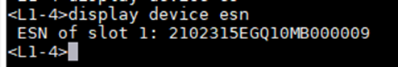
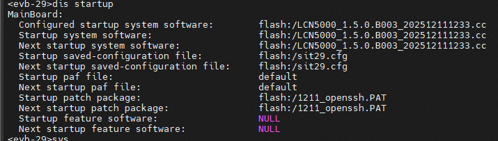

# LingQu Computing Network 安装包升级示例

> [!NOTE] 说明
> 下述步骤仅供参考，具体操作请以 [升级指导书](https://support.huawei.com/enterprise/zh/ascend-computing/lingqu-computing-network-pid-258003841) 和运维人员为准。

## 1520环境升级前检查

登录1520 L1之后，可以在1520上执行以下命令，反查L1物理设备的ESN，以便确保此L1确为待操作服务器上的交换机，查询示例结果如下：

```bash
display device esn
```



## LingQu Computing Network 安装

> [!NOTE] 说明
> 下述步骤以 **LCN5000_1.5.0.B003_202512111233** 版本为例，具体操作请以商用版本为准。

```bash
start sys LCN5000_1.5.0.B003_202512111233.cc
```

完成安装后执行 `reboot` 重启L1交换机。

> [!CAUTION] 注意
> 重启 L1 交换机会导致对应的A3服务器重启，同时与待操作L1相连的所有L2，会监管到此L1端口（管理IP）相关的多种告警：
>
> - L1端口LinkDown；
> - L1端口相连的IPv6的协议状态down；
> - 降Lane的告警；
> - 光模块无效的告警；
> - BGP告警；
> 因为在A3超节点中每台L1都会和56台L2相连，所以重启一个L1交换机，每种告警都会产生56个。

## 检查是否安装成功

重启之后可以通过以下命令查询是否升级成功。

```bash
display startup
```


