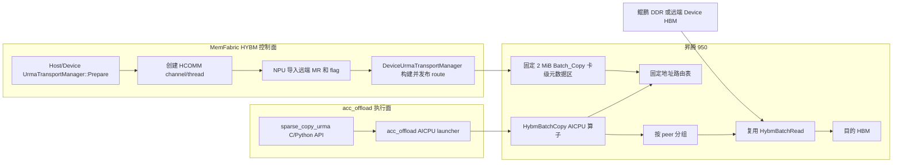
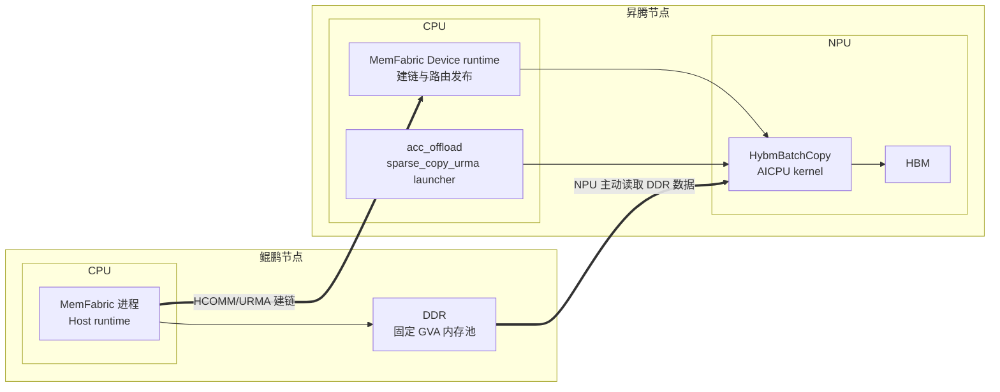
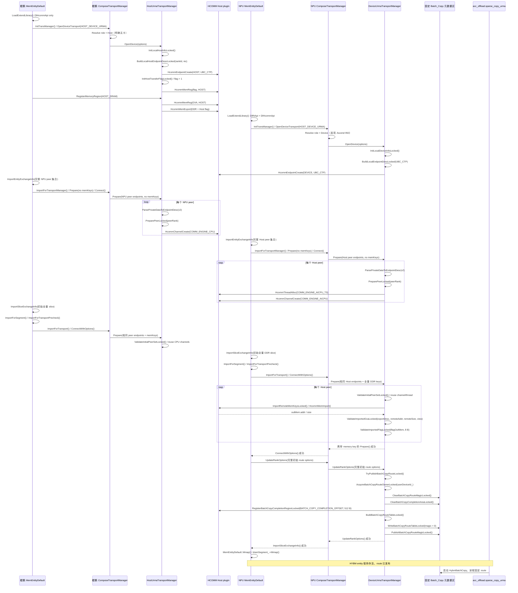
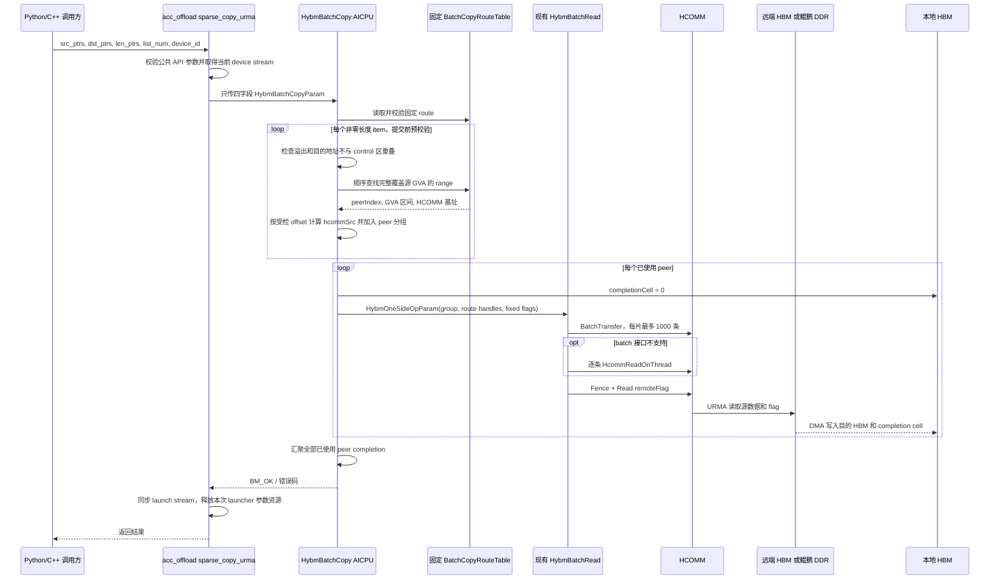

# 基于 URMA 的 sparse_copy_urma AICPU 技术方案

**Authors:** MemFabric Hybrid URMA Maintainers

**Created:** 2026-07-15

**Updated:** 2026-08-03

**Status:** Draft

**Related Issue/PR:** 待补充（RFC 批准前必须关联 Issue/PR）

**Implementation Plan:** [batch_copy_aicpu_urma_staged_implementation_plan.md](batch_copy_aicpu_urma_staged_implementation_plan.md)

---

# 1. 概述

## 1.1 简介

本方案面向鲲鹏服务器与昇腾 950 NPU 组成的超节点，为卡侧发起的 URMA 读提供
`sparse_copy_urma` 对外接口和 `HybmBatchCopy` AICPU 算子。接口输入为远端源地址列表、本地 HBM
目的地址列表、长度列表、列表元素个数和设备号；算子按源地址解析对应的 HCOMM
`channel/thread`，将远端数据批量读取到本地 NPU HBM。

方案把控制面和执行面分离。MemFabric HYBM entity 负责 Host/Device URMA 建链、远端内存导入、
固定 HBM 路由发布和资源清理；acc_offload 通过独立的 `sparse_copy_urma` C/Python API 启动 AICPU
算子，不经过 `copy_data/copy_data_batch`、`DataOpDeviceURMA` 或 `TransportManager` 数据操作接口。
路由表位于 `HYBM_DEVICE_META_ADDR` 前方固定的 2 MiB 卡级元数据区域。AICPU 算子不接收内部通信
句柄，直接读取这张只读表，按 peer 对 batch 分组，然后复用现有 `HybmBatchRead` 完成 HCOMM batch
提交、单条回退、fence 和完成标记读取。

## 1.2 动机

`sparse_copy_urma` 是面向 KV offload 的专用稀疏读取能力，其参数、完成语义和调用生命周期不同于
通用 `copy_data`。将该能力放入通用 DataOperator 和 Compose 转发链路会扩大接口语义，并使执行入口
与 URMA 资源管理耦合。方案因此由 HYBM 控制面统一持有建链、内存导入和路由生命周期，由
acc_offload 提供直接调用入口；两者通过固定 HBM route ABI 解耦。该设计保持通用拷贝接口稳定，同时
确保 AICPU 只使用已经建立并经过校验的通信资源。

## 1.3 目标与限制

### 目标

- 提供 `sparse_copy_urma` C/Python API，通过 acc_offload 直接启动四参数 `HybmBatchCopy` AICPU 算子。
- 路由表规格支持每张 NPU 最多 64 个鲲鹏 CPU peer，每个 peer 最多 16 个 DDR 地址区间。
- 支持 16 张 NPU、8 台双路鲲鹏服务器，即 16 个 CPU peer 的超节点规模。
- 建链成功后自动把地址范围与 `channel/thread` 的对应关系发布到 HBM。
- 单次 batch 可包含来自不同 CPU peer 的源地址，由算子完成查表、分组和传输。
- 统一支持 Device-HBM 和 Host-DDR 路由；Host 路径保持严格地址相等门禁。
- `copy_data/copy_data_batch`、`DataOpDeviceURMA`、`HybmBatchRead/HybmBatchWrite` 及 Host 侧数据面
  接口保持兼容。
- 对参数错误、路由缺失、句柄失效、HCOMM 失败和完成超时提供可定位的 ERROR 日志。

### 限制

- 不在算子中动态建链、注册内存或导入远端内存。
- 不支持建链完成后动态增加内存区间，也不支持 peer 移除、主动断链或路由热更新。
- 初始化建链和路由发布串行执行，不支持初始化流程并发。
- 由调用方保证同一张 NPU 上只有一个在途 `sparse_copy_urma`；算子内部不增加并发 guard。
- acc_offload 不创建或销毁用于路由发布的 HYBM entity，不接管 channel、thread、MR 或 route 生命周期。
- 不提供替代 transport、探测 launcher 或旁路算子；所有调用和示例均使用同一套生产路径。

---

# 2. 用例分析

## 2.1 核心用例

| 用例 | 功能要求 | 目标行为与约束 |
| --- | --- | --- |
| 单 CPU 单地址 | 从一个鲲鹏 DDR 区间读取到一个 HBM 区间 | GVA 路由命中、单条 HCOMM 读、完成语义 |
| 单 CPU 多地址 | 同一 peer 的多个离散 DDR 地址批量读取 | 优先使用 HCOMM batch，一次 fence |
| 多 CPU 混合 batch | 一个列表中包含不同 CPU peer 的地址 | 正确查表分组，每个 peer 使用自身句柄 |
| 两 NPU Device-HBM | 从远端 Device HBM GVA 读取到本地 HBM | GVA 到 HCOMM import view 的受检偏移转换 |
| 最大拓扑 | 每张 NPU 连接 64 个 CPU peer，每 peer 16 个地址区间 | 固定表容量和初始化失败回滚 |
| 异常输入 | 越界、溢出、空指针、无路由地址 | 传输前失败，不提交任何 HCOMM 请求 |


## 2.2 安全、可靠性与兼容性要求

- 源 GVA 的完整 `[src, src + len)` 必须落在一个已发布路由区间内。
- 目的地址必须位于本地 HBM 有效范围，且不得覆盖 Batch_Copy 卡级元数据、HYBM meta 或任一
  entity extra context。
- 地址加法必须检查 `uint64_t` 溢出，长度为 0 的条目按 no-op 跳过。
- 路由表和 entity extra context 使用相互独立的地址区间；entity extra context 保持用户上下文语义。
- 根错误必须记录 peer rank、地址、长度、channel、thread、batch index 和返回码中的相关字段。

---

# 3. 方案设计

## 3.1 总体方案

### 3.1.1 架构



HYBM 控制面负责资源创建、远端 MR 导入和路由发布；acc_offload 只负责参数转换、算子加载和启动；
AICPU 数据面只读路由表并使用已发布资源。`copy_data` 和 DataOperator 分发链路不参与该流程。
每张 NPU 的路由表最多记录 64 个 CPU peer，每个 peer 最多 16 个区间，总计最多 1024 个地址
区间。目标部署规模为 16 NPU × 16 CPU；每张 NPU 持有自己的本地
channel/thread 句柄，卡间不共享路由表。

#### 部署视图



鲲鹏节点由 CPU 上的常驻 MemFabric 进程持有固定 GVA DDR 内存池。昇腾节点的 CPU 业务进程加载
MemFabric Device runtime，负责建链和路由发布；同一进程通过 acc_offload 的 `sparse_copy_urma` 接口
启动 `HybmBatchCopy`。AICPU kernel 在 NPU 上运行，并通过已建立的 HCOMM/URMA 通道主动读取鲲鹏
DDR。调用方必须保证负责 route 发布的 HYBM entity 在算子完成前持续存活。

### 3.1.2 地址语义

`src_buf_addr_list` 中的元素定义为 MemFabric GVA，而不是源端进程本地 VA。
GVA 必须在路由表内唯一，且与 `RemoteRegistration::addr/size` 使用同一地址空间。每次发布只接受
一种远端内存形态：Device-HBM 或 Host-DDR，不在同一张表中混用两种 endpoint。

鲲鹏 DDR 源端采用 GVA 固定地址注册：

1. `HybmConnBasedSegment::ReserveMemorySpace()` 在 `enable56BitsGva=false` 时预留完整 GVA 窗口，
   `localVirtualBase_` 等于本 rank 的 GVA 起点；`AllocMemory()` 通过 `MAP_FIXED` 把 DDR 映射到
   `sliceAddr`，并只接受 `mapped == sliceAddr` 的结果。`XPU_TYPE=NONE` 的 `MapSlice()` 不调用
   `HalHostRegister()`，加入 `HybmVaManager` 的 DVA 为 0，HVA/GVA 均为 `mapped`。
2. `HostUrmaTransportManager::RegisterMemoryRegion()` 对 HOST_DRAM 直接调用
   `HcommMemReg(mr.addr)`。注册前通过 `HybmVaManager::FindAllocByVa(mr.addr, HVM_GVA)` 校验完整
   区间属于本地 rank 的 `HYBM_MEM_TYPE_HOST` 分配记录；其中 `mr.addr` 等于固定映射后的 GVA。
   昇腾本机 HOST_DRAM 由 `DeviceUrmaTransportManager` 执行 HVA→DVA 注册。
3. `QueryMemoryKey()` 导出的 `key.keys[1]` 与 HCOMM 实际注册地址使用同一个 GVA。
4. NPU 侧 `ImportRemoteMemKeysLocked()` 从 key 恢复 GVA，调用 `HcommMemImport()` 后校验
   `exportDesc.addr == remoteAddr == view.addr`、`exportDesc.size == remoteSize` 且
   `view.size >= remoteSize`。不满足时返回 `BM_NOT_SUPPORTED`，不发布路由。
鲲鹏节点配置 `enable56BitsGva=false`，DDR 必须由上述固定 GVA 内存池分配。通过
`hybm_register_local_memory()` 注册的任意 Host 指针不保证 HVA 等于 GVA，不进入 Batch_Copy 路由表。
GVA 超出窗口、地址已被占用或固定映射失败时，初始化失败。

`MemEntityDefault::ImportSliceExchangeInfo()` 保持 `ImportForSegment()` 在前、`ImportForTransport()` 在后的
调用顺序。
固定 GVA 资格由鲲鹏本地注册时完成校验，NPU 路由发布不依赖随后执行的
`HybmConnBasedSegment::Mmap()`。

目标 UBC_TP/UBC_CTP 后端保持 HCOMM 注册地址，地址传递流程如下：

1. `LocalUbRmaBuffer::GetExchangeDto()` 把 `buf->GetAddr()` 原样写入 `ExchangeUbBufferDto::addr`；
2. `RemoteUbRmaBuffer(rdmaHandle, dto)` 把 `dto.addr` 原样保存到 `addr`，底层
   `HrtRaUbRemoteMemImport()` 返回的 `targetSegVa` 另存为 `segVa`，不会覆盖 `addr`；
3. `UbRegedMemMgr::MemoryImport()` 最终执行
   `outMem->addr = reinterpret_cast<void *>(remoteUbRmaBuffer->GetAddr())`。

因此 Host UBC 后端应满足：

```text
HcommMemImport.outMem.addr == 对端传给 HcommMemReg 的地址
```

鲲鹏端固定 `mmap` 到 GVA，并以该地址调用 `HcommMemReg()`，因此导入结果等于 GVA。NPU 侧执行
`exportDesc.addr == remoteAddr == view.addr` 和 `view.size >= remoteSize` 校验，用于防止 CANN 后端变化、
描述符损坏或注册路径误用。该相等关系是 Host DDR 生产路径的硬门禁，不能因 route ABI 支持地址转换
而放宽。

路由区间同时保存调用者可见的 `srcGvaBegin/srcGvaEnd` 和 HCOMM 可访问的 `hcommVaBegin`。算子按偏移
计算传输地址：

```text
offset = srcGva - srcGvaBegin
hcommSrc = hcommVaBegin + offset
```

Host-DDR route 必须满足 `key.keys[1] == exportDesc.addr == view.addr`，因此
`hcommVaBegin == srcGvaBegin`。显式保存 HCOMM 基址用于固定共享 ABI 和地址域校验，不作为 import 地址
不相等时的兼容机制。Device-HBM route 允许 `hcommVaBegin == view.addr` 与 `srcGvaBegin` 不同，
但必须校验 export descriptor、导出 GVA、导入 view 的区间大小一致，并仅按受检 offset 做转换。
`hcommVaBegin` 使用 `BatchCopyRangeEntry` 原有 padding，结构仍为 32 B。

`HcommTransportManager::HcommMemImport()` 以 HCOMM 返回的内存视图为校验依据：普通 MR 检查
`outMem.type`，transfer flag 检查 `flagOutMem.type`，并同时校验地址和大小。实现不合成 type，也不使用
其他地址字段掩盖 descriptor 与 import view 的不一致。校验通过后，导入地址和大小保存到
`RemoteRankState`，供统一 route builder 使用。

不同 route peer 的源地址范围发生重叠时，NPU 侧 `BuildBatchCopyRouteTableLocked()` 返回失败，不发布 magic。

### 3.1.3 独立卡级元数据区

路由表位于 `HYBM_DEVICE_META_ADDR` 前方的固定卡级地址，生命周期归属逻辑 NPU。该区域与 entity
extra context 独立，`hybm_set_extra_context()` 只访问用户上下文。`HYBM_DEVICE_META_ADDR`、entity meta
和 user context 的地址保持不变。昇腾 950 使用 `MEM_HUGE_PAGE_TYPE`，因此卡级路由区按一个 2 MiB
大页映射；每张 NPU 占用 2 MiB HBM，16 张 NPU 共占用 32 MiB。NPU 初始化必须携带
`HYBM_FLAG_INIT_SHMEM_META`，使 `hybm_init_hbm_gva()` 建立该固定控制区映射。

地址常量如下：

```cpp
constexpr uint64_t HYBM_BATCH_COPY_META_SIZE = HYBM_LARGE_PAGE_SIZE; // 2 MiB
constexpr uint64_t HYBM_BATCH_COPY_META_ADDR =
    HYBM_DEVICE_META_ADDR - HYBM_BATCH_COPY_META_SIZE;
constexpr uint64_t HYBM_DEVICE_CONTROL_ADDR = HYBM_BATCH_COPY_META_ADDR;
constexpr uint64_t HYBM_DEVICE_CONTROL_SIZE =
    HYBM_BATCH_COPY_META_SIZE + HYBM_DEVICE_INFO_SIZE; // 34 MiB
```

其中 `HYBM_DEVICE_INFO_SIZE` 表示 32 MiB HYBM 元数据区。完整地址布局如下，地址从低到高：

```text
SVM_END_ADDR - 1 GiB
┌──────────────────────────────────────────────────────────────────┐
│ 1 GiB 固定 VA 预留区中的未映射部分：990 MiB                     │
├──────────────────────────────────────────────────────────────────┤
│ HYBM_BATCH_COPY_META_ADDR = SVM_END_ADDR - 34 MiB                │
│ Batch_Copy 卡级元数据映射：2 MiB                                 │
├──────────────────────────────────────────────────────────────────┤
│ HYBM_DEVICE_META_ADDR = SVM_END_ADDR - 32 MiB                    │
│ global meta + 511 个 entity meta：64 KiB                         │
├──────────────────────────────────────────────────────────────────┤
│ HYBM_DEVICE_USER_CONTEXT_ADDR                                    │
│ 511 个 entity extra context：511 × 64 KiB                        │
├──────────────────────────────────────────────────────────────────┤
│ SVM_END_ADDR                                                     │
└──────────────────────────────────────────────────────────────────┘

Batch_Copy 元数据区 + HYBM 元数据区 = 2 MiB + 32 MiB = 34 MiB
```

Modern 路径预留 1 GiB VA，`HalMemCreate()` 申请 34 MiB，并从 `HYBM_DEVICE_CONTROL_ADDR` 开始一次性
`HalMemMap()`；释放路径使用相同的 34 MiB 边界解除映射并释放物理资源。Legacy 路径保持原有
`HYBM_DEVICE_META_ADDR/HYBM_DEVICE_INFO_SIZE` 32 MiB 分配、映射和释放语义，不映射前置 2 MiB route，
因此不支持 `sparse_copy_urma`。该差异必须由初始化能力检查明确拒绝，不能让算子访问未映射地址。

每个逻辑 NPU 维护一份表。路由发布由上层初始化调用链保证串行，publisher 不设置按
`userDeviceId_` 索引的 owner registry，也不提供多发布者并发互斥或并发错误码。

### 3.1.4 路由表布局与规格

#### 固定规格

| 项目 | 规格 |
| --- | ---: |
| 每张 NPU 最大 peer 数 | 64 |
| 每个 peer 最大地址区间数 | 16 |
| 每张 NPU 最大地址区间总数 | 1024 |
| 每个 peer 的 channel/thread 数 | 各 1 |
| Completion cell 数 | 64，每项 8 B |
| `BatchCopyPeerEntry` 大小 | 32 B（`0x20`） |
| `BatchCopyRangeEntry` 大小 | 32 B（`0x20`） |
| 静态路由表大小 | 34880 B（`0x8840`） |
| 运行期 completion workspace | 512 B（`0x0200`） |
| Batch_Copy 控制区实际使用大小 | 35392 B（`0x8A40`） |
| 卡级元数据物理映射开销 | 2 MiB/NPU |
| 16 张 NPU 的额外 HBM 开销 | 32 MiB |

路由表使用固定容量数组。这样 AICPU 可以使用编译期 offset 定位 peer、range 和 completion，无需根据
数量计算变长区域地址。有效 peer 被压缩放在前 `peerCount` 项；有效 range 被全局按
`srcGvaBegin` 排序后放在前 `rangeCount` 项。

#### 结构体设计

```cpp
constexpr uint32_t BATCH_COPY_ROUTE_MAGIC = 0x42435059U; // "BCPY"
constexpr uint16_t BATCH_COPY_MAX_PEER_COUNT = 64;
constexpr uint16_t BATCH_COPY_MAX_RANGE_PER_PEER = 16;
constexpr uint16_t BATCH_COPY_MAX_RANGE_COUNT =
    BATCH_COPY_MAX_PEER_COUNT * BATCH_COPY_MAX_RANGE_PER_PEER;

struct alignas(64) BatchCopyRouteHeader {
    uint32_t magic;
    uint16_t peerCount;
    uint16_t rangeCount;
};

struct alignas(32) BatchCopyPeerEntry {
    uint64_t thread;
    uint64_t channel;
    uint64_t remoteFlagAddr;
};

struct alignas(32) BatchCopyRangeEntry {
    uint64_t srcGvaBegin;
    uint64_t srcGvaEnd;
    uint64_t hcommVaBegin;
    uint16_t peerIndex;
};

struct alignas(64) BatchCopyRouteTable {
    BatchCopyRouteHeader header;
    BatchCopyPeerEntry peers[BATCH_COPY_MAX_PEER_COUNT];
    BatchCopyRangeEntry ranges[BATCH_COPY_MAX_RANGE_COUNT];
};

struct alignas(64) BatchCopyCompletionArea {
    uint64_t cells[BATCH_COPY_MAX_PEER_COUNT];
};

static_assert(sizeof(BatchCopyRouteHeader) == 0x40);
static_assert(sizeof(BatchCopyPeerEntry) == 0x20);
static_assert(sizeof(BatchCopyRangeEntry) == 0x20);
static_assert(offsetof(BatchCopyRouteTable, peers) == 0x40);
static_assert(offsetof(BatchCopyRouteTable, ranges) == 0x840);
static_assert(sizeof(BatchCopyRouteTable) == 0x8840);
static_assert(sizeof(BatchCopyCompletionArea) == 0x200);

constexpr uint64_t BATCH_COPY_COMPLETION_OFFSET = sizeof(BatchCopyRouteTable);
constexpr uint64_t BATCH_COPY_CONTROL_USED_SIZE =
    sizeof(BatchCopyRouteTable) + sizeof(BatchCopyCompletionArea);
static_assert(BATCH_COPY_COMPLETION_OFFSET == 0x8840);
static_assert(BATCH_COPY_CONTROL_USED_SIZE == 0x8A40);
```

Header、PeerEntry 和 RangeEntry 中剩余的尾部 padding 只用于 64/32 字节对齐，不定义为扩展字段。
`BatchCopyPeerEntry` 的 3 个有效字段占 24 B，尾部对齐填充 8 B；`BatchCopyRangeEntry` 的有效字段
占 26 B，尾部对齐填充 6 B。`remoteFlagSize` 固定为 `sizeof(uint64_t)`，发布前校验，不写入表。
`BatchCopyRangeEntry` 使用左闭右开区间 `[srcGvaBegin, srcGvaEnd)`，查表要求
`srcGvaBegin <= srcGva` 且 `srcGva + len <= srcGvaEnd`；还必须检查
`hcommVaBegin + (srcGvaEnd - srcGvaBegin)` 不溢出。
`peerRank` 只用于 Host 侧建链和日志，AICPU 使用
`peerIndex` 定位通信资源，因此也不写入表。`BatchCopyRouteTable` 在发布后只读；单独定义的
`BatchCopyCompletionArea` 是算子和 HCOMM 在运行期读写的工作区，不属于静态路由表。

Flag 没有作为算子参数遗漏：`BatchCopyPeerEntry.remoteFlagAddr` 保存远端 8 B transfer flag 的
import 地址；本地 flag 地址由
`HYBM_BATCH_COPY_META_ADDR + BATCH_COPY_COMPLETION_OFFSET + peerIndex * sizeof(uint64_t)` 固定推导。
`flag_size` 固定为 8 B。AICPU 从 route 和 completion 区构造 `HybmOneSideOpParam`，调用方不传
thread、channel 或任一 flag 参数。

#### 2 MiB 区域内部布局

```text
HYBM_BATCH_COPY_META_ADDR
  + 0x000000  ┌──────────────────────────────────────┐
              │ BatchCopyRouteHeader                 │ 0x0040 B
  + 0x000040  ├──────────────────────────────────────┤
              │ PeerEntry[64]                        │ 0x0800 B
  + 0x000840  ├──────────────────────────────────────┤
              │ RangeEntry[1024]                     │ 0x8000 B
  + 0x008840  ├──────────────────────────────────────┤
              │ BatchCopyCompletionArea              │ 0x0200 B
              │   cells[64]                          │
  + 0x008A40  ├──────────────────────────────────────┤
              │ 大页映射粒度产生的未使用空间         │
  + 0x200000  └──────────────────────────────────────┘
HYBM_DEVICE_META_ADDR
```

`0x8A40～0x200000` 为 HBM 大页映射粒度产生的未使用空间，不承载协议字段。
普通 HBM 分配和 Batch_Copy 目的地址校验都必须把
`[HYBM_BATCH_COPY_META_ADDR, SVM_END_ADDR)` 视为控制区，禁止业务读写。

发布前必须满足：

- `1 <= peerCount <= 64`；
- `1 <= rangeCount <= 1024`，且 `rangeCount <= peerCount * 16`；
- 每个 `peerIndex` 对应的 range 不超过 16 个；
- 一张 route 中所有 peer 的 endpoint location 必须一致；Device-HBM 模式只收录
  `ENDPOINT_LOC_TYPE_DEVICE + DEVICE_HBM`，Host-DDR 模式只收录
  `ENDPOINT_LOC_TYPE_HOST + HOST_DRAM`，不允许混合；
- 每个区间非空、不溢出，所有有效区间按 GVA 升序且互不重叠；
- 每个 range 的 GVA/HCOMM view 区间大小一致且地址计算不溢出；Host-DDR 模式还必须满足
  `hcommVaBegin == srcGvaBegin`；
- 每个有效 peer 的 `thread/channel/remoteFlagAddr` 非 0。

`TryPublishBatchCopyRouteLocked()` 仅在初始 route peer 集合中的每个 peer 都已建立 channel/thread、
导入至少一个符合当前 route 模式的 MR 且导入 8 B transfer flag 后发布路由。发布时固定注册从
`BATCH_COPY_COMPLETION_OFFSET` 开始的 512 B HBM 区域。构建 route image 时先清零整个
`BatchCopyRouteTable`，header 的 `magic` 保持 0，并单独清零 `BatchCopyCompletionArea`；完成 H2D
拷贝和 completion 注册后，最后单独写入 `BATCH_COPY_ROUTE_MAGIC`。AICPU 只在 magic 有效时读取
静态表。publisher 成功后重复调用只返回 `BM_OK`，不刷新 route。Close 时先清零 magic，再释放
channel/thread 和 completion 注册句柄。

### 3.1.5 建链与路由表发布

#### Endpoint 描述

`UrmaEndpointDesc` 使用 HCOMM 原生 `EndpointLoc` 表示 endpoint 位置：

```cpp
struct UrmaEndpointDesc {
    UrmaProtocol protocol;
    CommAddrType type;
    uint8_t raws[URMA_ENDPOINT_RAW_LEN];
    EndpointLoc loc;
};
```

- 昇腾侧设置 `loc.locType = ENDPOINT_LOC_TYPE_DEVICE`，并填写 `loc.device.devPhyId`、
  `superDevId`、`serverIdx` 和 `superPodIdx`；
- 鲲鹏侧设置 `loc.locType = ENDPOINT_LOC_TYPE_HOST`，只填写 `loc.host.id = rankId`；初始化结构时
  先清零，不能把 `superPodId` 等 device 字段填成伪造值；
- `EndpointLoc.host.id` 使用全局唯一的 `rankId`，用于 MemFabric endpoint 描述符的稳定标识。
  CANN Host UB plugin 内部的 `hostResourceId` 固定为 0，与该字段不是同一概念。

#### Host/Device URMA manager 设计

`transport::urma` 公共模块提供 `HcommTransportManager`、endpoint/MR 描述符、序列化和范围查找工具。
`DeviceUrmaTransportManager` 管理 ACL、AICPU thread/channel、远端 MR 导入和固定 route 发布；
`HostUrmaTransportManager` 管理 Host endpoint、CPU channel、本地 DDR/flag 导出以及 Host CPU 主动
Read/Write/Fence 数据面。两个 manager 独立
实现 `TransportManager` 接口并组合使用公共 HCOMM 模块。

函数职责划分如下：

| 函数或函数组 | Device manager | Host manager |
| --- | --- | --- |
| `OpenDevice()`、`CloseDevice()` 及回滚函数 | 管理 Ascend 950、ACL、HCOMM 和 route 生命周期，不持有 acc_offload launcher | 管理 Host 内存及 HCOMM endpoint/channel/MR 生命周期 |
| 本地信息和 endpoint 构建函数 | 查询逻辑/物理卡、SDID、serverId、superPodId 和设备 EID | `InitLocalHostInfoLocked()/BuildLocalHostEndpointDescLocked()` 读取 Host NIC 并填写 `loc.host.id` |
| transfer flag 初始化 | 使用 `AclrtMalloc/AclrtMemcpy` 创建 device flag | `InitHostTransferFlagLocked()` 分配 8 B Host flag，写入 `uint64_t{1}`，并以 `COMM_MEM_TYPE_HOST` 注册 |
| TLS/completion context 函数 | 管理 ACL stream、device notify 和 TLS completion context | 不创建 ACL/TLS context；按 peer 保存 CPU channel 的 pending/fence 状态 |
| 本地 MR 注册、查询和注销函数 | 本机 HOST_DRAM 执行 HVA→DVA，HBM 使用 device address | 固定 GVA/HVA 直接注册；共用范围查找、描述符序列化和 refCount helper |
| 远端 MR 导入函数 | 导入 Device-HBM 或鲲鹏 DDR MR/flag，并同时保存 exported GVA 与 HCOMM view | Host peer 场景导入对端 DDR MR/flag；NPU peer 场景只导出本地 DDR/flag |
| `Prepare()` 及 channel 清理函数 | 首次调用固定同质 route peer 集合并创建 `COMM_ENGINE_AICPU_TS` thread、`COMM_ENGINE_AICPU` channel；携带 key 的后续调用复用资源并导入初始 key | 首次创建 `COMM_ENGINE_CPU` channel；携带 key 的后续调用校验 peer/endpoint 未变化并复用 channel |
| `UpdateRankOptions()` | 完整初始 options 就绪时发布 route；发布后相同调用幂等返回，route 不刷新；调用方保证不再提交 route 变更 | Batch_Copy 初始化完成后返回 `BM_NOT_SUPPORTED` |
| `RemoveRanks()` | route 发布后返回 `BM_NOT_SUPPORTED`；否则遵循 DEVICE_URMA 行为 | 存在 Batch_Copy peer 时返回 `BM_NOT_SUPPORTED` |
| 连接和 private-data 函数 | 序列化 Device `EndpointLoc` | 序列化 Host `EndpointLoc` |
| Remote I/O 函数 | `copy_data`/`DataOpDeviceURMA` 行为与 `sparse_copy_urma` 相互独立 | 提供 Host CPU Read/Write/Fence 数据面 |
| `sparse_copy_urma` launcher | 不在 manager 中实现；manager 只发布算子所需 route | 不加载或启动 device kernel |

协议类型包含 `HYBM_DOP_TYPE_HOST_DEVICE_URMA`（公共 Python 名为
`BmDataOpType.HOST_DEVICE_URMA`）。鲲鹏和
昇腾两端使用同一 `HOST_DEVICE_URMA` 协议位进入 URMA 建链、peer 过滤和
`TransportMemoryKey.keys[0, 6 * KEY_SIZE)` device key 区域。
`ComposeTransportManager::OpenDeviceTransport()` 调用 `CreateHostDeviceUrmaTransportManager()`：
初始化时运行时明确发现 Ascend 950 device 则创建 `DeviceUrmaTransportManager`，明确无 device 且构建包含
Host HCOMM 能力则创建 `HostUrmaTransportManager`。发现 device 但 SOC 不是 950，或 runtime/SOC 查询失败
时返回错误，不能静默回退 Host role。`XPU_TYPE=NONE` 构建不调用 ACL 探测，直接解析为 Host role；
`NVIDIA_GPU` 构建返回 `BM_NOT_SUPPORTED`。本地角色只解析一次，并由 transport 和 data operator 共用。
既有 `HOST_URMA` 继续进入 HCOM，既有 `DEVICE_URMA` 继续表示 Device↔Device HCOMM，`DEVICE_UBOE`
仍由 Device manager 处理。

鲲鹏部署加载 `libhcomm_cpu_ub_plugin.so`。该 plugin 注册 `COMM_PROTOCOL_UBC_TP` 和
`COMM_PROTOCOL_UBC_CTP`，只接管 `ENDPOINT_LOC_TYPE_HOST` endpoint，并要求 channel engine 为
`COMM_ENGINE_CPU`。`ASCEND_HOME_PATH` 非空时，插件安装在 `${ASCEND_HOME_PATH}/hcomm_plugin/`；
仅在 `ASCEND_HOME_PATH` 为空的独立调试环境中通过 `HCOMM_NIC_PLUGIN_SO` 显式指定路径。鲲鹏节点的
runtime device 数量必须为 0；CANN loader 检测到 device 时会跳过 Host NIC plugin 加载。

两个 manager 在 private data 中填写 `UrmaEndpointDesc.loc`。`URMA_PRIVATE_DATA_VERSION` 为 2，
`SerializePrivateData()/ParsePrivateDataToEndpointDesc()` 校验 magic、version、payloadLen 和容量；版本或
负载不匹配时返回 `BM_NOT_SUPPORTED`。

两端均通过 `HcommChannelDescInit()` 初始化 channel 描述符，填写远端 endpoint，设置
`exchangeAllMems = true`，并按 `(localRank > peerRank) ? CLIENT : SERVER` 选择互补的 socket role。
NPU 侧使用 `COMM_ENGINE_AICPU`，鲲鹏侧使用 `COMM_ENGINE_CPU`。

运行时职责如下：

- Device role 加载 `DlRtApi` 和 `DlHcommApi`；Host role 只加载 `DlHcommApi`。
- `DataOpDeviceURMA`、`HostDataOpRDMA` 和 `copy_data/copy_data_batch` 初始化及调用流程保持不变，
  `sparse_copy_urma` 不进入 DataOperator 分支，也不经 Compose 转发。
- acc_offload 在业务调用时按需加载 AICPU launcher；它不重复初始化 HYBM entity，也不管理 route 生命周期。
- `DlApi::CleanupLibrary()` 仍统一清理 MemFabric 已加载的 wrapper；acc_offload 按自身生命周期释放 launcher。

#### 建链和发布时序



entity 初始化会调用 manager 两次。`ImportEntityExchangeInfo()` 通过 `ImportForTransportManager()` 首次调用
`ComposeTransportManager::Prepare()/Connect()`，此时只有完整 peer endpoint，没有 memory key；
`ImportSliceExchangeInfo()` 随后执行 `ImportForSegment()`、`ImportForTransportPrecheck()` 和
`ImportForTransport()`，再由 `TransportManager::ConnectWithOptions()` 第二次调用
`ComposeTransportManager::Prepare()`，携带初始全量 memory key。Host/Device manager 的 `Prepare()`
必须支持相同 endpoint 的幂等复用。Device manager 在完整 memory key 导入成功后，由
`UpdateRankOptions()` 统一发布路由。组件职责和设计原因如下：

| 文件/位置 | 最终职责 | 设计原因 |
| --- | --- | --- |
| `smem_bm_def.h`、`hybm_def.h`、SMEM/TRANS 转换和 Python wrapper | 定义 `HOST_DEVICE_URMA` 公共/内部 bit，并保持其他枚举值稳定；统一合法值、冲突和无卡构建掩码 | 明确区分 HCOMM Host↔Device 与 `HOST_URMA` HCOM、`DEVICE_URMA` Device↔Device 路径，并让异构两端协商同一 bit |
| `hybm_entity_tag_info.cpp`、`hybm_entity_default.cpp` | 定义 `HOST_DEVICE_URMA` 的字符串双向映射、compatible info、能力和加载掩码 | DataOpType 会参与 tag 和 rank-to-rank 协商，不能只在 Compose 本地解释 |
| `transport/urma/hcomm_transport_manager.{h,cpp}` | 提供共享 endpoint/MR 描述符、private-data v2 编解码和 HCOMM 封装 | Host/Device manager 使用同一套 wire format 和资源封装 |
| `transport/urma/urma_transport_common.{h,cpp}` | `UrmaEndpointDesc` 保存完整 `EndpointLoc`；`SerializePrivateData()/ParsePrivateDataToEndpointDesc()` 严格校验 magic、v2、payloadLen 和容量 | HCOMM 根据 endpoint 实际位置创建 Host/Device 资源 |
| `compose_transport_manager.cpp`，`OpenDeviceTransport()/CreateHostDeviceUrmaTransportManager()` | 解析 `HOST_DEVICE_URMA` 运行时角色；发现 Ascend 950 创建 Device manager，明确无卡创建 Host manager，其他 SOC/探测错误失败 | 异构两端使用同一协议位，并且不把环境错误误判为 Host |
| `under_api/dl_api.cpp`，`LoadExtendLibrary(DL_EXT_LIB_DEVICE_URMA)` | `ASCEND_NPU` 加载 RT + HCOMM；`XPU_TYPE=NONE` 加载 HCOMM | 无卡鲲鹏只依赖 Host HCOMM 能力 |
| `data_operation/host/`、`hybm_compose_data_op.cpp` | 只承载通用 DataOperator 和 `copy_data/copy_data_batch` 行为 | `sparse_copy_urma` 从 acc_offload 直接启动，避免扩大通用数据面语义 |
| `host/urma/host_urma_transport_manager.{h,cpp}` | 实现 Host endpoint、DDR/flag 注册导出、Host peer MR 导入、CPU Read/Write/Fence、channel 和清理 | 承载无卡鲲鹏的 URMA 控制面与主动数据面 |
| `hybm_conn_based_segment.cpp`，`MapSlice()` | `ASCEND_NPU` 构建按现有条件执行 `HalHostRegister()`；无卡构建直接把固定 mmap 结果加入 VA manager，DVA 置 0 | 鲲鹏 DDR 不经过本地 device 映射，无卡节点不能依赖 HAL device 注册 |
| `HostUrmaTransportManager::RegisterMemoryRegion()/QueryMemoryKey()` | 使用 `FindAllocByVa(mr.addr, HVM_GVA)` 校验完整区间属于本地 rank 的 Host GVA 分配记录，再直接 `HcommMemReg(mr.addr)` 并导出同一 GVA | 鲲鹏 DDR 使用 Host VA/GVA，不经过 DVA；任意 Host 指针不会进入 `HOST_DEVICE_URMA` 导出集合 |
| `HcommTransportManager::HcommMemImport()` | 校验 HCOMM 返回的 `outMem.type/flagOutMem.type`、addr 和 size | HCOMM view 是本地可访问性依据，不能由上层合成 type 或跳过校验 |
| `DeviceUrmaTransportManager::ImportRemoteMemKeysLocked()` | 保存 exported GVA 和 import view；Host-DDR 强制三地址相等，Device-HBM 校验受检 offset 转换；两种模式都校验 flag | 两种 route 共用 ABI 和 builder，同时保持 Host equality 硬门禁 |
| `src/hybm/csrc/common/hybm_define.h`、`hybm_batch_copy_route.h` | 定义 2 MiB route 区、34 MiB control 映射常量及 Host/AICPU 共享路由 ABI | 固定地址、结构大小和 offset 使用同一组编译期定义 |
| `hybm_gva.cpp`，`hybm_init_hbm_gva()/HybmModernInitMetaGva()` | modern meta 物理申请和映射为 34 MiB，起点为 `HYBM_DEVICE_CONTROL_ADDR`；legacy 使用 32 MiB | modern 容纳 2 MiB route，legacy ABI 和资源边界保持稳定 |
| `src/hybm/csrc/hybm_entry.cpp`，`hybm_uninit()` | Modern 使用 34 MiB control 边界；Legacy 继续使用 32 MiB meta 边界 | 两条初始化/销毁路径分别成对，避免 legacy 释放未分配区域 |
| `DeviceUrmaTransportManager::Prepare()/PreparePeerLocked()` | 首次无 key 调用创建 channel/thread 并固定 route peer 集合；携带全量 key 的调用复用资源并导入初始 MR 与 flag | 对齐 entity 先交换 endpoint、后导入 slice 的初始化顺序，route 由 `UpdateRankOptions()` 发布 |
| `HostUrmaTransportManager::Prepare()/ValidateInitialPeerSetLocked()` | 首次创建 CPU channel 并固定 peer 集合；携带 key 的调用校验 peer/endpoint 未变化并复用 channel；NPU peer 不导入 HBM key | 支持 Host 主动数据面和鲲鹏对 NPU 的 DDR 导出，并接受 entity 的幂等 `Prepare()` |
| `DeviceUrmaTransportManager::RollbackInitialImportsLocked()` | 任一 peer 导入或 route 发布失败时，按逆序释放本轮事务创建的全部 import；已存在的 channel/thread 由 manager 清理流程持有 | 防止跨 peer 的部分导入残留，同时不误删已建立的资源 |
| `DeviceUrmaTransportManager::TryPublishBatchCopyRouteLocked()/PublishBatchCopyRouteLocked()` | 在符合条件的 Device-HBM 或 Host-DDR route peer 资源完整后发布；成功后重复调用只返回 `BM_OK` | publisher 与执行入口解耦，且不实现发布后的刷新或热更新 |
| `DeviceUrmaTransportManager::UpdateRankOptions()/RemoveRanks()` | 完整初始 options 触发 route 发布；route 发布后视为固定，调用方不再提交扩展或删除请求；`RemoveRanks()` 仍受生命周期保护 | 不实现发布后 route 刷新，防止 route 引用已释放资源 |
| `HostUrmaTransportManager::UpdateRankOptions()/RemoveRanks()` | Batch_Copy 初始化完成后的变更请求返回 `BM_NOT_SUPPORTED` | Host peer 集合和 DDR 导出集合在初始化后保持不变 |
| `DeviceUrmaTransportManager::CloseDevice()` | 先执行 `ClearBatchCopyRouteMagicLocked()`，再注销 completion 和通信资源 | 防止 AICPU 读取已经释放的 HCOMM 句柄 |
| HBM 目的地址校验 | 校验地址加法溢出并拒绝与固定 control 区重叠，不要求地址大于 `HYBM_DEVICE_VA_START` | PyTorch/框架分配的真实 HBM 地址可能不在 MemFabric SVM 业务窗口，不能用该窗口误拒绝合法 tensor |
| `src/smem/python/memfabric_hybrid/setup.py` | 制备白名单包含共享路由 ABI 头和 acc_offload 下的 AICPU 源文件 | wheel 首次 import 的交叉编译输入必须包含唯一算子源 |

初始化约束为：第一次 `ImportEntityExchangeInfo()` 一次性携带完整 peer 集合，第一次
`ImportSliceExchangeInfo()` 一次性携带 `sparse_copy_urma` 使用的全部源区间；调用方保证运行期不增加
route MR、不删除 peer，也不处理断链。实现不处理发布后的 route 变更，route 只在首次完整初始化时构建。
发布事务边界为：完成全部 route peer 建链 → NPU 导入并校验所有 MR 与 flag →
清零 completion area 并注册固定 completion 区 → 构建固定 route image →
以 magic=0 同步写入卡级元数据区 → 最后写 magic → 初始化成功。任一步失败都不得留下有效 magic，
导入或发布失败时释放本轮事务创建的全部 import。Close 前调用方保证没有在途算子，manager 先清 magic，
再按逆序释放 HCOMM 资源。

`TryPublishBatchCopyRouteLocked(options)` 只由 `UpdateRankOptions()` 调用。`Prepare()` 负责资源创建和
memory key 导入，不承担发布职责。该边界保证 route 只在完整初始拓扑和全部源区间就绪后变为可见，
也避免发布时点依赖 `Prepare()` 的调用次数。

### 3.1.6 `sparse_copy_urma` 执行流程



算子使用以下顺序处理一次调用：

1. 校验严格四字段 ABI、三组列表地址和 `list_num != 0`，检查按 `list_num` 计算临时空间时无整数溢出。
2. 从 `HYBM_BATCH_COPY_META_ADDR` 读取 header，校验 magic、`peerCount <= 64`、
   `rangeCount <= 1024`、固定 offset、每 peer range 数和区间互不重叠。
3. 扫描全部输入但不提交传输：0 长度条目跳过；检查源/目的地址加长度不溢出；使用顺序查找定位
   完整覆盖源区间的 range；校验 `peerIndex`、thread/channel；按受检 offset 计算 `hcommSrc`。目的地址
   只拒绝与 `[HYBM_BATCH_COPY_META_ADDR, SVM_END_ADDR)` 固定 control 区重叠，不使用
   `HYBM_DEVICE_VA_START` 作为下界，以允许框架分配的真实 HBM tensor 地址。
4. 按 `peerIndex` 分组，组内保持输入顺序，peer 组按索引升序处理。全部条目长度为 0 时直接返回
   `BM_OK`，不调用 HCOMM。
5. 对每个已使用 peer 清零 completion cell，使用 route 中的 thread/channel/remote flag 和固定本地
   completion 地址构造 `HybmOneSideOpParam`，调用现有 `HybmBatchRead()`。
6. `HybmBatchRead()` 每 1000 条分片提交，不支持 batch 时逐条回退，随后执行 fence 并把 remote flag
   读入 completion cell；其他错误立即停止后续 peer 提交。
7. 轮询所有已使用 peer 的 completion cell，全部完成或达到 60 秒超时后返回。

伪代码如下。正式实现必须先完成全 batch 预校验再提交第一条 HCOMM 请求，不实现
`ScopedBatchCopyGuard` 或等价的算子内并发锁：

```cpp
uint32_t HybmBatchCopy(HybmBatchCopyParam *param)
{
    RETURN_IF_ERROR(ValidateFourInputs(param));
    const auto *route =
        reinterpret_cast<const BatchCopyRouteTable *>(HYBM_BATCH_COPY_META_ADDR);
    RETURN_IF_ERROR(ValidatePublishedRoute(route));

    Group groups[BATCH_COPY_MAX_PEER_COUNT]{};
    RETURN_IF_ERROR(ValidateAndGroupAllItemsSequentially(param, route, groups));
    for (uint16_t peerIndex = 0; peerIndex < route->header.peerCount; ++peerIndex) {
        if (groups[peerIndex].empty()) {
            continue;
        }
        RETURN_IF_ERROR(SubmitPeerGroup(peerIndex, route->peers[peerIndex], groups[peerIndex]));
    }
    return WaitAllUsedCompletionCells(groups);
}
```

顺序查找命中 range 后按下式转换地址：

```text
hcommSrc = range.hcommVaBegin + (srcGva - range.srcGvaBegin)
```

算子没有 thread、channel、flag 或 completion 入参；这些值全部来自固定 route/control 区。
`InvalidateDeviceCache()`、`FlushDeviceCache()` 和 `DeviceMemoryBarrier()` 仅在 AArch64 AICPU 构建启用，
实现方式参考 `app/zbal`；非 AArch64 构建不引入无依据的 cache 指令或伪实现。

所有输入在提交前完成校验，因此参数错误不会导致部分拷贝。HCOMM 提交开始后的链路错误可能造成
部分完成，算子返回失败但不回滚已写入的 HBM；调用方不得在失败后使用整个 batch 的输出。

### 3.1.7 并发和顺序语义

- 正常部署由调用方保证同一张 NPU 只有一个在途 `sparse_copy_urma`；算子不做 guard，也不返回
  并发错误码。
- 同一 peer 内保持输入顺序，并在该 peer 最后执行 fence。
- 不同 peer 之间不承诺写入先后顺序，但接口成功返回时全部完成。
- 调用方不得提供相互重叠的目的 HBM 区间；算子不做 `O(n²)` 的重叠检测。
- route 在初始化完成后只发布一次，运行期不可变；不支持动态 route MR、peer 删除或断链。
- 最终 Close 前由调用方保证没有在途算子，然后先清除 route magic，再释放通信资源。

## 3.2 技术选型

- 路由键使用 MemFabric GVA，算子从固定 HBM 路由表解析 peer 和 HCOMM 句柄。
- 路由表位于 `HYBM_DEVICE_META_ADDR` 前方独立的 2 MiB 卡级元数据区。
- 路由在初始化期一次性发布，运行期只读。
- 鲲鹏 DDR 固定映射并以同一 GVA 调用 `HcommMemReg()`。
- 地址区间保持全局有序以便校验，算子使用顺序查找并按固定 64 个 peer 桶分组，以降低控制流复杂度。
- 每个 peer 复用 `HybmBatchRead` 按 1000 条分片提交，完成状态通过独立 completion cell 汇聚。
- AICPU 源码归属 acc_offload，并编入 `libcann_hybm_kernel.so`，复用其 JSON、run 包和 wheel
  制备链，避免维护第二套 kernel 产物和安装协议。

主要备选方案比较如下：

| 决策点 | 采用方案 | 未采用方案 | 原因 |
| --- | --- | --- | --- |
| 上层入口 | acc_offload `sparse_copy_urma` | 改造 `copy_data`/DataOperator/Compose | 专用 offload 能力不应改变通用拷贝语义；采用方案修改面更小 |
| 算子源码归属 | `src/acc_offload/csrc/operators/aicpu/` | 放在 `src/hybm/ops/hybm_kernel/` | 对外能力属于 acc_offload；二进制和 JSON 复用 HYBM 交付链 |
| 通信资源传递 | 固定 HBM route/control 区 | 扩大算子参数或从 launcher 传 thread/channel/flag | 固定四字段 ABI，资源生命周期由 HYBM 控制面统一管理 |
| range 查找 | 顺序查找 | 二分查找 | route 上限为 1024，顺序实现控制流更简单，也便于完整校验 range 覆盖关系 |
| route 模式实现 | Device-HBM 与 Host-DDR 共用 builder、publisher 和算子 | 为两种源内存分别实现 launcher、transport 和算子 | 两种模式只有地址一致性规则不同，共用实现可避免 ABI 和完成语义分叉 |

## 3.3 功能与性能设计

### 3.3.1 组件职责

| 模块 | 最终职责 |
| --- | --- |
| `src/hybm/csrc/common/` | 定义共享 route ABI 和卡级 control 常量；modern 使用 34 MiB，legacy 使用 32 MiB |
| `src/hybm/csrc/driver/`、`src/hybm/csrc/hybm_entry.cpp` | modern 管理 34 MiB control 区的映射、回滚和释放；legacy 管理 32 MiB meta 区 |
| `src/hybm/csrc/transport/device/urma/` | 管理 publisher、magic-last、completion 注册和统一 route builder；支持 Device-HBM 与 Host-DDR 两种同质 route |
| `src/hybm/csrc/transport/host/urma/` | 管理 Host endpoint、固定 GVA MR/flag、CPU channel 和 Host URMA 建链 |
| `src/hybm/csrc/data_operation/host/`、`src/hybm/csrc/transport/compose/` | 不承载 Batch_Copy launcher、`SupportsBatchCopyRoute`、`ReadRemoteBatchCopy` 或转发接口；`copy_data` 流程独立 |
| `src/acc_offload/csrc/operators/aicpu/hybm_batch_copy.{h,cc}` | 实现四字段 ABI、固定 route 读取、顺序查找、peer 分组、1000 条分片和 completion 汇聚 |
| `src/acc_offload/include/host/acc_offload.h`、`src/acc_offload/csrc/acc_offload.cpp` | 提供独立 C API `offload_sparse_copy_urma`，不依赖 `AccOffloadEntryManager::Initialize()` |
| `src/acc_offload/csrc/launch/acc_offload_launch.{h,cpp}` | 提供可选 `AccOffloadSparseCopyUrma` 符号和独立 lazy-load 调用，不经过 `AccOffloadEntryManager` |
| `src/acc_offload/csrc/launch/acc_offload_operators_launch.cpp` | 通过 `NPUGuard` 获取当前 device stream，按 device 缓存 AICPU binary/function handle，启动并同步 `HybmBatchCopy` |
| `src/acc_offload/csrc/python_wrapper/pymf_acc_offload.cpp`、`src/smem/python/memfabric_hybrid/memfabric_hybrid/mf_acc_offload.py` | 暴露 `sparse_copy_urma` Python API，并保持 `sparse_copy` 接口兼容 |
| `src/hybm/ops/hybm_kernel/libcann_hybm_kernel.json` | 注册内部符号 `HybmBatchCopy`，不维护第二份 JSON |
| `src/hybm/ops/CMakeLists.txt`、`src/hybm/ops/hybm_kernel/CMakeLists.txt` | 从 acc_offload AICPU 目录编译唯一算子源码，生成 `libcann_hybm_kernel.so` 和 `cann-hybm-compat.tar.gz` |
| `src/smem/python/memfabric_hybrid/setup.py` | wheel 制备白名单包含 acc_offload AICPU 源码和共享 route ABI |
| `script/run_pkg_maker/make_run.sh`、`script/run_pkg_maker/install.sh` | 递归收集 `operators/aicpu` 源码，保证 run 包与 wheel 使用同一份实现 |
| `examples/kv_offload/sparse_copy_urma/` | 提供 `01_single_node_multi_device_urma.py` 和 `02_host_device_urma.py`；都在建链后直接调用 `sparse_copy_urma` |
| `docs/API.md`、`docs/pythonAPI.md`、AICPU 安装文档 | 描述接口、生命周期、打包安装、错误语义和两种 example |

### 3.3.2 性能策略

- 路由表只在初始化建链完成后写入一次，不在数据热路径写入。
- AICPU 只读取实际 `peerCount/rangeCount` 对应的内容。
- 地址区间按 GVA 有序发布并使用顺序查找；单项最坏比较 1024 个 range。该上限下优先保持控制流简单，
  同时顺序遍历便于复用区间合法性检查结果。
- HCOMM batch 每组最多 1000 条，沿用现有内核限制和 fallback 行为。
- 每个 peer 只执行一次 fence 和一次 completion read。
- `list_num` 没有固定总条数上限。临时数组按 `list_num` 受检分配，所有长度乘法先做溢出检查；分配失败记录
  batch size 并返回 `BM_MALLOC_FAILED`。每次 HCOMM 提交最多包含 1000 条。
- completion 默认超时为 60 秒，与 Device URMA 数据面超时保持一致。

### 3.3.3 返回语义

| 场景 | 返回值 | 是否可能已写入部分 HBM |
| --- | --- | --- |
| 空指针、`list_num == 0`、长度计算或地址溢出 | `BM_INVALID_PARAM` | 否 |
| 路由表未初始化或布局非法 | `BM_NOT_INITIALIZED` / `BM_INVALID_PARAM` | 否 |
| 地址未命中或 peer 句柄无效 | `BM_NOT_CONNECTED` | 否 |
| 临时内存不足 | `BM_MALLOC_FAILED` | 否 |
| HCOMM 提交/fence 失败 | `BM_ERROR` | 是 |
| completion 超时 | `BM_TIMEOUT` | 是 |
| 全部成功 | `BM_OK` | 是，且全部可见 |

并发调用不属于受支持输入，调用方必须在卡级串行化；算子不为该场景增加 guard 或专用返回码。

## 3.4 安全隐私与 DFX 设计

发布前校验 64 peer、每 peer 16 range、总计 1024 range 的边界、GVA
区间和 HCOMM 句柄；算子提交前校验输入、目的地址溢出/control 区重叠和 route 命中。错误日志记录
`userDeviceId/phyDeviceId/rankId/peerIndex`、batch index、地址/长度和 HCOMM 返回码，但不读取或打印
业务数据。
Host 与 AICPU 对共享结构执行 `sizeof/offsetof` 断言；publisher 在运行时校验固定容量、区间顺序、
地址边界和 publisher 待清理状态。
`ValidatePublishedRoute()` 仅在校验失败时记录 ERROR 日志，包含失败字段、header 计数以及相关 peer/range
索引和地址；成功路径不以 ERROR 级别输出完整路由，避免热路径日志膨胀。日志不打印业务数据。

## 3.5 编程与调用设计

### 3.5.1 编程模型基本设计

#### 开发环境

- 昇腾 950 NPU 与支持 URMA/HCOMM 的鲲鹏服务器。
- CANN/Ascend 环境由 `ASCEND_HOME_PATH` 指定。
- 昇腾节点以 `XPU_TYPE=NPU` 构建；鲲鹏无卡节点以 `XPU_TYPE=NONE` 构建。两端均包含目标 HCOMM/URMA
  依赖，只有昇腾节点构建和安装 AICPU 算子。
- 鲲鹏节点把 `libhcomm_cpu_ub_plugin.so` 安装到 `${ASCEND_HOME_PATH}/hcomm_plugin/`。独立调试且
  `ASCEND_HOME_PATH` 为空时，通过 `HCOMM_NIC_PLUGIN_SO` 指向该文件。
- 鲲鹏节点不安装 NPU，HCOMM runtime device 探测结果必须为 0。
- AICPU 算子沿用两种交付路径：`script/kernel/build_ops_run.sh` 生成独立 run 包；NPU wheel 在首次
  `import memfabric_hybrid` 时由 `_provision.py` 使用随包源码构建并安装。两条路径使用相同的源文件、
  共享路由 ABI 头和 `libcann_hybm_kernel.json`。

#### 使用约束

- NPU 侧通过 `HYBM_FLAG_INIT_SHMEM_META` 完成 HYBM 初始化，并完成 URMA 建链、鲲鹏 DDR
  注册/导出和 NPU 侧导入。
- 鲲鹏和昇腾两端都配置 `BmDataOpType.HOST_DEVICE_URMA`；manager 由本地运行时角色决定。
- `src_buf_addr_list` 的元素必须是 MemFabric GVA。
- 三组列表本身必须位于 AICPU 可访问的设备内存。
- 目的地址必须是本地 NPU HBM 的真实地址；可以来自 PyTorch/框架分配器，不要求落在 MemFabric SVM
  业务窗口，但不得与固定 control 区重叠。
- `sparse_copy_urma` 不要求调用 `offload.initialize()`；路由来自调用方已初始化并保持存活的 MemFabric
  entity。不得为了该接口再创建第二个 HYBM entity。
- 单张 NPU 只允许一个在途 `sparse_copy_urma`，由调用方串行化。

#### 验收设计

- 单元测试覆盖 route ABI offset/capacity、magic-last、completion 清理、同质 route 筛选、Host equality、顺序查找、
  四字段参数校验、1000 条边界、completion 汇聚和错误退出日志。
- 两卡 NPU example 验证 Device-HBM route、真实框架 HBM 地址和 acc_offload 直接调用。
- Host-DDR→NPU example 在目标鲲鹏/昇腾环境验证固定 GVA、HCOMM import equality 和跨节点数据正确性。
- run 包与 wheel 分别执行安装及符号加载验证；无法实际执行的构建或硬件测试必须明确记录为未执行，
  不能写成通过。

### 3.5.2 接口定义与设计

#### 3.5.2.1 公共 `sparse_copy_urma` 接口

**描述：** 使用已由 MemFabric HYBM entity 发布的固定 route，把一个或多个远端 Device-HBM/Host-DDR
GVA 区间读取到本地昇腾 950 HBM。该接口属于 acc_offload，不改变 SMEM/HYBM `copy_data` API。

**C 原型：**

```cpp
int32_t offload_sparse_copy_urma(uint64_t srcPtrs, uint64_t dstPtrs, uint64_t lenPtrs,
                                 uint32_t listNum, uint16_t deviceId);
```

**Python 原型：**

```python
mf_acc_offload.sparse_copy_urma(src_ptrs, dst_ptrs, len_ptrs, list_num, device)
```

| 参数 | 类型 | 说明 | 约束 |
| --- | --- | --- | --- |
| `srcPtrs/src_ptrs` | `uint64_t` / NPU tensor | 源 GVA 数组的设备地址 | 元素为 64 位地址，数组至少包含 `listNum` 项 |
| `dstPtrs/dst_ptrs` | `uint64_t` / NPU tensor | 本地真实 HBM 地址数组的设备地址 | 元素为 64 位地址，数组至少包含 `listNum` 项 |
| `lenPtrs/len_ptrs` | `uint64_t` / NPU tensor | 每项字节数数组的设备地址 | `uint64_t`，数组至少包含 `listNum` 项 |
| `listNum/list_num` | `uint32_t` / `int` | 三个列表的元素个数 | 大于 0，不是设备 scalar 指针 |
| `deviceId/device` | `uint16_t` / `torch.device` | 启动 AICPU 的本地逻辑设备 | 必须与 route 所属 NPU 一致 |

接口按 `src, dst, len` 顺序与现有 acc_offload `sparse_copy` 保持一致；内部构造 AICPU 参数时按固定 ABI
写入 `list_num, dst, src, len`。launcher 在当前 device stream 上启动并同步，返回 `BM_OK` 表示所有
非零长度条目完成；因此参数 tensor 在调用期间必须保持存活。接口不调用 `offload_init()`，也不使用
`AccOffloadEntryManager` 创建内存池或第二个 HYBM entity。

`offload_sparse_copy_urma()` 每次先调用线程安全的 `AccOffloadLaunchApi::TryLoadLibrary()`，再调用
`AccOffloadSparseCopyUrma` 可选符号。扩展库通过 `NPUGuard` 绑定 `deviceId`，取得当前 NPU stream，并按
device 缓存 AICPU binary/function handle；缓存不包含 route、channel 或 thread。加载失败、符号缺失、
kernel launch 或 stream 同步失败均返回错误并打印 device、stream、kernel 名和返回码。lazy-load 资源按
进程生命周期持有，清理前必须保证没有在途调用，不提供单独的 `sparse_copy_urma_init()`。

**返回值：**

| 返回值 | 说明 |
| --- | --- |
| `BM_OK` | 全部非零长度条目完成，目的 HBM 数据可见 |
| `BM_INVALID_PARAM` | 公共参数、内部 ABI、地址、长度或 route 表项非法 |
| `BM_NOT_INITIALIZED` | AICPU kernel 未加载或固定 route magic 尚未发布 |
| `BM_NOT_CONNECTED` | 源地址无 route 或 peer 句柄无效 |
| `BM_MALLOC_FAILED` | launcher/AICPU 临时空间分配失败 |
| `BM_TIMEOUT` | 一个或多个 peer 未在 60 秒内完成 |
| `BM_ERROR` / `BM_DL_FUNCTION_FAILED` | HCOMM、kernel launch、stream 同步或其他内部错误 |

参数和 route 错误在任何 HCOMM 提交前返回。提交后的错误可能已经写入部分目的地址，调用方应丢弃
本 batch 的全部输出。并发调用、目的区间重叠和 route 生命周期提前结束属于不支持的调用方式。

**Python 参考代码：**

```python
src_ptrs = torch.tensor(source_gvas, dtype=torch.int64, device=device)
dst_ptrs = torch.tensor([tensor.data_ptr() for tensor in outputs], dtype=torch.int64, device=device)
len_ptrs = torch.tensor(copy_lengths, dtype=torch.int64, device=device)

ret = mf_acc_offload.sparse_copy_urma(src_ptrs, dst_ptrs, len_ptrs, src_ptrs.numel(), device)
if ret != 0:
    raise RuntimeError(f"sparse_copy_urma failed: {ret}")
```

#### 3.5.2.2 内部 `HybmBatchCopy` AICPU ABI

```cpp
struct HybmBatchCopyParam {
    uint32_t list_num;
    void **dst_buf_addr_list;
    void **src_buf_addr_list;
    uint64_t *len_list;
};

static_assert(offsetof(HybmBatchCopyParam, list_num) == 0x00);
static_assert(offsetof(HybmBatchCopyParam, dst_buf_addr_list) == 0x08);
static_assert(offsetof(HybmBatchCopyParam, src_buf_addr_list) == 0x10);
static_assert(offsetof(HybmBatchCopyParam, len_list) == 0x18);
static_assert(sizeof(HybmBatchCopyParam) == 0x20);

extern "C" uint32_t HybmBatchCopy(HybmBatchCopyParam *param);
```

该结构严格只有四个业务字段；`list_num` 后的 4 B 只是 64 位 ABI 对齐 padding。thread、channel、
remote/local flag、completion、timeout 和 route mode 均从固定 HBM route/control 区读取，不得增加为
算子参数。内部符号继续注册在 `libcann_hybm_kernel.json`，不作为 HYBM 公共 C API 暴露。

#### 3.5.2.3 内部路由发布接口

```cpp
Result DeviceUrmaTransportManager::BuildBatchCopyRouteSourcesLocked(
    const HybmTransPrepareOptions &options, std::vector<BatchCopyRouteSource> &sources) const;
Result DeviceUrmaTransportManager::TryPublishBatchCopyRouteLocked(
    const HybmTransPrepareOptions &options);
Result DeviceUrmaTransportManager::PublishBatchCopyRouteLocked(
    const std::vector<BatchCopyRouteSource> &sources);
Result DeviceUrmaTransportManager::ClearBatchCopyRouteMagicLocked();
```

这些函数是 Device manager 私有控制面，不向 acc_offload、SMEM/HYBM 公共 API 或 entity 暴露。统一
builder 根据完整 options 构建一种同质 route：Device endpoint 只收录 `DEVICE_HBM`；Host endpoint 只收录
`HOST_DRAM`，并强制 exported GVA、descriptor addr 和 import view addr 相等。资源完整后 publisher 获取
清除 magic、清零并注册 completion 区、写入 route image，最后发布 magic。发布成功后再次
调用只返回 `BM_OK`，不刷新 route；调用方保证不再提交发布后的 route 变更，`RemoveRanks()` 仍受生命周期保护，
最终销毁前先清除 magic。发布入口和资源就绪条件见 3.1.5。

### 3.5.3 编程手册设计

AICPU 安装文档和 API 文档覆盖以下内容：

1. 支持平台、HCOMM/RDMA 构建开关、run 包和 wheel 安装。
2. `sparse_copy_urma` 公共参数与 `HybmBatchCopy` 内部四字段 ABI，特别说明 `list_num` 为 Host scalar。
3. MemFabric GVA、HCOMM import view 和 raw remote VA 的区别，以及 Host 三地址相等门禁。
4. HYBM 建链与 acc_offload 调用的生命周期关系，明确不要求 `offload.initialize()`。
5. 两卡 Device-HBM 和 Host-DDR→NPU 两个 Python example 的环境、执行和数据校验步骤。
6. 每卡 64 peer、每 peer 16 range、总计 1024 range 的容量和调用方串行约束。
7. 错误码、部分完成语义、超时和重试建议。
8. user/physical device、peer/channel/thread 和 route 数量日志的排障方法。

## 3.6 端到端验收场景

Device-HBM 与 Host-DDR 使用同一套共享 route ABI、publisher、AICPU 算子、acc_offload API 和交付链。
两种源内存形态分别通过以下 Python example 验收：

| 验收场景 | route 模式 | 主要验证点 |
| --- | --- | --- |
| `01_single_node_multi_device_urma.py` | Device-HBM | 两卡 route 发布、GVA→import view 受检转换、直接 `sparse_copy_urma` 调用 |
| `02_host_device_urma.py` | Host-DDR | Host 固定 GVA、三地址严格相等、跨节点 URMA 读和 completion |

两个 example 只负责拓扑初始化、测试数据准备、真实地址获取、接口调用和结果校验，不包含替代
transport、模拟 route 或测试专用 launcher。Host-DDR 场景的
`exported GVA == descriptor addr == import view addr` 由生产 builder 强制校验，不依赖 example 保证。

---

# 4. 缺点和风险

| 风险 | 影响 | 缓解措施 |
| --- | --- | --- |
| 源地址不是 route 内唯一 GVA | 可能路由到错误远端 peer | 发布时拒绝跨 peer 重叠地址区间 |
| 固定 GVA mmap 失败 | 鲲鹏源 DDR 无法按 GVA 注册 | 限制并预留可映射 GVA 窗口；初始化失败且不发布路由 |
| Host HCOMM import 重定位地址 | 不满足固定 GVA 契约，算子可能访问错误地址 | Host 建链时强制校验 `view.addr == remoteAddr`，不相等则拒绝发布 |
| 目标 CANN 未提供无卡 Host UB plugin | 鲲鹏端创建 endpoint 失败 | 部署包含 Host UB plugin 的 CANN 版本，并在启动时检查能力 |
| modern 元数据映射从 32 MiB 增至 34 MiB | 每张 NPU 额外占用 2 MiB HBM | 仅 modern 使用 34 MiB 成对边界；legacy 保持 32 MiB 并明确拒绝该能力 |
| 同一 NPU 路由发布并发调用 | 固定路由表被相互覆盖 | 上层初始化调用链保证串行；publisher 不增加 owner 或锁 |
| Host/NPU 的 URMA private-data 版本混用 | endpoint 位置被错误解释或建链失败 | 解析端严格校验 v2，并在创建 channel 前拒绝其他版本 |
| NPU HYBM/AICPU 包版本不匹配 | route 映射范围和算子 ABI 不一致，可能访问未映射地址 | HYBM、acc_offload 和 AICPU 包版本绑定；启动时校验固定 magic |
| 最终销毁时仍有在途算子 | use-after-free、传输失败或设备异常 | 调用方保证 quiescent；先清 route magic，再释放 HCOMM 资源 |
| 多 peer 完成语义不明确 | 算子提前返回，目的数据未完成 | 使用每 peer completion cell 汇聚，并采用设备侧内存屏障和超时机制 |
| AICPU 轮询占用核 | 长尾或断链时占用 AICPU 资源 | 60 秒超时并返回 `BM_TIMEOUT` |
| 大 batch 的临时描述占用 AICPU 堆 | 内存不足或抖动 | 字节数溢出检查、每 1000 条分片提交、分配失败可诊断 |
| batch 中途失败可能部分完成 | 上层误用部分数据 | 明确失败语义；成功前不对上层声明可用；提供整体重试建议 |
| peer/range 超过固定规格 | 初始化无法发布路由 | 超过 64 peer、每 peer 16 range 或总计 1024 range 时返回资源不足 |
| 单实例限制影响多 stream 并发 | 无算子内 guard 时并发行为不受支持 | 调用方按卡串行提交 `sparse_copy_urma`，测试覆盖生命周期约束 |
| acc_offload 与 HYBM entity 生命周期分离 | route 尚未发布或已释放时启动算子 | API 校验 magic；文档和 example 保证 entity 先建链、后调用、最后销毁 |
| run/wheel 源码收集规则不一致 | 某一交付物缺少算子源码或 ABI 头 | CMake、run maker 和 setup 白名单均引用唯一 acc_offload 源并做产物安装验证 |
| route 校验日志包含地址布局 | 地址信息可能增加排障日志敏感度 | 仅在校验失败时记录相关表项，不打印业务数据，并遵循部署日志访问控制 |

`copy_data/copy_data_batch`、`HybmBatchRead/HybmBatchWrite` 和既有 acc_offload `sparse_copy` 调用者均
无需修改。`sparse_copy_urma` 调用者通过既有 run 包或 NPU wheel 获取包含 `HybmBatchCopy` 的 AICPU
kernel，并使用 route ABI 一致的 `libmf_hybm_core.so` 与 acc_offload 库。

---

# 5. 现有技术

本方案复用以下仓库能力：

- `HybmBatchRead()` 提供 HCOMM batch、单条 fallback、fence 和 remote flag 完成通知封装。
- `device_urma_transport_manager.cpp` 提供按 peer 保存的 `RemoteRankState`、远端 MR 导入和 HCOMM view。
- `hybm_define.h/hybm_gva.cpp` 提供 `SVM_END_ADDR` 前的固定 VA 预留和 HBM 大页映射能力。
- `hybm_conn_based_segment.cpp` 提供固定地址 `mmap()` 能力。
- `DeviceUrmaTransportManager::RegisterMemoryRegion()` 处理昇腾本机 HOST_DRAM 的 HVA→DVA 注册；
  `HostUrmaTransportManager` 处理鲲鹏 DDR 的固定 GVA 注册。
- `src/smem/python/memfabric_hybrid/memfabric_hybrid/_provision.py` 提供 NPU wheel 首次 import 时的
  AICPU kernel 构建和安装能力。
- `src/acc_offload/csrc/launch/`、`pymf_acc_offload.cpp` 和 `mf_acc_offload.py` 提供现有算子加载、C API、
  pybind 和 Python tensor 地址转换模式。
- `app/zbal` 提供 Host/Device 共用定长结构和固定 offset 的 AICPU ABI 实践。

---

# 6. 未解决问题

以下硬件和部署条件需在 RFC 批准前确认：

- [ ] 创建并关联本方案的 Issue/PR，补齐文档头部 traceability。
- [ ] 确认目标 CANN 安装包包含并启用 `libhcomm_cpu_ub_plugin.so`，启动日志显示 Host UB plugin
      已加载并注册 UBC_TP/UBC_CTP。
- [ ] 确认 runtime device 探测接口能稳定区分“明确无卡”“发现非 950 设备”和“探测失败”，避免
      `HOST_DEVICE_URMA` 角色误判。
- [ ] 确认鲲鹏进程可固定 mmap 的 GVA 窗口及预留策略；配置 `enable56BitsGva=false`。
- [ ] HCOMM/CANN 团队确认昇腾 950 上 completion cell 清零、remote flag 写入和 AICPU 轮询所需的
      设备内存屏障；若不支持，改用每 peer STARS notify/event 聚合。
- [ ] 确认 `HcommChannelFenceOnThread` 的完成边界，明确 fence 后 remote flag read 是否覆盖该
      thread 上此前所有 batch/single read。
- [ ] 确认昇腾 950 modern 路径支持从 `HYBM_DEVICE_META_ADDR - 2 MiB` 开始一次性映射 34 MiB，且
      初始化失败回滚和 uninit 使用相同边界；legacy 路径继续只验证原 32 MiB。
- [ ] 确认 AArch64 AICPU 上参考 zbal 的 cache invalidate/flush 和 memory barrier 足以保证 route 与
      completion 可见性；非 AArch64 构建不启用这些实现。
- [ ] 确认 run 包与 wheel 均能从 `src/acc_offload/csrc/operators/aicpu/` 收集同一份源码并成功安装
      `HybmBatchCopy` 注册符号。

---

# 附录

## A. 参考文件

- `src/hybm/csrc/transport/device/urma/device_urma_transport_manager.h`
- `src/hybm/csrc/transport/device/urma/device_urma_transport_manager.cpp`
- `src/hybm/csrc/transport/device/urma/hcomm_transport_manager.cpp`
- `src/hybm/csrc/transport/hybm_transport_common.h`
- `src/hybm/csrc/transport/hybm_transport_manager.cpp`
- `src/hybm/csrc/transport/compose/compose_transport_manager.cpp`
- `src/hybm/csrc/entity/hybm_entity_default.cpp`
- `src/hybm/csrc/mm/hybm_conn_based_segment.cpp`
- `src/hybm/ops/hybm_kernel/hybm_batch_transfer.h`
- `src/hybm/ops/hybm_kernel/hybm_batch_transfer.cc`
- `src/hybm/ops/hybm_kernel/libcann_hybm_kernel.json`
- `src/hybm/ops/CMakeLists.txt`
- `src/hybm/ops/hybm_kernel/CMakeLists.txt`
- `src/acc_offload/include/host/acc_offload.h`
- `src/acc_offload/csrc/acc_offload.cpp`
- `src/acc_offload/csrc/launch/acc_offload_launch.cpp`
- `src/acc_offload/csrc/python_wrapper/pymf_acc_offload.cpp`
- `src/smem/python/memfabric_hybrid/memfabric_hybrid/mf_acc_offload.py`
- `src/smem/python/memfabric_hybrid/setup.py`
- `src/smem/python/memfabric_hybrid/memfabric_hybrid/_provision.py`
- `src/hybm/csrc/common/hybm_define.h`
- `src/hybm/csrc/driver/hybm_gva.cpp`
- `docs/installation_aicpu_kernel.md`
- `examples/kv_offload/`

CANN/HCOMM 源码参考（以下路径相对于 HCOMM 源码根目录）：

- `include/hcomm_res_defs.h`
- `src/base_comm/primitives/api_c_adpt/hcomm_c_adpt.cc`
- `src/base_comm/primitives/api_c_adpt/nic_plugin/nic_plugin_dispatcher.cc`
- `src/base_comm/resources/reged_mems/urma_mem.cc`
- `src/legacy/ascend950/unified_platform/resource/buffer/local_ub_rma_buffer.cc`
- `src/legacy/ascend950/unified_platform/resource/buffer/remote_rma_buffer.cc`
- `experimental/base_comm/nic_plugin/README.md`
- `experimental/base_comm/nic_plugin/host_ub_plugin.cc`
- `experimental/base_comm/endpoint/cpu_urma_endpoint.cc`
- `experimental/base_comm/channel/host_cpu_urma_channel.cc`
- `experimental/base_comm/comm_mem/urma_mem.cc`

## B. 术语

| 术语 | 含义 |
| --- | --- |
| GVA | MemFabric 全局虚拟地址，在已发布 route 中必须可唯一定位远端 peer 和 MR |
| HCOMM view | `HcommMemImport()` 返回、可供本地 HCOMM 操作使用的远端内存视图 |
| peer | 一条本地 NPU 到远端 Device 或 Host endpoint 的通信关系 |
| completion cell | 每个 peer 的本地 HBM 完成标记，由 remote flag read 写入 |

## C. 配套文档

- `docs/API.md` 和 `docs/pythonAPI.md` 描述 `sparse_copy_urma` 的公共参数、返回值和生命周期约束。
- `docs/installation_aicpu_kernel.md` 描述 run 包、wheel 和 AICPU kernel 安装方法。
- 两个 example 的 README 分别描述环境变量、运行命令、期望输出和硬件验收方法。
- 实现和验证顺序由
  [batch_copy_aicpu_urma_staged_implementation_plan.md](batch_copy_aicpu_urma_staged_implementation_plan.md)
  维护，不在本设计文档中展开。
