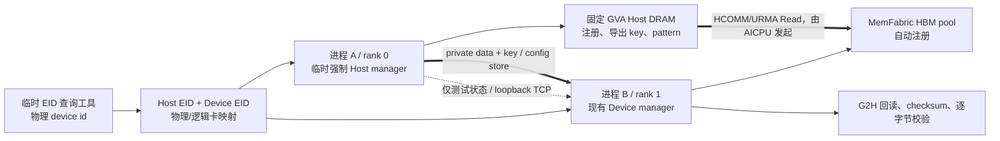

# 单机本地 DRAM 模拟远端 DRAM→HBM 拷贝验证方案

- **Authors:** MemFabric Hybrid URMA Maintainers
- **Created:** 2026-08-08
- **Updated:** 2026-08-08
- **Status:** Draft / 待评审，未批准前不得实现
- **Related Issue/PR:** 无；第 7 节要求批准实施前创建并关联
- **Baseline:** `feat/aicpu-urma-design-local-dram`，提交 `766fc0d4`
**Related Design:**
[`batch_copy_aicpu_urma_design.md`](batch_copy_aicpu_urma_design.md)、
[`batch_copy_aicpu_urma_staged_implementation_plan.md`](batch_copy_aicpu_urma_staged_implementation_plan.md)

---

# 1. 概述

## 1.1 简介

本方案设计一个只在单台昇腾节点上使用的双进程验证环境，以本机 Host DRAM 模拟真实鲲鹏节点的远端
DRAM，并验证现有生产链路能否由 Device/AICPU 发起 URMA Read，把 Host DRAM 数据写入指定 NPU HBM。
最终形态为：进程 A 提供固定 GVA DRAM、Host Endpoint 和导出 key；进程 B 创建 Device Endpoint、导入
Host key、发布 BatchCopy route，并通过现有 `mf_acc_offload.sparse_copy_urma()` 完成拷贝与校验。

方案不新增第二套 transport、route、operator 或 launcher。EID 工具参考 `review_test_hcomm` 已有的 DCMI/
DSMI/`urma_admin` 选路逻辑，以独立单文件放在 `examples/kv_offload` 下；实际进程继续复用现有
`MF_HOST_URMA_EID` 和 `USE_LOCAL_EID` 环境变量。为使同一个 NPU 构建中的进程 A 能选择当前仅在
`NO_XPU` 构建使用的 `HostUrmaTransportManager`，临时代码同时受构建参数、编译宏和运行时角色开关隔离，
不得改变真正无卡 Host 的编译期路径。

## 1.2 动机

真实鲲鹏+昇腾双节点环境准备成本高，当前 `02_host_device_urma.py` 也假设 Host 与 NPU 分处两台机器。
在进入真实环境前，需要先回答以下问题：

1. 指定物理卡对应的 Host/CPU EID 与 Device EID 是否能被稳定、可审计地选出；
2. 同机 Host Endpoint 与 Device Endpoint 能否建立 HCOMM channel；
3. Host 固定 GVA 的注册、导出、Device 导入和 route 发布是否满足现有三地址相等门禁；
4. 现有 AICPU、`HybmBatchRead`、fence/completion 和 acc_offload launcher 是否能完成数据闭环；
5. 哪些失败属于 MemFabric 缺口，哪些是 CANN/HCOMM/硬件行为差异。

若不先做单机闭环，跨节点联调中的 EID、ACL context、HCOMM import、route 和数据正确性问题会混在一起，
难以定位根因。

## 1.3 目标与非目标

### 目标

- 输入一张昇腾卡的物理 device id，输出一组可互联的 Host/DRAM EID 与 Device/HBM EID；
- 在同一台节点上以两个独立进程建立 Host↔Device UBC_CTP/HCOMM 链路；
- 进程 A 使用 MemFabric 固定 GVA DRAM，进程 B 使用 MemFabric 注册的本地 HBM 池；
- 被测数据路径只使用生产 `sparse_copy_urma → HybmBatchCopy → HybmBatchRead → HCOMM`；
- 覆盖单条、batch、边界和错误输入；
- 明确真实场景保留代码、单机临时代码、直接复用代码和最小修改文件；
- 为后续多个 DRAM 进程、多个 HBM 进程保留 rank/EID/route 扩展点。

### 非目标

- 本文不实施代码、不提交、不推送、不合并；
- 不用本机验证替代真实鲲鹏+昇腾验收；
- 不放宽 Host `key addr == export descriptor addr == import view addr` 门禁；
- 不修改 `copy_data/copy_data_batch`、DataOperator 或 AICPU 四字段 ABI；
- 不让 `HostUrmaTransportManager` 持有 ACL、device、HBM 或 AICPU 资源；
- 不让最终 `XPU_TYPE=NONE` 路径加载或调用 ACL/RT/HAL；
- 不把 EID 查询工具或角色覆盖代码带入最终鲲鹏+昇腾方案；
- 不修改 `test/` 目录，后续实现不补充单元用例；
- 不声称尚未在目标节点执行的 CANN/HCOMM 行为已经验证。

---

# 2. 用例分析

## 2.1 用例与验收目标

| 用例 | 优先级 | 验收目标 |
| --- | --- | --- |
| EID 查询 | P0 | 指定物理卡唯一得到 Host/Device EID；结果为 32 位小写十六进制 |
| 单条 4 KiB | P0 | Host 固定 GVA→本地注册 HBM，逐字节一致 |
| 多条 batch | P0 | 1、999、1000、1001 条均成功，覆盖 HCOMM 分片边界 |
| 非零 offset/尾边界 | P0 | 完整区间命中 route；MR 尾部恰好结束成功 |
| 非法输入 | P0 | 非法 EID、key、GVA、长度、物理/逻辑卡号在可预期层失败 |
| 多尺寸 | P1 | 1 B、4 KiB、1 MiB、池边界和全 0 长度 batch |
| 扩展拓扑 | P2 | 元数据协议可表达多个 Host rank 与多个 Device rank |

## 2.2 兼容性与实现约束

- 所有根错误记录 ERROR 日志，并携带实际存在的 `rankId`、device id、EID、key magic、地址、长度、
  channel/thread 和返回码；上层只透传已记录错误时不重复刷 ERROR；
- 进程 A 的 DRAM、key 和 entity 必须存活到进程 B 返回 `COPY_DONE`；
- 单张卡同一时刻只允许一个 `sparse_copy_urma`，不增加算子内并发 guard；
- 新增/修改函数尽量不超过 50 行，嵌套不超过 4 层，行宽不超过 120 字符；
- 构建参数缺省为 `OFF`，关闭时不编译任何本机模拟 C++ 分支，当前生产行为不变。

---

# 3. 方案设计

## 3.1 基线核对结论

### 3.1.1 两份原设计的固定约束

两份原设计已逐行核对，共 2150 行。与本任务直接相关且必须保留的结论如下：

- Host 固定 GVA DRAM 由 `HostUrmaTransportManager` 直接以 GVA/HVA 注册并导出；
- Device manager 导入 Host key 后强制三地址相等，route 只能在资源完整后发布；
- Host manager 不创建 ACL/TLS/AICPU 资源，Device manager 负责 device context、HBM flag、AICPU
  thread/channel 和 route publisher；
- `sparse_copy_urma` 不进入 `copy_data`、DataOperator 或 Compose 数据操作转发；
- route 发布后不可热更新，Close 前必须 quiescent，Close 先清 magic；
- `02_host_device_urma.py` 原本是跨节点 Host-DDR→NPU 的真实验收入口。

### 3.1.2 当前实现事实

| 事实 | 当前文件、符号和行号 | 对本方案的影响 |
| --- | --- | --- |
| Host EID 已有注入能力 | `host_urma_transport_manager.cpp:32,44-61` | 复用 `MF_HOST_URMA_EID` |
| Host endpoint 不含 ACL 逻辑 | 同文件 `71-139`；header `30-132` 无 ACL/device 成员 | 同机 ACL context 必须放在 Python 临时模式，不进入 manager |
| Host endpoint 使用 EID + Host loc | 同文件 `100-113` | 工具输出 Host EID 可直接注入 |
| Host DRAM 注册与 key | 同文件 `182-253,286-348` | 复用固定 GVA、MR/flag export 和 key layout |
| Host channel 使用 CPU engine | 同文件 `396-423` | 与真实 Host 角色一致 |
| Device EID 已有注入能力 | `device_urma_eid_reader.cpp:84-112,289-303` | 复用 `USE_LOCAL_EID` |
| Device endpoint/context | `device_urma_transport_manager.cpp:143-181,220-259,328-360` | 复用现有构造 |
| Device flag/HBM 注册 | 同文件 `184-217,915-979` | 继续复用，无新增 binding |
| Host key import 与三地址门禁 | 同文件 `1095-1277,1308-1351` | 单机验证不得绕过 type/address 校验 |
| AICPU channel/thread | 同文件 `1548-1588` | thread 为 `AICPU_TS`，channel 为 `AICPU`；需实机确认与当前 HCOMM 版本匹配 |
| route 发布 | 同文件 `1280-1478` | 继续使用统一 Host/Device builder 和 publisher |
| HBM pool 自动注册 | `src/hybm/csrc/entity/hybm_entity_default.cpp:215-241` | 进程 B 的 MemFabric HBM 池无需样例再次注册 |
| route control 自动初始化 | `src/smem/csrc/smem_bm/smem_bm.cpp:93-105` | `bm.initialize` 自动加 `HYBM_FLAG_INIT_SHMEM_META` |
| Compose 按编译宏选角色 | `compose_transport_manager.cpp:48-65` | NPU 构建不能选择 Host manager |
| 无卡 loader 不触碰 RT | `src/hybm/csrc/under_api/dl_api.cpp:96-109` | 临时方案不得改动 `NO_XPU` 分支 |
| 无卡 MapSlice 不做 HAL 注册 | `src/hybm/csrc/mm/hybm_conn_based_segment.cpp:388-413` | 临时同机 Host 是有卡验证路径；真实无卡路径保持不变 |
| 当前 Python Host 示例 | `02_host_device_urma.py:64-231` | 缺同机角色、Device EID 和稳健清理 |

### 3.1.3 当前缺口与已发现问题

1. NPU 构建中 `HOST_DEVICE_URMA` 总是创建 `DeviceUrmaTransportManager`；进程 A 无法仅靠 Python 参数选择
   Host manager。
2. 当前 `02_host_device_urma.py` 只给 Host 设置 `MF_HOST_URMA_EID`，Device EID 依赖自动发现，不能保证
   与临时工具选择的是同一对。
3. 当前 Host pattern 以 4 KiB block 重复，但 NPU 预期以整个 batch 连续 `arange % 251` 生成；batch 大于
   1 时两者在第二个 block 起不一致，必须改成全池连续 pattern 或按 block 重建期望。
4. 当前 NPU 创建本地 HBM pool，其 key 可能随 entity 交换给 Host；Host `Prepare()` 对所有非空 key 都调用
   `ImportRemoteMemKeysLocked()`，而该函数固定按 Host DRAM 解释。原设计明确 Host 面向 Device peer 不导入
   HBM key，当前代码没有清晰实现该过滤。
5. 当前 Device endpoint 在 `UBC_CTP` 下把 EID bytes 放入 `raws`，但 `type` 设置为
   `COMM_ADDR_TYPE_IP_V6` (`device_urma_transport_manager.cpp:230-240`)；Host 侧为
   `COMM_ADDR_TYPE_EID`。这是当前实现，不在本任务中擅自改写，需由实机建链结果确认兼容性。

## 3.2 参考项目分析

参考项目根目录为 `C:\code\review_test_hcomm`。以下结论来自实际源码，不把方案文档中的描述当成运行结果。

### 3.2.1 EID 发现与选路

`host_device_urma_demo/src/eid_discovery.cc` 的实际链路为：

1. `DcmiApi::GetLogicId()` 用 DCMI 把物理卡号映射到逻辑卡号（`210-220`）；
2. `ResolveTopology()` 通过 mainboard id 判断 server/pod；显式 `--topology` 可覆盖（`471-497`）；
3. `MeshDieId()` 规定 server mesh die=1，pod 中物理卡 0～3 取 die 0、4～7 取 die 1（`120-126`）；
4. `DsmiApi::GetUbDevName()` 获取指定逻辑卡关联的 UB UDMA 名（`341-359`）；
5. `RunUrmaAdminShow()` 以固定 argv 执行 `urma_admin show`，限制输出为 4 MiB（`371-468`）；
6. `ParseUrmaAdminOutput()` 解析 UDMA/EID 行（`570-622`）；
7. `FindCpuPgEidForUdma()` 在相同 UDMA 名下选择 PG EID；byte 6 高半字节为 3 或 7 表示 PG
   (`550-567,624-645`)；
8. `DcmiApi::GetUrmaDevices()` 获取 Device EID 候选（`237-290`）；
9. `FindDeviceEid()`：server 选择只有 1 个 EID、非 PG 且位于 non-mesh die 的项；pod 从 3 EID 组中
   选择 non-mesh die 的 PG EID（`647-693`）；
10. `DiscoverEidPair()` 汇聚并打印选择结果（`696-759`）。

参考工具入口已经存在：`host_device_urma_demo/src/eid_discovery_main.cc:71-125`，CMake target 为
`hcomm_urma_eid_discovery` (`host_device_urma_demo/CMakeLists.txt:15-24`)。本方案不修改参考仓，而是把上述
发现链路裁剪成 MemFabric `examples/kv_offload/urma_eid_query.cpp` 单文件，便于与样例一起临时使用。

### 3.2.2 Endpoint、内存与拷贝链路

- `BuildEndpoint()` 使用同一对 EID 构造 Host/Device endpoint：Host 为 `ENDPOINT_LOC_TYPE_HOST`，Device
  为 `ENDPOINT_LOC_TYPE_DEVICE`，协议均为 UBC_CTP
  (`host_device_urma_demo/src/link_demo_common.cc:428-450`)；
- 两端 channel name 由 Device EID、Host EID、port 和 index 构成，`BuildChannelDesc()` 设置相同 name、
  `exchangeAllMems=true` 和互补 socket role（同文件 `478-514`）；
- Host 进程先初始化 ACL context，再发现 EID、创建 Host endpoint
  (`host_server.cc:12-49`)；这是参考项目在同机环境中的实测前置条件，不等价于真实无卡鲲鹏路径；
- Host 以 `malloc` 分配/触碰 DRAM，`HcommMemReg(COMM_MEM_TYPE_HOST)` 后 `HcommMemExport`
  (`host_server.cc:51-100`)；
- Host channel 使用 `COMM_ENGINE_CPU`（`host_server.cc:195-214`）；
- Device 以 ACL 分配 HBM 并注册 `COMM_MEM_TYPE_DEVICE`，创建 Device channel
  (`device_client.cc:163-201`)；
- Device 导入 Host descriptor，再分配 AICPU_TS thread
  (`device_client.cc:263-305`)；
- `HduAicpuHostDramRead()` 是唯一 Read 发起点，执行 batch start、`HcommReadOnThread`、fence、batch end
  (`aicpu_kernel/src/hdu_aicpu_h2d_kernel.cc:55-90`)；
- Device 通过 D2H 回读、checksum 和逐字节 mismatch 验证，Host 独立复核结果
  (`device_client.cc:331-410`、`host_server.cc:269-325`)；
- 清理按 import/thread/channel/MR/device buffer/endpoint 依赖逆序执行
  (`device_client.cc:65-119`、`host_server.cc:116-140`)。

### 3.2.3 不能由源码直接确认的差异

参考项目 `device_client.cc:282-285` 明确记录：某 AICPU_TS 路径导入 Host DRAM 后，返回 view 的 type
可能是 `COMM_MEM_TYPE_DEVICE`。当前 MemFabric 把该返回映射为 `DEVICE_HBM`
(`hcomm_transport_manager.cpp:390-413`)，随后 Host route 在
`device_urma_transport_manager.cpp:1224-1233` 要求 view type 为 `HOST_DRAM`。两者存在冲突，但参考项目
记录不等于当前目标 CANN/HCOMM 的最终行为。本方案保持现有校验，失败时保存原始 type/addr/size 和版本，
再单独评审 T0.2，禁止在验证分支直接绕过。

参考项目 Device channel 使用 `COMM_ENGINE_AICPU_TS`，当前 MemFabric Device manager 使用
`COMM_ENGINE_AICPU` channel + `COMM_ENGINE_AICPU_TS` thread。该组合是否为当前 HCOMM 的正确生产接口也标为
待实机确认。

## 3.3 总体方案

### 3.3.1 架构与边界



生产链路保持不变。临时内容只有：

1. `examples/kv_offload` 下增加单文件 EID 查询工具，独立编译、独立运行；
2. 使用 `--build_local_dram_validation ON` 构建时定义 `MF_LOCAL_DRAM_VALIDATION`；
3. 只有宏已定义且运行时角色明确为 Host 时，进程 A 才选择 Host manager；
4. Python 示例的 `--local-dram-validation` 分支负责进程 A ACL context 和同机控制面。

### 3.3.2 临时 EID 查询工具

#### 位置与目标

工具放在 MemFabric 示例目录，但不接入产品 CMake、wheel 或 run 包：

```text
examples/kv_offload/urma_eid_query.cpp
```

该文件包含 CLI、DCMI/DSMI 动态加载、`urma_admin show` 解析、EID 选择和输出，不引用 MemFabric 库，也不
修改 `examples/kv_offload` 或仓库根目录的 CMake。实现按代码级逻辑复用
`review_test_hcomm/host_device_urma_demo/src/eid_discovery.cc`，但只复制完成本任务所需的最小函数和结构。

#### 命令行与输出

```bash
/tmp/mf_urma_eid_query \
  --device-id 0 \
  --topology auto \
  --format env \
  --no-candidates
```

`--device-id` 明确定义为物理卡号。`env` 输出固定如下；其中 logical 字段是 DCMI/EID 发现逻辑号，
不是 `ASCEND_RT_VISIBLE_DEVICES` 下的 ACL/Torch 可见索引：

```text
export MF_LOCAL_DRAM_PHYSICAL_DEVICE_ID=0
export MF_LOCAL_DRAM_LOGICAL_DEVICE_ID=0
export MF_LOCAL_DRAM_TOPOLOGY='server'
export MF_LOCAL_DRAM_UDMA='udmaX'
export MF_HOST_URMA_EID='0123456789abcdef0123456789abcdef'
export USE_LOCAL_EID='fedcba9876543210fedcba9876543210'
```

`json` 为单行 schema：

```json
{"schema":"mf-local-dram-eid/v1","physical_device_id":0,"logical_device_id":0,
 "topology":"server","mesh_die_id":1,"udma":"udmaX",
 "host_eid":"0123456789abcdef0123456789abcdef",
 "device_eid":"fedcba9876543210fedcba9876543210"}
```

`text` 使用 `[EID]` 人类可读格式。EID 必须为 32 位小写十六进制且非全 0。`env` 输出包含 `export` 并对
字符串做 shell 单引号转义，可直接 source；多个候选时输出候选数并以退出码 4 失败，禁止静默选择。

#### 错误与依赖

| 退出码 | 含义 |
| ---: | --- |
| 0 | 成功且输出完整 pair |
| 2 | CLI、device id 或 format 非法 |
| 3 | `libdcmi.so`、`libdrvdsmi_host.so`、符号或 `urma_admin` 不可用 |
| 4 | 拓扑未知、EID 为空/重复/无匹配 |
| 5 | 输出序列化或内部异常 |

stderr 格式为 `[ERROR] stage=<stage> physical_device_id=<id> ret=<ret> detail=<text>`。依赖 Linux、Ascend
driver、DCMI/DSMI 与可执行的 `urma_admin show`。所需运行用户和设备节点权限必须在目标节点确认。

#### 独立编译与运行

```bash
g++ -std=c++17 -O2 -Wall -Wextra -Werror \
  examples/kv_offload/urma_eid_query.cpp \
  -ldl -o /tmp/mf_urma_eid_query

/tmp/mf_urma_eid_query --device-id 0 --format env
```

编译仅产生 `/tmp/mf_urma_eid_query`，不会写入仓库 `build/` 或 `output/`。工具不进入 MemFabric CMake、
wheel、run 包或安装目录；本机模拟结束后删除源文件和临时二进制。

### 3.3.3 EID 环境变量复用

| 角色 | 现有变量 | 解析位置 | 格式/约束 |
| --- | --- | --- | --- |
| 进程 A / Host | `MF_HOST_URMA_EID` | `host_urma_transport_manager.cpp:44-61` | 必填，32 hex，大小写均可 |
| 进程 B / Device | `USE_LOCAL_EID` | `device_urma_eid_reader.cpp:84-112` | 可选覆盖；设置后必须为 32 hex |

工具的 `env` 输出直接生成这两个既有变量。样例只负责在 manager 首次构建 endpoint 前设置；不新增
`MF_DEVICE_EID`、EID map 文件或 Python→C++ binding。两个变量可同时存在，因为 Host manager 只读前者，
Device manager 只读后者。

最小缺口不是 EID 注入，而是同一 NPU 构建中选择 Host manager。临时能力先由构建参数开启：

```bash
bash script/build_and_pack_run.sh --build_local_dram_validation ON
```

参数在 `script/build_and_pack_run.sh` 中缺省为 `OFF`，经 `script/build.sh` 传给 CMake 变量
`BUILD_LOCAL_DRAM_VALIDATION`。只有值为 `ON` 且 `XPU_TYPE=NPU`、`BUILD_TOOL=cmake` 时，
`src/hybm/csrc/CMakeLists.txt` 才对 `hybmm_objects` 定义私有编译宏：

```cmake
target_compile_definitions(hybmm_objects PRIVATE MF_LOCAL_DRAM_VALIDATION)
```

参数为 `OFF` 时，临时 C++ 分支不进入目标文件。参数为 `ON` 但平台或构建工具不符合约束时，配置阶段直接
失败。宏内仍使用以下运行时变量区分同一套验证二进制中的两个进程角色：

```text
MF_LOCAL_DRAM_VALIDATION_ROLE=host
```

它不是 EID 机制。仅进程 A 设置；进程 B 不设置并保持 Device 默认。仅设置环境变量但没有打开构建参数，
不会启用 Host 角色覆盖。

### 3.3.4 临时角色覆盖与 ACL 边界

`ComposeTransportManager::OpenDeviceTransport()` 的临时逻辑：

```cpp
if (options.protocol & HYBM_DOP_TYPE_HOST_DEVICE_URMA) {
#if defined(NO_XPU)
    return CreateHostUrmaManager(options);
#elif defined(MF_LOCAL_DRAM_VALIDATION)
    auto role = GetLocalDramValidationRole(options);
    if (role == ValidationRole::INVALID) {
        return BM_INVALID_PARAM;
    }
    if (role == ValidationRole::HOST) {
        return CreateHostUrmaManager(options);
    }
    return CreateDeviceUrmaManager(options);
#else
    return CreateDeviceUrmaManager(options);
#endif
}
```

`GetLocalDramValidationRole()` 只在 `MF_LOCAL_DRAM_VALIDATION` 宏内编译，并同时校验：环境值严格等于
`host`、`rankId == 0`、
`MF_HOST_URMA_EID` 已设置、协议只有允许组合，并打印 WARN：`validation-only, do not use in production`。
非法值返回错误，不能静默回退。该 helper 不调用 ACL。宏未定义时，源代码只保留现有 `NO_XPU` 与 Device
分支，最终鲲鹏+昇腾构建不包含角色覆盖代码。

进程 A 在 Python 的 local 模式中先执行：

```python
torch.npu.set_device(runtime_device_id)
```

其中 `logical_device_id` 是 EID 工具/DCMI 返回的逻辑卡号，`runtime_device_id` 是
`ASCEND_RT_VISIBLE_DEVICES` 下 ACL/Torch 使用的可见索引；两者必须显式区分。再执行
`mf.initialize()`、`bm.initialize()` 和 `bm.create2()`。这一顺序借鉴参考项目
`InitializeAclBeforeEidDiscovery()` (`link_demo_common.cc:157-177`)，只为同机 Host Endpoint 提供当前 device
context。ACL 生命周期由 torch/CANN runtime 持有，不进入 Host manager。

真实 `XPU_TYPE=NONE` 构建仍由 `NO_XPU` 分支直接创建 Host manager，`DlApi::LoadExtendLibrary()` 只加载
HCOMM，`MapSlice()` 不把 `HOST_DEVICE_URMA` 加入 HAL register mask。临时代码不修改这些分支，因此最终
无卡 Host 不触碰 ACL/RT/HAL。

职责放置取舍如下：

| 能力 | 放置位置 | 原因 | 明确不放的位置 |
| --- | --- | --- | --- |
| 同机 Host 所需 device context | Python local 模式 | torch 已有 NPU runtime 生命周期，删除简单 | 不进入 Host manager/binding |
| Host/Device manager 选择 | Compose 私有 helper | 工厂选择只在此处发生，修改面最小 | 不增加公共 Python/C API |
| Host DRAM 分配/注册/export | 现有 Host manager/entity | 正是被测生产路径 | 不在样例直接调 HCOMM |
| HBM 分配/注册 | 现有 Device entity/manager | `create2` 的 HBM pool 已自动注册 | 不新增 validation binding |
| Device EID | 现有 `USE_LOCAL_EID` reader | 已有严格 parser 和自动发现 fallback | 不增加 EID map API |
| HCOMM init/channel/import/route | 现有两个 manager | 验证生产控制面 | 不使用参考项目的私有 transport |
| 测试协调 | Python loopback control | 不进入 key/descriptor 数据面 | 不把业务数据经 TCP 传输 |

### 3.3.5 两进程角色、参数与启动顺序

#### 进程 A：DRAM provider / rank 0

1. 读取工具输出，设置 `MF_HOST_URMA_EID` 和 `MF_LOCAL_DRAM_VALIDATION_ROLE=host`；
2. 用 `runtime_device_id` 初始化 torch NPU context；
3. `bm.initialize(tcp://127.0.0.1:<store>, 2, runtimeDeviceId, rank0Config)`，rank 0 启动 store；
4. `bm.create2(local_dram_size=POOL_BYTES, local_hbm_size=0,
   data_op_type=HOST_DEVICE_URMA, enable_56bits_gva=False)`；
5. `join()` 后取得 rank 0 Host GVA 与 `LOCAL_HOST` VA，要求两者相等；
6. 以全池连续 `byte[i] = (i * 131 + seed) & 0xff` 初始化，调用现有 `copy_data(H2G)`；
7. Host manager 自动注册固定 GVA、导出 MR/flag key；
8. loopback TCP 只发送 schema、Host GVA、size、seed、round 和 checksum；
9. 收到 B 的 `COPY_DONE` 后才 leave/destroy/uninitialize。

#### 进程 B：HBM consumer / rank 1

1. 设置 `USE_LOCAL_EID`，不设置临时 Host role；
2. `torch.npu.set_device(runtimeDeviceId)`；
3. `bm.initialize(... rank1Config)`；
4. `bm.create2(local_dram_size=0, local_hbm_size=POOL_BYTES,
   data_op_type=HOST_DEVICE_URMA)` 并 `join()`；
5. 本地 HBM pool 由 entity 分配并以 `REG_MR_FLAG_HBM` 自动注册；取得本地 HBM GVA 和
   `gva_to_va(..., LOCAL_DEVICE)` 返回的实际 device VA；
6. Device manager 导入 Host MR/flag，验证三地址相等并发布 route；
7. 在 HBM 上构造 `src/dst/len` 三组 `torch.int64` 地址 tensor；dst 元素使用本地 HBM pool 的实际 VA；
8. 调用现有 `mf_acc_offload.sparse_copy_urma()`；launcher 同步返回后，再用 `copy_data(G2H)` 回读到 Host
   staging buffer，仅用于校验；
9. 比较 checksum 与逐字节内容，发送 `COPY_DONE`，随后 leave/destroy/uninitialize。

本方案优先使用 MemFabric HBM pool，而不是未注册的 torch destination，从而同时验证 HBM 分配/注册和
AICPU 写入。`src/dst/len` 控制 tensor 仍由 torch 分配。若实机证明 `sparse_copy_urma` 目的地址必须是框架
HBM 才可用，则增加一个独立用例，不改变默认验收。

### 3.3.6 Host 是否需要过滤 Device HBM key：原因与结论

提出该修改的原因来自当前调用链，而不是本机模拟本身：

1. `ComposeTransportManager::GetDevicePrepareOptions()` 会把 peer 的 `memKeys` 全部转成 Device URMA key，
   交给当前 `deviceTransportManager_`；本机进程 A 通过临时角色覆盖后，该对象实际是
   `HostUrmaTransportManager`；
2. `HostUrmaTransportManager::Prepare()` 在 `peerInfo.memKeys` 非空时无条件调用
   `ImportRemoteMemKeysLocked()`；
3. 该函数把每个 key 都按 Host DRAM export descriptor 导入，并把 view 固定标记为 `HOST_DRAM`；
4. 本方案是 Device 主动读取 Host DRAM。Host 只需导出自己的 DRAM/flag，不需要导入进程 B 的 HBM；若
   entity 确实把进程 B 的 HBM key 发给进程 A，Host 可能在无用的导入步骤提前失败，拷贝尚未触发就退出。

但是，仅凭当前源码不能确认进程 B 的 HBM key 最终一定出现在进程 A 的 `peerInfo.memKeys` 中；同时，直接按
Device endpoint 跳过全部 key 可能影响未来双向数据面。因此修订后的结论是：**不把 Host key 过滤列为默认
修改项**。首轮运行先观察 `Prepare()` 收到的 key 数量、descriptor tag/type 和失败点：

- 未收到 Device HBM key，或现有 `Prepare()` 成功：Host manager 零修改；
- 明确收到 Device HBM key 且因此失败：再增加仅受 `MF_LOCAL_DRAM_VALIDATION` 宏保护的过滤分支；
- 若真实鲲鹏+昇腾场景也需要同一过滤：脱离本临时方案单独评审，确认双向语义后才可转为正式代码。

这样修改的目的只是避免单向验证被无关的反向 HBM key 阻塞，不是放宽 Host DRAM 的 key magic、地址相等、
type 或 size 校验。

### 3.3.7 控制面元数据

MemFabric endpoint/private data/key 的正式交换继续走现有 config store/entity 流程。loopback TCP 不传 HCOMM
descriptor，消息只用于测试协调：

```text
HELLO v1: role, rank, pid, physical_device_id, logical_device_id, runtime_device_id,
          host_eid, device_eid, round
SOURCE_READY v1: host_gva, pool_bytes, item_bytes, seed, checksum
COPY_READY v1: imported_gva, import_view, hbm_gva, hbm_va, route_mode
COPY_DONE v1: result, bytes, expected_checksum, actual_checksum,
              first_mismatch, hcomm_ret
RELEASE v1: round
```

消息使用一行一个 JSON 对象；TCP 只承担启动与结果协调，不承载 pattern 数据或 HCOMM descriptor。

### 3.3.8 端到端时序

为避免渲染器不支持 Mermaid，时序改用普通 Markdown 表格：

| 步骤 | 发起方 | 接收方/组件 | 动作与结果 |
| ---: | --- | --- | --- |
| 1 | EID 工具 | 本机环境 | 物理卡号映射为逻辑卡号、UDMA、Host EID 和 Device EID |
| 2 | 进程 A | Host manager | 设置 Host EID 和临时角色，初始化 NPU context，创建 Host endpoint/CPU channel |
| 3 | 进程 A | Host manager | 分配固定 GVA DRAM，初始化 pattern，注册并导出 DRAM/flag key |
| 4 | 进程 B | Device manager | 设置 Device EID，创建 Device endpoint、AICPU thread/channel 和本地 HBM pool |
| 5 | entity/store | 两个 manager | 交换 endpoint private data 和 key，双方执行 `Prepare()` |
| 6 | Device manager | route control | 导入 Host key，校验 addr/type/size，发布 Host DRAM route |
| 7 | 进程 A | 进程 B | loopback 控制面发送 `SOURCE_READY` 和源 GVA/size/pattern 元数据 |
| 8 | 进程 B | AICPU | 调用 `sparse_copy_urma(src GVA, dst HBM VA, len)` |
| 9 | AICPU | HCOMM/HBM | route lookup、分组、`HybmBatchRead`、fence/completion，数据写入 HBM |
| 10 | 进程 B | 本地校验 | G2H 回读并比较 checksum 与逐字节内容 |
| 11 | 进程 B | 进程 A | 成功时发送 `COPY_DONE`；双方按依赖顺序释放资源并退出 |

### 3.3.9 同步、fence 与完成语义

- `sparse_copy_urma` launcher 在当前 stream 启动并同步；AICPU 内部 `HybmBatchRead` 对每 peer fence，并通过
  remote flag/completion cell 完成确认；
- Python 的 `torch.npu.synchronize()` 只作额外诊断，不替代生产 completion；
- `COPY_DONE` 只能在 API 返回 `BM_OK` 且 G2H 校验完成后发送；
- HCOMM 已提交后失败可能部分写入 HBM，整批输出必须丢弃，不做数据回滚；
- Close 前必须收到双方 quiescent handshake，禁止在途 kernel 时清 route。

### 3.3.10 地址、key 与 EID 约束

- Host GVA、`key.keys[1]`、`UrmaExportDesc.addr`、Host import view addr 必须相等；
- Host pool `enable_56bits_gva=False`，固定映射失败即退出，不回退任意 HVA；
- HBM dst 使用 `gva_to_va(local_hbm_gva, LOCAL_DEVICE)` 得到的实际 VA，不把 HBM GVA误当 DVA；
- `[src, src+len)` 必须完整落入一个 route range，所有加法先查溢出；
- dst 不得与 `[HYBM_BATCH_COPY_META_ADDR, SVM_END_ADDR)` control 区重叠；
- key magic/version/headerSize/descLen/type/size/flag 均继续使用现有校验；
- Host/Device EID 都是 16 B，CLI 表示为 32 hex；工具输入物理卡号，EID/DCMI 使用工具输出的逻辑卡号，
  torch/ACL/bm 使用 `ASCEND_RT_VISIBLE_DEVICES` 下的 runtime 可见索引；
- 一个进程只注入一个本地 endpoint EID；未来多卡由每个 Device 进程独立环境生成，不能在同一进程动态切换。

### 3.3.11 资源生命周期与退出顺序

进程 A：

```text
torch/ACL context（临时同机前置）
  -> mf.initialize
  -> bm.initialize / HYBM meta
  -> Host endpoint
  -> Host flag malloc + HcommMemReg
  -> fixed GVA DRAM + HcommMemReg/Export
  -> CPU channel
  -> wait COPY_DONE
  -> leave/destroy
  -> bm.uninitialize
  -> mf.uninitialize
```

进程 B：

```text
torch/ACL context
  -> mf.initialize
  -> bm.initialize / route control
  -> Device endpoint + device flag
  -> HBM pool + HcommMemReg
  -> AICPU thread/channel
  -> Host MR/flag import
  -> route publish
  -> sparse_copy_urma
  -> route magic clear
  -> completion/import/thread/channel/MR/endpoint cleanup
  -> HBM pool release
  -> bm.uninitialize / mf.uninitialize
```

Python 使用 `try/finally` 按已创建资源的逆序退出。根错误按仓库规范记录 stage、rank、device 和返回码；
禁止用 `assert` 承担参数校验，因为 `python -O` 会移除 assert。

### 3.3.12 并发与扩展边界

- 当前：1 Host rank + 1 Device rank，一卡一个在途 batch；两个进程绑定同一物理卡和同一 runtime 可见索引，
  EID/DCMI 逻辑卡号单独用于发现与映射校验；
- 多 DRAM 进程：每个 Host rank 独立固定 GVA区间、Host EID/endpoint/channel；Device route 按 peer 分组；
- 多 HBM 进程：每个 Device rank 绑定独立 device id、使用该卡 EID 和独立 route control 区；
- 不支持多个进程同时在同一张卡发布不同 route。是否允许同卡多 Device 进程共享/覆盖固定 route 是未来设计，
  本方案明确拒绝；
- 控制面由单连接升级为 coordinator + `rank -> endpoint/EID/pool` 表，消息 schema 已包含 rank/device；
- route 仍受 64 peer、每 peer 16 range、总 1024 range 限制。

### 3.3.13 环境与前置条件

| 项目 | 要求 | 验证方式 |
| --- | --- | --- |
| 硬件 | 单台带目标 Ascend 950 的 Linux 节点 | `npu-smi`/DCMI，记录物理与逻辑卡映射 |
| CANN/driver | 包含 ACL/RT、HCOMM、DCMI、DSMI 和目标 Host/Device UBC 能力 | 记录版本和实际 so 路径 |
| HCOMM plugin | 能在同一 device context 创建 Host 与 Device UBC_CTP endpoint | 以 endpoint/channel 日志为准 |
| EID 工具 | `libdcmi.so`、`libdrvdsmi_host.so`、`urma_admin show` 可用 | 独立查询命令成功 |
| MemFabric | 基于 `766fc0d4` 的 NPU 构建，已安装 Python 包 | wrapper 默认构建命令 |
| AICPU | `HybmBatchCopy` 已随匹配版本 kernel 包安装 | 符号/launcher 实际加载日志 |
| 配置存储 | `tcp://127.0.0.1:<port>`，rank 0 启动 store | 两 rank join 成功 |
| 端口 | store、entity NIC、control 三类端口不冲突 | 启动前 bind 探测 |
| GVA | `enable_56bits_gva=False`，固定窗口未被占用 | Host GVA==VA 日志 |
| 权限 | driver/DCMI/DSMI/URMA 设备节点可访问 | 以实际用户运行，不预设 root |

构建基线：

```bash
bash script/build_and_pack_run.sh
```

`ASCEND_HOME_PATH` 必须指向实际 CANN 安装；AICPU run/wheel 的构建和安装沿用原设计，不因本机验证新增
交付物。目标 Host UBC plugin 的准确
文件名、加载路径和是否需要 `HCOMM_NIC_PLUGIN_SO` 取决于目标 CANN 包，必须以节点安装和日志确认。

## 3.4 技术选型与备选方案

| 方案 | 优点 | 缺点 | 结论 |
| --- | --- | --- | --- |
| NPU 构建临时选择现有 Host manager | 最大化复用生产 key/route/entity | 需显式角色覆盖；同机 Host 要 ACL context | 采用，仅验证分支 |
| 直接运行参考项目 Host server，B 使用 MemFabric | Host 侧已验证 | 控制协议/key 格式不同，绕过 MemFabric Host manager | 拒绝 |
| 新增 pybind 暴露 HCOMM endpoint/MR | Python 灵活 | 扩大公共 API，旁路 entity/route 生命周期 | 拒绝 |
| 在 Host manager 内加入 ACL/device 逻辑 | 调用集中 | 污染真实无卡 T1，违反职责边界 | 拒绝 |
| NPU 进程同时模拟 Host 和 Device endpoint | 文件少 | 同进程生命周期/全局状态耦合，不能验证双进程 | 拒绝 |
| `examples/kv_offload` 单文件 EID 工具 | 与样例同目录，独立编译运行 | 临时复制最小发现逻辑 | 采用，验收后删除 |
| 继续修改 `review_test_hcomm` 的工具 | 无需复制算法 | 使用者需要切换代码仓，交付不集中 | 拒绝 |
| 使用 torch tensor 作为默认 dst | 贴近框架 | 目的区未由 MemFabric/HCOMM 显式注册 | 作为补充用例 |
| 使用 MemFabric HBM pool 作为默认 dst | 验证分配、注册、实际 HBM VA | G2H 校验多一步 | 采用 |

## 3.5 编程与接口设计

### 3.5.1 Python CLI

保留现有 `--rank` 入口，新增仅验证模式参数：

```text
--local-dram-validation
--physical-device-id N        # 可选覆盖；默认读取 MF_LOCAL_DRAM_PHYSICAL_DEVICE_ID
--device-id N                 # 可选兼容覆盖；默认读取 MF_LOCAL_DRAM_LOGICAL_DEVICE_ID
--runtime-device-id N         # 可选覆盖；默认由物理卡号和 ASCEND_RT_VISIBLE_DEVICES 派生
--host-eid 32HEX
--device-eid 32HEX
--rounds N
--sizes 1,4096,1048576
--batch-counts 1,999,1000,1001
--negative none|bad-gva|cross-range|overflow-len|wrong-device
```

物理/逻辑设备 ID 和 `--host-eid/--device-eid` 缺省读取 EID 工具及现有环境变量；runtime index 由
`ASCEND_RT_VISIBLE_DEVICES` 派生。CLI 值与环境同时存在但不一致时失败，避免静默覆盖。真实跨节点默认模式
保持现有行为，不设置临时角色变量，也不要求 Host 初始化 ACL。

### 3.5.2 预期日志

```text
[eid] physical=0 logical=0 topology=server host_eid=<32hex> device_eid=<32hex>
[host] validation_role=host rank=0 gva=0x... va=0x... bytes=8388608 key_exported=true
[npu] rank=1 runtime_device=0 logical_device=0 physical_device=0 host_gva=0x... import_view=0x... equality=pass
[npu] hbm_gva=0x... hbm_va=0x... registered_pool_bytes=8388608 route=HOST_DRAM
[npu] sparse_copy_urma round=0 count=1001 bytes=4100096 ret=0 fence=complete
[npu] verify expected=0x... actual=0x... first_mismatch=none result=PASS
[host] peer_result=PASS release=sent
02_host_device_urma local validation: PASS
```

日志中的 `fence=complete` 只能由 API 成功返回语义推导，不伪造 HCOMM 内部事件；若没有直接字段，不打印
具体 fence 次数。

### 3.5.3 完整调用示例

先构建临时验证版本并独立编译 EID 工具：

```bash
bash script/build_and_pack_run.sh --build_local_dram_validation ON

g++ -std=c++17 -O2 -Wall -Wextra -Werror \
  examples/kv_offload/urma_eid_query.cpp \
  -ldl -o /tmp/mf_urma_eid_query

EID_TOOL=/tmp/mf_urma_eid_query
"${EID_TOOL}" --device-id 0 --format env --no-candidates > /tmp/mf-local-dram-eid.env
. /tmp/mf-local-dram-eid.env
```

终端 1，进程 A：

```bash
export MF_LOCAL_DRAM_VALIDATION_ROLE=host
export MF_HOST_URMA_EID
python3 examples/kv_offload/sparse_copy_urma/02_host_device_urma.py \
  --local-dram-validation \
  --rank 0 \
  --head-ip 127.0.0.1
```

终端 2，进程 B：

```bash
unset MF_LOCAL_DRAM_VALIDATION_ROLE
export USE_LOCAL_EID
python3 examples/kv_offload/sparse_copy_urma/02_host_device_urma.py \
  --local-dram-validation \
  --rank 1 \
  --head-ip 127.0.0.1
```

启动顺序为 A 后 B；A 的 `join()` 可等待 B。禁止以固定 sleep 判定 ready，使用 store join 和控制帧。

## 3.6 文件级修改设计

### 3.6.1 现有代码可直接复用

- `HostUrmaTransportManager` 的 Host endpoint、flag、固定 GVA MR、key export、CPU channel 和清理；
- `DeviceUrmaTransportManager` 的 ACL/device info、Device EID、MR/flag import、thread/channel、route builder；
- `BatchCopyRoutePublisher`、固定 route ABI、`HybmBatchCopy`、`HybmBatchRead`、acc_offload launcher；
- `MF_HOST_URMA_EID`、`USE_LOCAL_EID`、config store/entity/private data/key 交换；
- Python `bm.initialize/create2/join/peer_rank_ptr/gva_to_va/copy_data`；
- 参考项目 `eid_discovery.cc` 的物理/逻辑卡映射、拓扑、UDMA 和 EID 选择逻辑。

### 3.6.2 MF 修改点汇总（不含 EID 工具）

| 序号 | 文件 | 修改点 | 修改原因 | 最终方案是否使用 | 隔离方式 |
| ---: | --- | --- | --- | --- | --- |
| 1 | `script/build_and_pack_run.sh` | 增加 `--build_local_dram_validation ON/OFF` | 给临时能力提供唯一构建入口，缺省关闭 | 否 | 参数缺省 `OFF` |
| 2 | `script/build.sh` | 接收第 13 个参数并传 `-DBUILD_LOCAL_DRAM_VALIDATION` | wrapper 最终通过该脚本执行 CMake | 否 | 参数缺省 `OFF` |
| 3 | `hybm/csrc/CMakeLists.txt` | 给 `hybmm_objects` 增加宏 | 限定宏作用域 | 否 | 编译宏 |
| 4 | `compose_transport_manager.cpp` | 宏内选择 Host role | NPU 构建当前只能选 Device | 否 | 编译宏 + role |
| 5 | `02_host_device_urma.py` | CLI、生产路径和进程调度 | 保持入口兼容并隔离 validation 分支 | 否；pattern 可保留 | CLI 开关 |
| 6 | `urma_example_common.py` | 日志、控制通道、生命周期和参数解析 | 拆出公共职责，复用生产/验证路径 | 否 | 同目录私有示例模块 |
| 7 | `urma_local_validation.py` | 本机双进程 copy、握手、校验 | 拆出 validation-only 数据面 | 否 | CLI 开关 |
| 8 | `sparse_copy_urma/README.md` | 增加临时构建、EID 查询及启动命令 | 避免使用者遗漏宏或混淆物理/逻辑卡号 | 否 | 标记 validation-only |
| C1 | `host_urma_transport_manager.h` | 声明条件 key 过滤 helper | 仅当 3.3.6 的 Device HBM key 问题实机出现 | 待定 | 编译宏，条件修改 |
| C2 | `host_urma_transport_manager.cpp` | 宏内跳过本机验证不需要的 Device HBM key | 避免单向验证在无用导入处失败 | 待定 | 编译宏，条件修改 |

因此，**EID 工具除外，MF 必改 8 个文件**：2 个构建脚本、1 个 CMake、1 个 C++、3 个 Python 示例模块和
1 个 README。Host manager 的 2 个文件只是条件项，未观察到 3.3.6 所述问题时保持零修改。无需修改
binding、Device manager、AICPU、route/key ABI 或 `test/` 目录。

### 3.6.3 最终保留与临时代码边界

| 分类 | 内容 | 处理方式 |
| --- | --- | --- |
| 最终真实鲲鹏+昇腾复用 | 既有 EID 环境变量、两个 manager、key/endpoint、route、AICPU 和 acc_offload | 保持现状 |
| 可独立保留的通用修正 | Python 全池连续 pattern 修正 | 与本机模式拆分后可保留 |
| 仅单机模拟 | 构建参数、编译宏、Compose 角色覆盖、Python local 分支、EID 工具、临时 README | 验证结束后删除 |
| 条件临时项 | Host manager 过滤 Device HBM key | 仅实机触发时实现；先置于宏内 |

所有最终方案不使用的 C++ 代码必须位于 `#if defined(MF_LOCAL_DRAM_VALIDATION)` 内。Python 不参与 C++
编译，因此使用 `--local-dram-validation` 隔离；其本机分支只有在宏开启的库上才可工作。EID 工具是独立源文件，
不受产品宏控制，也不进入产品构建。验证结束后删除上述临时内容并以默认参数重新构建。

### 3.6.4 不需要修改的关键文件

- `device_urma_eid_reader.cpp`：已支持 `USE_LOCAL_EID`；
- `hcomm_transport_manager.cpp`：不绕过 import type；
- `device_urma_transport_manager.cpp`：当前 route/import 生产门禁保持不变；
- `hybm_batch_copy.*`、`hybm_batch_transfer.*`、acc_offload launcher：使用现有实现；
- `dl_api.cpp`、`hybm_conn_based_segment.cpp` 的 `NO_XPU` 分支：禁止修改；
- binding、wheel/run 打包文件：不增加公共接口或安装内容。

### 3.6.5 逐文件拟改符号与伪代码

#### 构建参数与编译宏（临时）

`script/build_and_pack_run.sh` 增加参数解析、help 和打印：

```bash
BUILD_LOCAL_DRAM_VALIDATION="OFF"
--build_local_dram_validation)
    BUILD_LOCAL_DRAM_VALIDATION="$2"
    shift 2
    ;;
```

`script/build.sh` 以第 13 个位置参数接收并传给 CMake。值为 `ON` 时只允许 CMake + NPU 构建，其他组合在
脚本或 CMake 配置阶段记录参数值并失败。`src/hybm/csrc/CMakeLists.txt` 的目标级设计为：

```cmake
option(BUILD_LOCAL_DRAM_VALIDATION "Build temporary local DRAM validation path" OFF)
if (BUILD_LOCAL_DRAM_VALIDATION AND NOT XPU_TYPE STREQUAL "NPU")
    message(FATAL_ERROR "BUILD_LOCAL_DRAM_VALIDATION requires XPU_TYPE=NPU")
endif ()

add_library(hybmm_objects OBJECT ${HYBMM_SRC_FILES})
if (BUILD_LOCAL_DRAM_VALIDATION)
    target_compile_definitions(hybmm_objects PRIVATE MF_LOCAL_DRAM_VALIDATION)
endif ()
```

#### `compose_transport_manager.cpp`（临时）

helper 和调用点全部包在宏内：

```cpp
#if defined(MF_LOCAL_DRAM_VALIDATION)
ValidationRole GetLocalDramValidationRole(const TransportOptions &options)
{
    const char *role = std::getenv("MF_LOCAL_DRAM_VALIDATION_ROLE");
    if (role == nullptr) {
        return ValidationRole::DEVICE;
    }
    if (std::strcmp(role, "host") != 0 || options.rankId != 0) {
        BM_LOG_ERROR("invalid local DRAM validation role, rankId=" << options.rankId
                     << ", role=" << role);
        return ValidationRole::INVALID;
    }
    return ValidationRole::HOST;
}
#endif
```

`OpenDeviceTransport()` 仅在宏内解释该枚举，对 INVALID 返回 `BM_INVALID_PARAM`。宏关闭时编译器看不到
helper、枚举、环境变量和 Host override 分支。

#### `host_urma_transport_manager.{h,cpp}`（条件修改）

默认不修改。只有实机证明 Device HBM key 导致 Host `Prepare()` 失败时，才在宏内增加私有
`ImportPeerKeysForLocalValidationLocked()`。该 helper 只过滤已确认的 Device HBM descriptor，不按 endpoint
位置盲目跳过全部 key；宏关闭时仍直接调用现有 `ImportRemoteMemKeysLocked()`。具体 descriptor 识别依据必须
来自首轮日志，不能在文档中猜测字段。

#### `02_host_device_urma.py`（本机分支临时）

拟拆分为以下 helper，每个只做一个职责：

```python
def _parse_and_validate_eids(args): ...
def _configure_local_validation_env(args): ...
def _initialize_role_runtime(args): ...
def _create_host_source(handle, pool_bytes, seed): ...
def _get_registered_hbm_destination(handle, size): ...
def _build_device_address_tensors(src, dst, lengths, device): ...
def _verify_hbm_by_g2h(handle, hbm_gva, expected): ...
def _report_result(conn, stage, ret): ...
```

主流程伪代码：

```python
state = RuntimeState()
try:
    eids = _parse_and_validate_eids(args)
    _configure_local_validation_env(args)
    state.runtime = _initialize_role_runtime(args)
    state.handle = _create_handle_for_role(args)
    state.handle.join()
    if args.rank == HOST_RANK:
        _serve_host_cases(state, args)
    else:
        _run_device_cases(state, args)
finally:
    _cleanup_in_dependency_order(state)
```

全池 pattern 改成绝对 offset 可复现；参数错误使用显式检查并携带 stage/rank/device/ret。真实跨节点模式
不调用 `torch.npu.set_device()` 的 Host 分支，也不设置 validation role。

#### `README.md`（文档）

新增“真实跨节点模式”和“临时本机模式”两节；说明构建参数、宏、EID 工具输入物理卡、Python 区分 EID 逻辑卡和
runtime 可见索引，
并注明临时模式的删除边界。

#### `examples/kv_offload/urma_eid_query.cpp`（独立临时工具）

单文件内拆分 `ParseArgs()`、`LoadDcmi()`、`MapPhysicalToLogical()`、`GetTopology()`、`GetUdmaName()`、
`RunUrmaAdmin()`、`ParseUrmaEntries()`、`FindHostEid()`、`FindDeviceEid()` 和 `PrintResult()`。每个函数尽量不超过
50 行；根错误记录 stage、physical/logical device id、库/接口名和返回码。工具只通过第 3.3.2 节的 `g++`
命令编译，不新增 CMake 或构建脚本入口。

---

# 4. 分阶段实施与验收计划

## 4.1 阶段 A：静态核对与编译

1. 记录 commit、CANN、driver、HCOMM plugin、Python/torch_npu 版本；
2. 实现前后执行 `git diff --check`；
3. 默认构建确认临时宏关闭：

```bash
bash script/build_and_pack_run.sh
```

4. 临时验证构建确认 CMake 输出 `BUILD_LOCAL_DRAM_VALIDATION=ON`：

```bash
bash script/build_and_pack_run.sh --build_local_dram_validation ON
```

5. 使用 `XPU_TYPE=NONE` 或 Bazel 同时开启该参数时，配置必须明确失败。

## 4.2 阶段 B：EID 工具运行检查

- 使用第 3.3.2 节的 `g++` 命令独立编译；
- `--device-id 0 --format text|json|env` 输出字段一致；
- 非法卡号、无法加载 DCMI/DSMI、`urma_admin` 失败时返回对应非零退出码；
- 用 `urma_admin show` 和 DCMI 原始候选人工复核 Host/Device EID 与物理/逻辑卡映射；
- 若出现多个候选，记录枚举顺序和选择依据，不声称唯一映射。

## 4.3 阶段 C：单机双进程 happy path

1. 1 MR、单条 4 KiB；
2. 1 B、4 KiB、1 MiB；
3. 1/999/1000/1001 条；
4. 非零 offset、MR 尾部恰好结束；
5. 本地 HBM pool destination；补充 torch HBM destination；
6. 校验 endpoint loc、EID、物理/逻辑卡、key/export/view、route peer/range、thread/channel；
7. 每轮校验 checksum 和首 mismatch，保存双方完整日志。

## 4.4 阶段 D：负向测试

| 负向项 | 注入层 | 预期 |
| --- | --- | --- |
| Host EID 长度/非 hex | 环境/Host manager | `BM_INVALID_PARAM`，未创建 endpoint |
| Device EID 长度/非 hex | 环境/Device reader | `BM_INVALID_PARAM`，日志含 phy/rank |
| 不存在的物理卡号 | EID tool | 非 0 退出，未输出部分 env |
| 物理/逻辑卡不一致 | Python precheck + Device manager log | 启动前失败或明确 mapping mismatch |
| 失效 key | A 导出后退出，再由 B 发起导入/读取 | HCOMM import/read 失败，记录接口与返回码 |
| 未知 GVA | Python `--negative=bad-gva` | `BM_NOT_CONNECTED`，无 HCOMM submit |
| 跨 range/越界长度 | Python | `BM_INVALID_PARAM/BM_NOT_CONNECTED`，无提交 |
| 地址加法溢出 | Python 构造输入 | Python 参数检查失败，不触发算子 |
| 全 0 长度 | Python | `BM_OK`，不调用 HCOMM |
| wrong device | Python | route/device mismatch，明确失败 |

本方案不增加 key mutator 或其他仅为负向验证服务的产品接口。若“失效 key”无法稳定到达目标导入路径，记录
为当前样例不可注入，不扩展本次修改范围。

## 4.5 阶段 E：下一步多进程扩展

1. 2 Host ranks → 1 Device rank，验证两个 peer 分组和 completion cell；
2. 1 Host rank → 2 Device ranks，每张卡独立 EID/route/HBM；
3. 2×2，coordinator 分发 rank/EID/pool 元数据；
4. 每个 Host peer 1～16 MR；
5. 超过 64 peer/1024 range 明确拒绝；
6. 同卡多个 Device 进程仍不支持，需另立 route owner/并发设计。

---

# 5. 缺点和风险

| 风险 | 影响 | 缓解/回滚 |
| --- | --- | --- |
| 同机 Host Endpoint 依赖 ACL context | 与真实无卡 Host 行为不同 | 只在 Python local 模式初始化；manager/NO_XPU 不变 |
| import view type 为 DEVICE | 当前 Host route type 门禁失败 | 保存证据，单独评审 T0.2；不临时绕过 |
| Host import view addr 不等于 GVA | route 不发布 | 保持 equality 硬失败，转真实环境或修 HCOMM 根因 |
| Device endpoint addr type 与参考不同 | channel 可能失败 | 先记录当前 raw/type；是否修正另立决策 |
| AICPU channel engine 组合不匹配 | channel/thread 创建失败 | 保存 HCOMM 版本与返回码，不能擅改生产组合 |
| 两进程共享同一卡 HYBM meta 初始化 | 固定 HBM control 资源可能冲突 | 首轮 1×1 实测；失败则评审独立 Host helper，不硬改 meta |
| NPU HBM key 被 Host 误导入 | Host Prepare 失败 | 经日志确认后在宏内按 descriptor 做最小过滤 |
| 临时角色代码进入最终构建 | 最终二进制包含无用分支 | 构建参数缺省 OFF，C++ 使用编译宏隔离，验收后删除 |
| EID 多候选取首个不稳定 | 建链到错误端口 | 打印全部候选并要求人工确认；可改为多候选即失败 |
| 本机成功掩盖跨节点问题 | 真实鲲鹏仍失败 | 本机仅前置门禁，保留真实 T3 验收 |

回滚最简单路径为：使用缺省 `--build_local_dram_validation OFF` 重新构建，再删除 Compose 临时角色分支、
Python local 模式和独立 EID 工具。Host key 过滤若被证明影响既有 Host↔Device 反向数据面，则删除该条件
修改，并重新评审真实语义。

---

# 6. 现有技术

- MemFabric 当前 Host/Device manager、private-data v2、key ABI、route publisher、AICPU 和 acc_offload API；
- `C:\code\review_test_hcomm` 的 EID 发现、同机 ACL context、Endpoint/Channel、Host MR export、Device
  import、AICPU Read 和双端校验闭环；
- 原设计中的固定 GVA、Host equality、immutable route、completion/magic-last 和资源回滚策略。

本方案借用参考项目的 EID/同机运行经验，但数据面必须走 MemFabric 生产 manager 和 `sparse_copy_urma`，
不复用参考项目的私有 control descriptor 或独立 AICPU kernel。

---

# 7. 待审查者决策与未解决问题

本轮审查已确认：EID 工具放在 `examples/kv_offload` 并独立编译；临时 C++ 代码使用构建参数和编译宏隔离；
后续实现不修改 `test/` 目录。以下问题仍需在批准实现前或首轮实机后明确：

- [ ] 是否接受 EID 多候选时“按 DCMI/`urma_admin` 枚举顺序取首个”，还是改为多候选即失败；
- [ ] 确认本机进程 A 可临时绑定与进程 B 相同的逻辑 NPU context；
- [ ] 确认 Host key 过滤只在 3.3.6 所述问题实机出现后实施，不作为默认修改；
- [ ] 确认默认 destination 使用 MemFabric 注册 HBM pool，torch HBM 作为补充；
- [ ] 目标 CANN/HCOMM 上 Host DRAM import view 的实际 type、addr、size；
- [ ] `COMM_ENGINE_AICPU` channel + `COMM_ENGINE_AICPU_TS` thread 的支持性；
- [ ] 当前 Device endpoint `COMM_ADDR_TYPE_IP_V6` 携带 EID bytes 是否为目标版本要求；
- [ ] 同一卡两个进程各自 `hybm_init` 固定 control 区是否允许；
- [ ] `HcommChannelFenceOnThread` 与 remote flag read 的完成边界；
- [ ] DCMI/DSMI/`urma_admin` 的用户权限要求；
- [ ] 创建并关联 Issue/PR，补齐 traceability。

上述硬件/CANN/HCOMM 行为都标记为“待实机验证”。源码只能证明调用和校验逻辑，不能证明目标环境会返回
何种 type/address、两进程能否共享 control 区或 channel 一定成功。

---

# 附录

## A. 审查完成定义

本文评审通过只表示可以进入实现，不表示功能完成。批准后实施必须满足：

1. 只改评审批准的最小文件；
2. 临时代码有单独 commit/清晰标记且不上主线；
3. 构建、EID 工具、1×1 happy path 和负向验证均保留原始日志；
4. 未执行或因环境阻塞的项目明确写“未执行/阻塞”；
5. 单机结果归档后停下，再由用户决定是否进入真实鲲鹏+昇腾验收。

## B. 术语

| 术语 | 含义 |
| --- | --- |
| Host EID | 与指定 NPU 可互联的本机 CPU/DRAM 侧 EID |
| Device EID | 指定 NPU Device/HBM 侧 EID |
| 物理 device id | EID 工具/DCMI 输入的卡号 |
| EID 逻辑 device id | DCMI/EID 发现返回的逻辑卡号，用于映射校验 |
| runtime device id | `ASCEND_RT_VISIBLE_DEVICES` 下 torch、ACL、`bm.initialize` 使用的可见索引 |
| validation role | 仅 NPU 构建本机模拟时让 rank 0 选择 Host manager 的临时角色 |
| HCOMM view | `HcommMemImport()` 返回的本地可访问远端内存视图 |

## C. 文档更新计划

- 实施前补 Issue/PR 和审查决定；
- 首轮实机后补 CANN/HCOMM/driver 版本、原始 type/addr/size、EID 候选和结论；
- 删除临时代码时更新文件清单和归档路径；
- 真实鲲鹏+昇腾验收仍回写原 T3 计划，不以本文替代。
