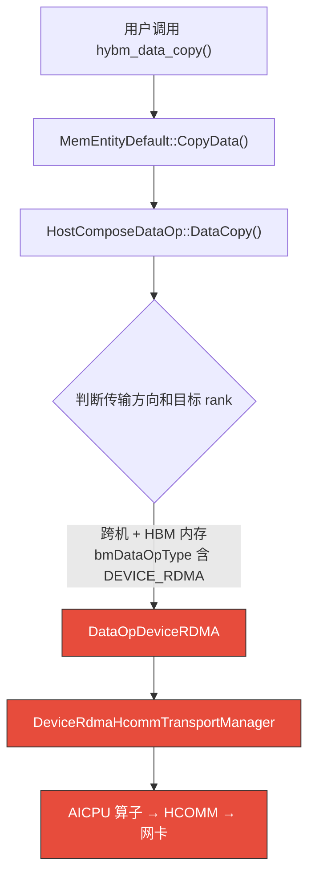

# Device RDMA (HCOMM) 文档

## 概述

**Device RDMA (HCOMM) 是昇腾设备侧通过 AICPU 算子进行 RDMA 传输的路径。** 在 A3/A2 服务器上，Device RDMA 通过 HCOMM 库（libhcomm.so）实现设备侧 HBM/DRAM 直接内存访问。

**核心特点：**
- Device 发起，通过 AICPU 算子调用 HCOMM 库进行 One-Side RDMA 操作
- 需要建链（HCOMM Channel）和 MR 注册（HcommMemReg）
- 支持直接 RDMA 和 Swap（中转）两种路径

**与 Host RDMA 的区别：**

| 维度 | Host RDMA (HCOM) | Device RDMA (HCOMM) |
|------|------------------|---------------------|
| 库 | `libhcom.so` | `libhcomm.so` |
| 引擎 | CPU 线程 | AICPU 算子 |
| 收发模型 | host 线程直接调 ChannelPut/Get | host 下发 AICPU 算子，算子内调 HcommBatchTransfer |
| 内存地址 | HVA | DVA |
| 完成同步 | Synchronize() | AclrtSynchronizeStream |

---

## 一、什么条件下走到 Device RDMA？



**走到 Device RDMA 的条件：**
1. `bmDataOpType` 包含 `HYBM_DOP_TYPE_DEVICE_RDMA`
2. 内存类型为 `HYBM_MEM_TYPE_DEVICE`（HBM 池化）
3. 跨机访问（`srcRankId != destRankId`）
4. 启用 HCOMM：`MF_HYBM_RDMA_USE_HCOMM=1` 且 CANN≥9.1

---

## 二、提前准备

> 详见 `device_rdma_hcomm_init_flow.excalidraw`

### create2 流程（smem_bm_create2）

- `hybm_create_entity()` → 创建 Entity + 初始化
  - `LoadExtendLibrary()` → dlopen 加载 libhcomm.so
  - `InitTransManager()` → 创建 TransportManager，调用 OpenDevice()
- `ReserveMemorySpace()` → 预留 GVA 虚拟地址空间
- `AllocLocalMemory()` → 分配 HBM 物理内存
- `RegisterMemoryRegion()` → 注册 MR（HcommMemReg）

### join 流程（smem_bm_join）

- `Prepare()` → 保存远端 MR 信息
- `Connect()` → 建立 Channel（HcommChannelCreate）

---

## 三、关键概念

| 概念 | 谁创建 | 谁持有 | 作用 |
|------|--------|--------|------|
| **Endpoint** | `DeviceRdmaHcommTransportManager` | `endpoints_[rankId]` | HCOMM 通信端点 |
| **Channel** | `DeviceRdmaHcommTransportManager` | `state.channel` | HCOMM 传输通道 |
| **Thread** | `DeviceRdmaHcommTransportManager` | `state.thread` | HCOMM 线程句柄（AICPU_TS 引擎） |
| **MR** | `DeviceRdmaHcommTransportManager` | `localRegistrations_` | HCOMM 注册的内存区域 |
| **DVA** | `HybmVaManager` | Segment | 设备虚拟地址（AICPU 可访问） |

**地址转换关系：**
```
GVA (全局统一地址)
    │
    ▼ HybmVaManager::TransformVa(GVA → DVA)
DVA (设备虚拟地址)
    │
    ▼ AICPU DMA
PA (物理地址)
```

---

## 四、一条请求怎样执行？

> 详见 `device_rdma_hcomm_overview.excalidraw`

---

## 五、什么时候算完成？

| 阶段 | 状态 | Buffer 可复用？ |
|------|------|----------------|
| **提交返回** | AICPU kernel 启动成功 | ❌ 数据可能还在传输 |
| **传输完成** | AclrtSynchronizeStream 返回 | ✅ 数据已落地，buffer 可复用 |

**关键代码：**
```cpp
// StageAndLaunchTransfer 中
const auto syncRet = DlAclApi::AclrtSynchronizeStream(ctx.stream);
```

---

## 六、关键代码在哪里？

| 问题 | 文件 | 函数 |
|------|------|------|
| **Device RDMA 入口** | `hybm_data_op_device_rdma.cpp` | `DataCopy()` |
| **GVA → DVA 转换** | `device_rdma_hcomm_transport_manager.cpp` | `ConvertGvaToDva()` |
| **MR 注册** | `device_rdma_hcomm_transport_manager.cpp` | `RegisterMemoryRegion()` |
| **Channel 创建** | `device_rdma_hcomm_transport_manager.cpp` | `CreatePeerResources()` |
| **AICPU kernel 启动** | `device_rdma_hcomm_transport_manager.cpp` | `StageAndLaunchTransfer()` |
| **AICPU 算子实现** | `hybm_batch_transfer.cc` | `HybmBatchTransfer()` |

---

## 七、RDMA 常见缩写

| 缩写 | 全称 | 说明 |
|------|------|------|
| **QP** | Queue Pair | RDMA 通信端点，包含 SQ 和 RQ |
| **WR** | Work Request | 工作请求，描述一次 RDMA 操作 |
| **SGL** | Scatter/Gather List | 散列/聚集列表，描述多段内存 |
| **SGE** | Scatter/Gather Element | 散列/聚集元素 |
| **MR** | Memory Region | 内存区域，RDMA 注册的内存 |
| **DVA** | Device Virtual Address | 设备虚拟地址 |
| **AICPU** | AI CPU | 昇腾 AI 处理器 |
| **HCOMM** | Huawei Communication | 华为设备侧通信库 |
| **HCOM** | Host Communication | 华为 Host 侧通信库 |
| **One-Side** | One-Side RDMA | 单边操作，远端 CPU 不参与 |

---

## 八、RDMA 接口在 HCOMM 中的映射

| RDMA 接口 | HCOMM 封装 | MF 调用位置 |
|-----------|-----------|------------|
| **ibv_alloc_pd** | `RsIbvAllocPd()` | `OpenDevice()` → 创建 Endpoint |
| **ibv_create_cq** | `RsIbvCreateCq()` | `OpenDevice()` → 创建 Endpoint |
| **ibv_create_qp** | `RsIbvCreateQp()` | `CreatePeerResources()` → 创建 Channel |
| **ibv_reg_mr** | `RsIbvRegMr()` | `RegisterMemoryRegion()` → 注册 MR |
| **ibv_post_send** | `RsIbvPostSend()` | `HcommBatchTransferOnThread()` → 数据传输 |
| **ibv_post_recv** | `RsIbvPostRecv()` | `HcommReadOnThread()` → 数据传输 |

**MF 调用 HCOMM 接口的流程：**

| 流程 | MF 接口 | HCOMM 接口 | 底层 RDMA |
|------|---------|-----------|-----------|
| **注册 MR** | `HcommApiWrapper::RegisterMemory()` | `HcommMemReg()` | `ibv_reg_mr()` |
| **导出 MR** | `HcommApiWrapper::ExportMemory()` | `HcommMemExport()` | - |
| **导入 MR** | `HcommApiWrapper::ImportMemory()` | `HcommMemImport()` | - |
| **创建 Channel** | `HcommApiWrapper::CreateChannel()` | `HcommChannelCreate()` | `ibv_create_qp()` |
| **分配 Thread** | `HcommApiWrapper::AllocThread()` | `HcommThreadAlloc()` | - |
| **数据传输** | `hybm_batch_transfer.cc` | `HcommBatchTransferOnThread()` | `ibv_post_send()` |
| **数据读取** | `hybm_batch_transfer.cc` | `HcommReadOnThread()` | `ibv_post_recv()` |

**完整调用链（以注册 MR 为例）：**

```
MF: HcommApiWrapper::RegisterMemory()
  → DlHcommApi::HcommMemReg()
    → HCOMM: RoceRegedMemMgr::RegisterMemory()
      → LocalRdmaRmaBuffer() → RaRegisterMr()
        → RsRegisterMr() → RsDrvMrReg()
          → RsIbvRegMr() → ibv_reg_mr()
```

---

## 文件清单

| 文件 | 说明 |
|------|------|
| `device_rdma_hcomm_init_flow.excalidraw` | 提前准备流程图（create2 + join） |
| `device_rdma_hcomm_overview.excalidraw` | 拷贝流程图（层间调用 + 每层函数） |
